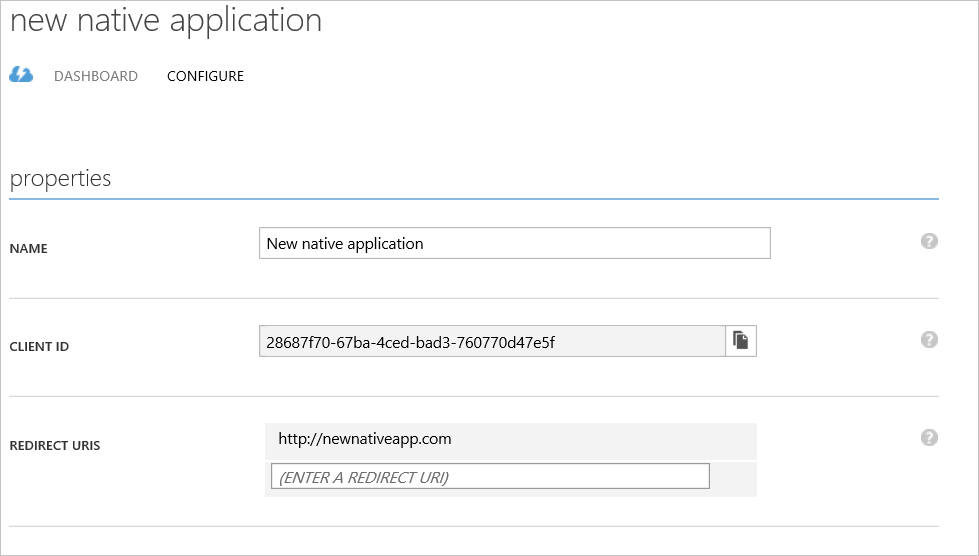

# How to enable native client apps to interact with proxy Applications
Azure Active Directory Application Proxy is widely used to publish browser applications such as SharePoint, Outlook Web Access and custom line of business applications. It can also be used to publish native client apps, which differ from web apps because they get installed on a device. This is done by supporting Azure AD issued tokens that are sent in standard Authorize HTTP headers.

The recommended method to publish such applications is to use the Azure AD Authentication Library, which takes care of all the authentication hassle and supports many different client environments. Application Proxy fits into the [Native Application to Web API scenario](active-directory-authentication-scenarios.md#native-application-to-web-api). The process for accomplishing this is as follows:

## Step 1: Publish your application
Publish your proxy application as you would any other application, assign users and give them premium or basic licenses. For more information see  [Publish applications with Application Proxy](active-directory-application-proxy-publish.md).

## Step 2: Configure your application
Configure your native application as follows:

1. Sign in to the Azure classic portal.
2. Select the Active Directory icon on the left menu, and then select your directory.
3. On the top menu, click **Applications**. If no apps have been added to your directory, this page will only show the **Add an App** link. Click on the link, or alternatively you can click on the **Add** button on the command bar.
4. On the **What do you want to do** page, click on the link to **Add an application my organization is developing**.
5. On the **Tell us about your application** page, specify a name for your application and choose **Native client application**. Click the arrow icon to continue.
6. On the **Application information** page, provide the **Redirect URI** for the native client application, then click the checkmark to finish.

Your application has been added, and you will be taken to the Quick Start page for your application.

## Step 3: Grant access to other applications
Enable the native application to be exposed to other applications in your directory:

1. On the top menu, click **Applications**, select the new native application, and then click **Configure**.
2. Scroll down to the **permissions to other applications** section. Click on the **Add application** button and select the proxy application that you want to grant the native application access to, and click the check mark in the bottom right corner. From the **Delegated Permissions** drop-down menu, select the new permission.

## Step 4: Edit the Active Directory Authentication Library
Edit the native application code in the authentication context of the Active Directory Authentication Library (ADAL) to include the following:

        // Acquire Access Token from AAD for Proxy Application
        AuthenticationContext authContext = new AuthenticationContext("https://login.microsoftonline.com/<TenantId>");
        AuthenticationResult result = authContext.AcquireToken("< Frontend Url of Proxy App >",
                                                        "< Client Id of the Native app>",
                                                        new Uri("< Redirect Uri of the Native App>"),
                                                        PromptBehavior.Never);

        //Use the Access Token to access the Proxy Application
        HttpClient httpClient = new HttpClient();
        httpClient.DefaultRequestHeaders.Authorization = new AuthenticationHeaderValue("Bearer", result.AccessToken);
        HttpResponseMessage response = await httpClient.GetAsync("< Proxy App API Url >");

The variables should be replaced as follows:

* **TenantId** can be found in the GUID in the URL of the application's **Configuration** page, right after “/Directory/”.
* **Frontend URL** is the front end URL you entered in the Proxy Application and can be found on the **Configuration** page of the proxy app.
* **Client Id** of the native app can be found on the **Configure** page of the native application.
* **Redirect URI of the native app** can be found on the **Configure** page of the native application.

For more information about the native application flow, see [Native application to web API](active-directory-authentication-scenarios.md#native-application-to-web-api).

## See also
* [Publish applications using your own domain name](active-directory-application-proxy-custom-domains.md)
* [Enable conditional access](active-directory-application-proxy-conditional-access.md)
* [Working with claims aware applications](active-directory-application-proxy-claims-aware-apps.md)
* [Enable single-sign on](active-directory-application-proxy-sso-using-kcd.md)

For the latest news and updates, check out the [Application Proxy blog](http://blogs.technet.com/b/applicationproxyblog/)

