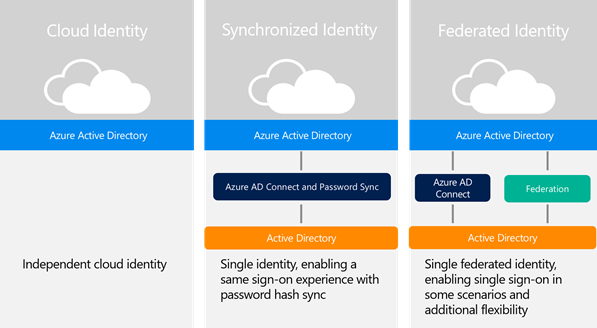
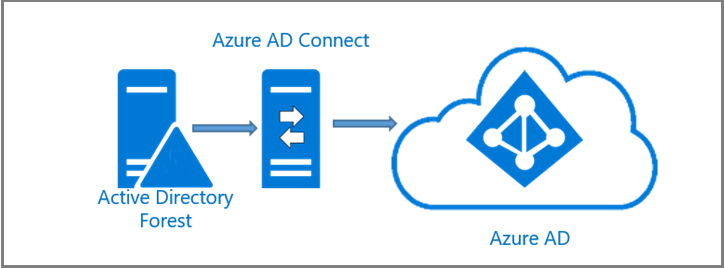
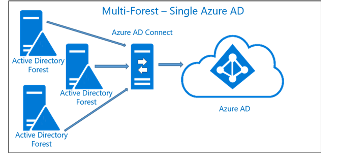
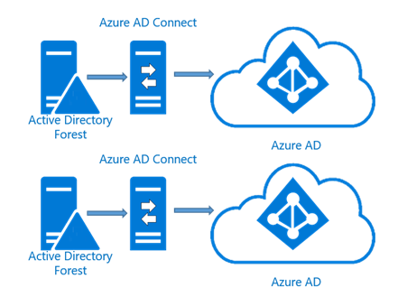
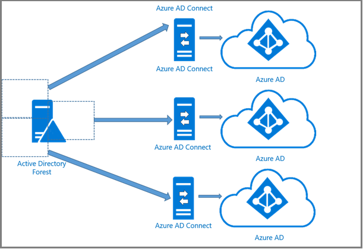

# Define a hybrid identity adoption strategy
In this task, you’ll define the hybrid identity adoption strategy for your hybrid identity solution to meet the business requirements that were discussed in :

* [Determine business needs](active-directory-hybrid-identity-design-considerations-business-needs.md)
* [Determine directory synchronization requirements](active-directory-hybrid-identity-design-considerations-directory-sync-requirements.md)
* [Determine multi-factor authentication requirements](active-directory-hybrid-identity-design-considerations-multifactor-auth-requirements.md)

## Define business needs strategy
The first task addresses determining the organizations business needs.  This can be very broad and scope creep can occur if you are not careful.  In the beginning keep it simple but always remember to plan for a design that will accommodate and facilitate change in the future.  Regardless of whether it is a simple design or an extremely complex one, Azure Active Directory is the Microsoft Identity platform that supports Office 365, Microsoft Online Services and cloud aware applications.

## Define an integration strategy
Microsoft has three main integration scenarios which are cloud identities, synchronized identities, and federated identities.  You should plan on adopting one of these integration strategies.  The strategy you choose can vary and the decisions in choosing one may include, what type of user experience you want to provide, do you have some of the existing infrastructure already in-place, and what is the most cost effective.  

The scenarios defined in the above figure are:

* **Cloud identities**: these are identities that exist solely in the cloud.  In the case of Azure AD, they would reside specifically in your Azure AD directory.
* **Synchronized**: these are identities that exist on-premises and in the cloud.  Using Azure AD Connect, these users are either created or joined with existing Azure AD accounts.  The user’s password hash is synchronized from the on-premises environment to the cloud in what is called a password hash.  When using synchronized the one caveat is that if a user is disabled in the on-premises environment, it can take up to 3 hours for that account status to show up in Azure AD.  This is due to the synchronization time interval.
* **Federated**: these identities exist both on-premises and in the cloud.  Using Azure AD Connect, these users are either created or joined with existing Azure AD accounts.  

> [!NOTE]
> For more information about the Synchronization options read [Integrating your on-premises identities with Azure Active Directory](active-directory-aadconnect.md).
> 
> 

The following table will help in determining the advantages and disadvantages of each of the following strategies:

| Strategy | Advantages | Disadvantages |
| --- | --- | --- |
| **Cloud identities** |Easier to manage for small organization.   Nothing to install on-premises- No additional hardware needed Easily disabled if the user leaves the company |Users will need to sign-in when accessing workloads in the cloud   Passwords may or may not be the same for cloud and on-premises identities |
| **Synchronized** |On-premises password will authenticate both on-premises and cloud directories  Easier to manage for small, medium or large organizations  Users can have single sign-on (SSO) for some resources   Microsoft preferred method for synchronization   Easier to manage |Some customers may be reluctant to synchronize their directories with the cloud due specific company’s police |
| **Federated** |Users can have single sign-on (SSO)  If a user is terminated or leaves, the account can,be immediately disabled and access revoked,  Supports advanced scenarios that cannot be,accomplished with synchronized |More steps to setup and configure   Higher maintenance   May require additional hardware for the STS infrastructure   May require additional hardware to install the federation server.Additional software is required if AD FS is used   Require extensive setup for SSO   Critical point of failure if the federation server is down, users won’t be able to authenticate |

### Client experience
The strategy that you use will dictate the user sign-in experience.  The following tables provide you with information on what the users should expect their sign-in experience to be.  Note that not all federated identity providers support SSO in all scenarios.

**Doman-joined and private network applications**:

|  | Synchronized Identity | Federated Identity |
| --- | --- | --- |
| Web Browsers |Forms based authentication |single sign on, sometimes required to supply organization ID |
| Outlook |Prompt for credentials |Prompt for credentials |
| Skype for Business (Lync) |Prompt for credentials |single-sign on for Lync, prompted credentials for Exchange |
| Skydrive Pro |Prompt for credentials |single sign on |
| Office Pro Plus Subscription |Prompt for credentials |single sign on |

**External or untrusted  sources**:

|  | Synchronized Identity | Federated Identity |
| --- | --- | --- |
| Web Browsers |Forms based authentication |Forms based authentication |
| Outlook, Skype for Business (Lync), Skydrive Pro, Office subscription |Prompt for credentials |Prompt for credentials |
| Exchange ActiveSync |Prompt for credentials |single-sign on for Lync, prompted credentials for Exchange |
| Mobile apps |Prompt for credentials |Prompt for credentials |

If you have determined from task 1 that you have a 3rd party IdP or are going to use one to provide federation with Azure AD, you need to be aware of the following supported capabilities:

* Any SAML 2.0 provider which is compliant for the SP-Lite profile can support authentication to Azure AD and associated applications
* Supports passive authentication, which facilitates auth to OWA, SPO, etc.
* Exchange Online clients can be supported via the SAML 2.0 Enhanced Client Profile (ECP)

You must also be aware of what capabilities will not be available:

* Without WS-Trust/Federation support, all other active clients will break
  * That means no Lync client, OneDrive client, Office Subscription, Office Mobile prior to Office 2016
* Transition of Office to passive authentication will allow them to support pure SAML 2.0 IdPs, but support will still be on a client-by-client basis

> [!NOTE]
> For the most updated list read the article http://aka.ms/ssoproviders.
> 
> 

## Define synchronization strategy
In this task you will define the tools that will be used to synchronize the organization’s on-premises data to the cloud and what topology you should use.  Because, most organizations use Active Directory, information on using Azure AD Connect to address the questions above is provided in some detail.  For environments that do not have Active Directory, there is information about using FIM 2010 R2 or MIM 2016 to help plan this strategy.  However, future releases of Azure AD Connect will support LDAP directories, so depending on your timeline, this information may be able to assist.

### Synchronization tools
Over the years, several synchronization tools have existed and used for various scenarios.  Currently Azure AD Connect is the go to tool of choice for all supported scenarios.  AAD Sync and DirSync are also still around and may even be present in your environment now. 

> [!NOTE]
> For the latest information regarding the supported capabilities of each tool, read [Directory integration tools comparison](active-directory-hybrid-identity-design-considerations-tools-comparison.md) article.  
> 
> 

### Supported topologies
When defining a synchronization strategy, the topology that is used must be determined. Depending on the information that was determined in step 2 you can determine which topology is the proper one to use. 
The single forest, single Azure AD topology is the most common and consists of a single Active Directory forest and a single instance of Azure AD.  This is going to be used in a majority of the scenarios and is the expected topology when using Azure AD Connect Express installation as shown in the figure below.

Single Forest Scenario
It is very common for large and even small organizations to have multiple forests, as shown in Figure 5.

> [!NOTE]
> For more information about the different on-premises and Azure AD topologies with Azure AD Connect sync read the article [Topologies for Azure AD Connect](active-directory-aadconnect-topologies.md).
> 
> 

 

Multi-Forest Scenario

If this the case then the multi-forest-single Azure AD topology should be considered if the following items are true:

* Users have only 1 identity across all forests – the uniquely identifying users section below describes this in more detail.
* The user authenticates to the forest in which their identity is located
* UPN and Source Anchor (immutable id) will come from this forest
* All forests are accessible by Azure AD Connect – this means it does not need to be domain joined and can be placed in a DMZ if this facilitates this.
* Users have only one mailbox
* The forest that hosts a user’s mailbox has the best data quality for attributes visible in the Exchange Global Address List (GAL)
* If there is no mailbox on the user, then any forest may be used to contribute these values
* If you have a linked mailbox, then there is also another account in a different forest used to sign in.

> [!NOTE]
> Objects that exist in both on-premises and in the cloud are “connected” via a unique identifier. In the context of Directory Synchronization, this unique identifier is referred to as the SourceAnchor. In the context of Single Sign-On, this is referred to as the ImmutableId. [Design concepts for Azure AD Connect](active-directory-aadconnect-design-concepts.md#sourceanchor) for more considerations regarding the use of SourceAnchor.
> 
> 

If the above are not true and you have more than one active account or more than one mailbox, Azure AD Connect will pick one and ignore the other.  If you have linked mailboxes but no other account, these accounts will not be exported to Azure AD and that user will not be a member of any groups.  This is different from how it was in the past with DirSync and is intentional to better support these multi-forest scenarios. A multi-forest scenario is shown in the figure below.

 

**Multi-forest multiple Azure AD scenario**

It is recommended to have just a single directory in Azure AD for an organization but it is supported it a 1:1 relationship is kept between an Azure AD Connect sync server and an Azure AD directory.  For each instance of Azure AD, you will need an installation of Azure AD Connect.  Also, Azure AD, by design is isolated and users in one instance of Azure AD will not be able to see users in another instance.

It is possible and supported to connect one on-premises instance of Active Directory to multiple Azure AD directories as shown in the figure below:

 

**Single-forest filtering scenario**

In order to do this the following must be true:

* Azure AD Connect sync servers must be configured for filtering so they each have a mutually exclusive set of objects.  This done, for example, by scoping each server to a particular domain or OU.
* A DNS domain can only be registered in a single Azure AD directory so the UPNs of the users in the on-premises AD must use separate namespaces
* Users in one instance of Azure AD will only be able to see users from their instance.  They will not be able to see users in the other instances
* Only one of the Azure AD directories can enable Exchange hybrid with the on-premises AD
* Mutual exclusivity also applies to write-back.  This makes some write-back features not supported with this topology since these assume a single on-premises configuration.  This includes:
  * Group write-back with default configuration
  * Device write-back

Be aware that the following is not supported and should not be chosen as an implementation:

* It is not supported to have multiple Azure AD Connect sync servers connecting to the same Azure AD directory even if they are configured to synchronize mutually exclusive set of object
* It is unsupported to sync the same user to multiple Azure AD directories. 
* It is also unsupported to make a configuration change to make users in one Azure AD to appear as contacts in another Azure AD directory. 
* It is also unsupported to modify Azure AD Connect sync to connect to multiple Azure AD directories.
* Azure AD directories are by design isolated. It is unsupported to change the configuration of Azure AD Connect sync to read data from another Azure AD directory in an attempt to build a common and unified GAL between the directories. It is also unsupported to export users as contacts to another on-premises AD using Azure AD Connect sync.

> [!NOTE]
> If your organization restricts computers on your network from connecting to the Internet, this article lists the endpoints (FQDNs, IPv4, and IPv6 address ranges) that you should include in your outbound allow lists and Internet Explorer Trusted Sites Zone of client computers to ensure your computers can successfully use Office 365. For more information read [Office 365 URLs and IP address ranges](https://support.office.com/article/Office-365-URLs-and-IP-address-ranges-8548a211-3fe7-47cb-abb1-355ea5aa88a2?ui=en-US&rs=en-US&ad=US).
> 
> 

## Define multi-factor authentication strategy
In this task you will define the multi-factor authentication strategy to use.  Azure Multi-Factor Authentication comes in two different version.  One is a cloud-based and the other is on-premises based using the Azure MFA Server.  Based on the evaluation you did above you can determine which solution is the correct one for your strategy.  Use the table below to determine which design option best fulfill your company’s security requirement:

Multi-factor design options:

| Asset to secure | MFA in the cloud | MFA on-premise |
| --- | --- | --- |
| Microsoft apps |yes |yes |
| SaaS apps in the app gallery |yes |yes |
| IIS applications published through Azure AD App Proxy |yes |yes |
| IIS applications not published through the Azure AD App Proxy |no |yes |
| Remote access as VPN, RDG |no |yes |

Even though you may have settled on a solution for your strategy, you still need to use the evaluation from above on where your users are located.  This may cause the solution to change.  Use the table below to assist you determining this:

| User location | Preferred design option |
| --- | --- |
| Azure Active Directory |Multi-FactorAuthentication in the cloud |
| Azure AD and on-premises AD using federation with AD FS |Both |
| Azure AD and on-premises AD using Azure AD Connect no password sync |Both |
| Azure AD and on-premises using Azure AD Connect with password sync |Both |
| On-premises AD |Multi-Factor Authentication Server |

> [!NOTE]
> You should also ensure that the multi-factor authentication design option that you selected supports the features that are required for your design.  For more information read [Choose the multi-factor security solution for you](../multi-factor-authentication/multi-factor-authentication-get-started.md#what-am-i-trying-to-secure).
> 
> 

## Multi-Factor Auth Provider
Multi-factor authentication is available by default for global administrators who have a Azure Active Directory tenant. However, if you wish to extend multi-factor authentication to all of your users and/or want to your global administrators to be able to take advantage features such as the management portal, custom greetings, and reports, then you must purchase and configure Multi-Factor Authentication Provider.

> [!NOTE]
> You should also ensure that the multi-factor authentication design option that you selected supports the features that are required for your design. 
> 
> 

## Next steps
[Determine data protection requirements](active-directory-hybrid-identity-design-considerations-dataprotection-requirements.md)

## See also
[Design considerations overview](active-directory-hybrid-identity-design-considerations-overview.md)

