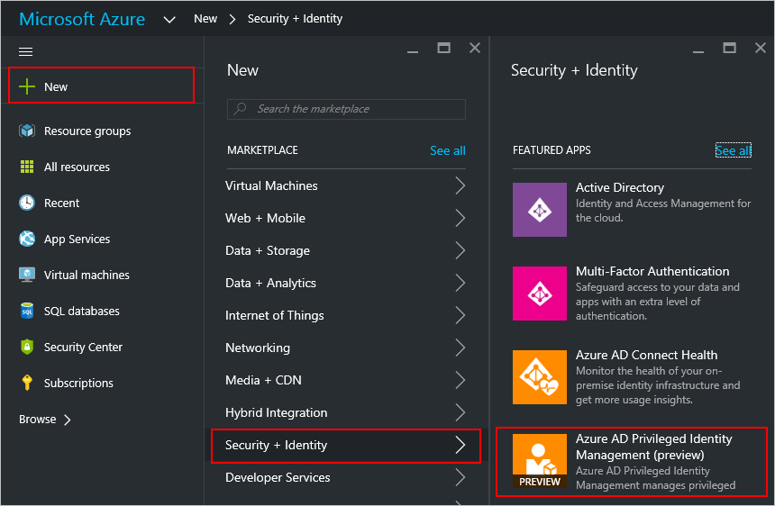
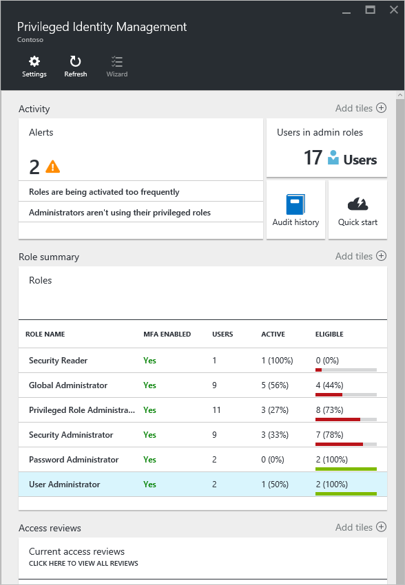
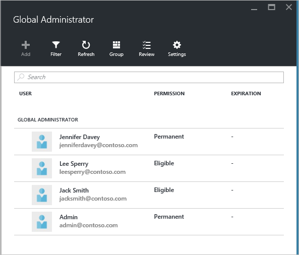
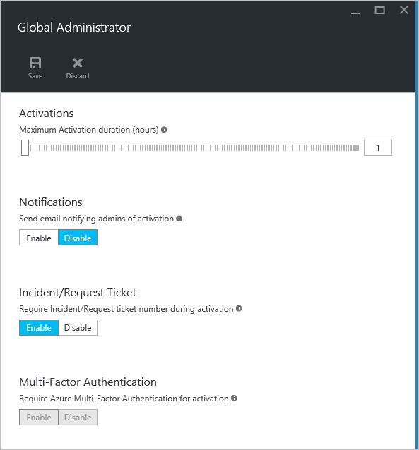
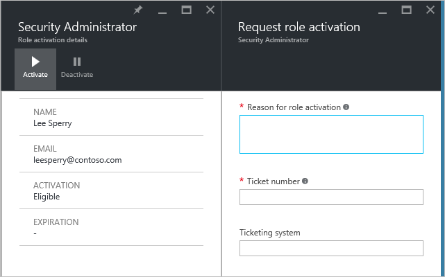
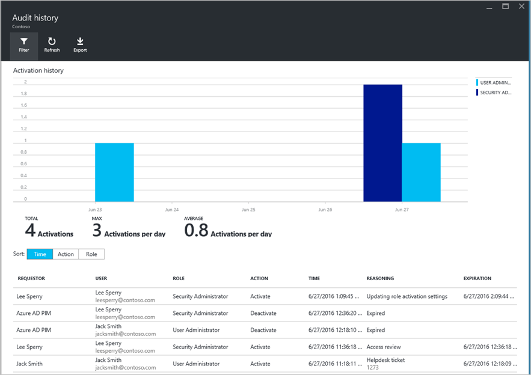

# Azure AD Privileged Identity Management
With Azure Active Directory (AD) Privileged Identity Management you can manage, control, and monitor access to resources in Azure AD as well as other Microsoft online services like Office 365 or Microsoft Intune.  

Organizations want to minimize the number of people who have access to secure information or resources, because that reduces the chance of a malicious user getting that access. However, users still need to carry out privileged operations in Azure, Office 365, or SaaS apps. In the end, the work has to get done, so organizations give users privileged access in Azure AD without monitoring what those users are doing with their admin privileges. Azure AD Privileged Identity Management helps to resolve this risk.  

Azure AD Privileged Identity Management helps you:  

* See which users are Azure AD administrators
* Enable on-demand, "just in time" administrative access to Microsoft Online Services like Office 365 and Intune
* Get reports about administrator access history and changes in administrator assignments
* Get alerts about access to a privileged role

Azure AD Privileged Identity Management can manage the built-in Azure AD organizational roles, including:  

* Global Administrator
* Billing Administrator
* Service Administrator  
* User Administrator
* Password Administrator

## Just in time administrator access
Historically, you could assign a user to an admin role through the Azure Management Portal or Windows PowerShell. As a result, that user becomes a **permanent admin**, always active in his or her assigned role. Azure AD Privileged Identity Management introduces the concept of an **eligible admin**. Eligible admins should be users that need privileged access now and then, but not every day. The role is inactive until the user needs access, then they complete an activation process and become an active admin for a predetermined amount of time.

## Enable Privileged Identity Management for your directory
You can start using Azure AD Privileged Identity Management in the [Azure portal](https://portal.azure.com/).

> [!NOTE]
> You must be a global administrator with an organizational account (e.g. @yourdomain.com), not a Microsoft account (e.g. @outlook.com), to enable Azure AD Privileged Identity Management for a directory.
> 
> 

1. Sign in to the [Azure portal](https://portal.azure.com/) as a global administrator of your directory.
2. If your organization has more than one directory, click on your username in the upper right hand corner of the Azure portal, and select the directory where you will use Azure AD Privileged Identity Management.
3. Select **New** > **Security + Identity** > **Azure AD Privileged Identity Management**.
   
    
4. Check the **Pin to dashboard** option and then click the **Create** button. The Privileged Identity Management dashboard will open.

If you're the first person to use Azure AD Privileged Identity Management in your directory, then the [security wizard](active-directory-privileged-identity-management-security-wizard.md) will walk you through the initial assignment experience. After that you will automatically become the first **Security administrator** and **Privileged role administrator** of the directory.

Only a privileged role administrator can manage access for other administrators. You can [give other users the ability to manage in PIM](active-directory-privileged-identity-management-how-to-give-access-to-pim.md).

## Privileged Identity Management dashboard
Azure AD Privileged Identity Manager provides a dashboard which gives you important information such as:

* Alerts that point out opportunities to improve security
* The number of users who are assigned to each privileged role  
* The number of eligible and permanent admins
* Ongoing access reviews

## Privileged role management
With Azure AD Privileged Identity Management, you can manage the administrators by adding or removing permanent or eligible administrators to each role.

## Configure the role activation settings
Using the role activation setting you can configure the eligible role activation properties including:

* The duration of the role activation period
* The role activation notification
* The information a user needs to provide during the role activation process  

Note that in the image, the buttons for **Multi-Factor Authentication** are disabled. For certain, highly-privileged roles, we require MFA for heightened protection.

## Role activation
In order to activate a role, an eligible admin needs to request a time-bound "activation" for the role. The activation can be requested using the **Activate my role** option in Azure AD Privileged Identity Management.

An admin who wants to activate a role needs to initialize Azure AD Privileged Identity Management in the Azure portal.

Any type of admin can use Azure AD Privileged Identity Management to activate his or her role.

Role activation is time-bound. In the Role Activation settings you can set the length of the activation, as well as the required information that the admin needs to provide in order to activate the role.

## Role activation history
Using Azure AD Privileged Identity Management, you can also track changes in privileged role assignments and role activation history. This can be done using the audit log options:

## Next steps
[!INCLUDE [active-directory-privileged-identity-management-toc](../../includes/active-directory-privileged-identity-management-toc.md)]

<!--Image references-->

[1]: ./media/active-directory-privileged-identity-management-configure/PIM_EnablePim.png
[2]: ./media/active-directory-privileged-identity-management-configure/PIM_Dash.png
[3]: ./media/active-directory-privileged-identity-management-configure/PIM_AddRemove.png
[4]: ./media/active-directory-privileged-identity-management-configure/PIM_RoleActivationSettings.png
[5]: ./media/active-directory-privileged-identity-management-configure/PIM_RequestActivation.png
[6]: ./media/active-directory-privileged-identity-management-configure/PIM_ActivationHistory.png
