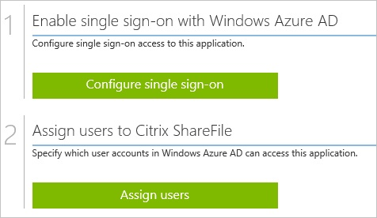
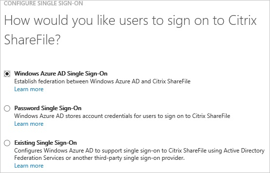
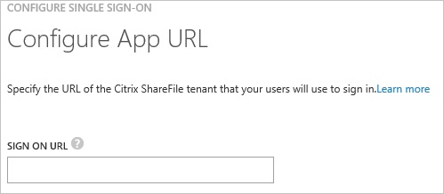
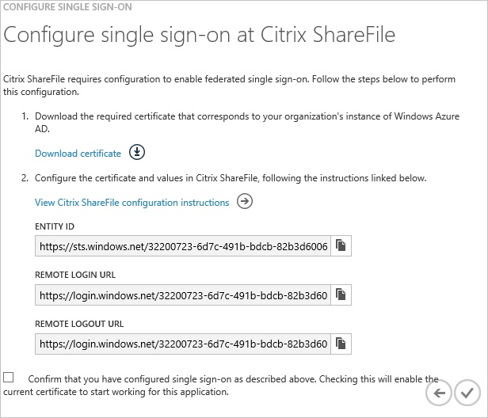
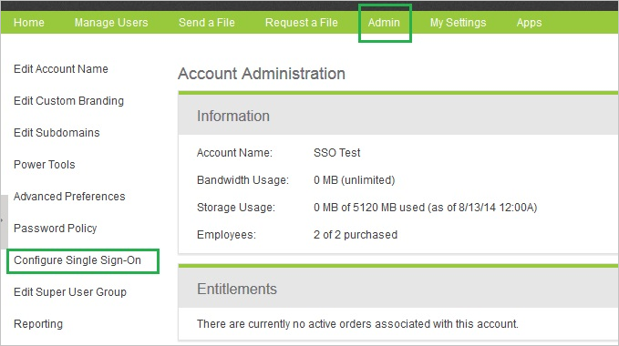
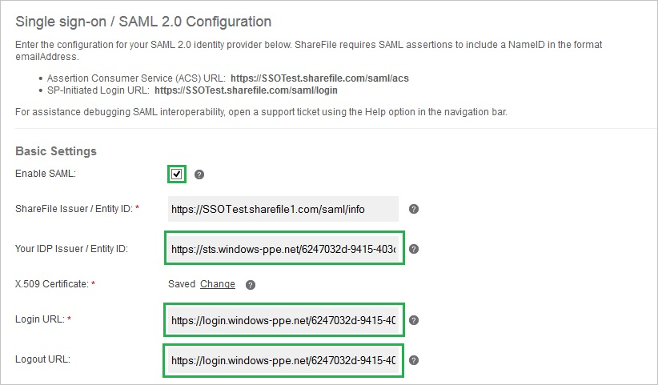
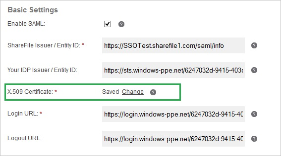
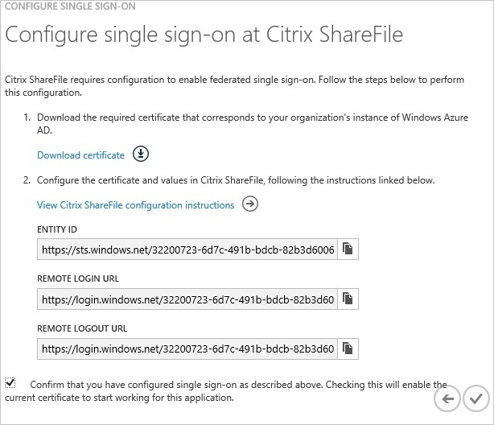
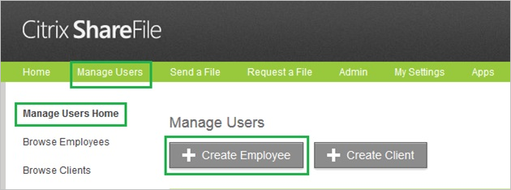
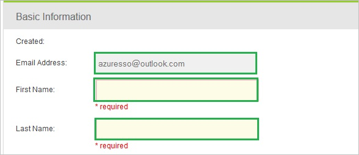

# Tutorial: Azure Active Directory Integration with Citrix ShareFile
The objective of this tutorial is to show the integration of Azure and Citrix ShareFile.  
The scenario outlined in this tutorial assumes that you already have the following items:

* A valid Azure subscription
* A Citrix ShareFile tenant

After completing this tutorial, the Azure AD users you have assigned to Citrix ShareFile will be able to single sign into the application at your Citrix ShareFile company site (service provider initiated sign on), or using the [Introduction to the Access Panel](active-directory-saas-access-panel-introduction.md).

The scenario outlined in this tutorial consists of the following building blocks:

1. Enabling the application integration for Citrix ShareFile
2. Configuring single sign-on
3. Configuring user provisioning
4. Assigning users

## Enabling the application integration for Citrix ShareFile
The objective of this section is to outline how to enable the application integration for Citrix ShareFile.

### To enable the application integration for Citrix ShareFile, perform the following steps:
1. In the Azure classic portal, on the left navigation pane, click **Active Directory**.
   
   
2. From the **Directory** list, select the directory for which you want to enable directory integration.
3. To open the applications view, in the directory view, click **Applications** in the top menu.
   
   
4. Click **Add** at the bottom of the page.
   
   
5. On the **What do you want to do** dialog, click **Add an application from the gallery**.
   
   
6. In the **search box**, type **Citrix ShareFile**.
   
   
7. In the results pane, select **Citrix ShareFile**, and then click **Complete** to add the application.
   
   
   
   ## Configuring single sign-on

The objective of this section is to outline how to enable users to authenticate to Citrix ShareFile with their account in Azure AD using federation based on the SAML protocol.

### To configure single sign-on, perform the following steps:
1. In the Azure classic portal, on the **Citrix ShareFile** application integration page, click **Configure single sign-on** to open the **Configure Single Sign On ** dialog.
   
   
2. On the **How would you like users to sign on to Citrix ShareFile** page, select **Microsoft Azure AD Single Sign-On**, and then click **Next**.
   
   
3. On the **Configure App URL** page, in the **Citrix ShareFile Sign On URL** textbox, type your URL using the following pattern `https://<tenant-name>.shareFile.com`, and then click **Next**.
   
   
4. On the **Configure single sign-on at Citrix ShareFile** page, to download your certificate, click **Download certificate**, and then save the certificate file on your computer.
   
   
5. In a different web browser window, log into your **Citrix ShareFile** company site as an administrator.
6. In the toolbar on the top, click **Admin**.
7. In the left navigation pane, select **Configure Single Sign-On**.
   
   
8. On the **Single Sign-On/ SAML 2.0 Configuration** dialog page under **Basic Settings**, perform the following steps:
   
   
   
   1. Click **Enable SAML**.
   2. In the Azure classic portal, on the **Configure single sign-on at Citrix ShareFile** dialog page, copy the **Entity ID** value, and then paste it into the **Your IDP Issuer/ Entity ID** textbox.
   3. In the Azure classic portal, on the **Configure single sign-on at Citrix ShareFile** dialog page, copy the **Remote Login URL** value, and then paste it into the **Login URL** textbox.
   4. In the Azure classic portal, on **the Configure single sign-on at Citrix ShareFile** dialog page, copy the **Remote Logout URL** value, and then paste it into the **Logout URL** textbox.
   5. Click **Change** next to the **X.509 Certificate** field and then upload the certificate you downloaded from the Azure AD classic portal.
      
9. Click **Save** on the Citrix ShareFile management portal.
10. On the Azure classic portal, select the single sign-on configuration confirmation, and then click **Complete** to close the **Configure Single Sign On** dialog.
    
    
    
    ## Configuring user provisioning

In order to enable Azure AD users to log into Citrix ShareFile, they must be provisioned into Citrix ShareFile.  
In the case of Citrix ShareFile, provisioning is a manual task.

### To provision a user accounts, perform the following steps:
1. Log in to your **Citrix ShareFile** tenant.
2. Click **Manage Users \> Manage Users Home \> + Create Employee**.
   
   
3. Enter the **Email**, **First name** and **Last name** of a valid Azure AD account you want to provision.
   
   
4. Click **Add User**.
   
   > [!NOTE]
   > The AAD account holder will receive an email and follow a link to confirm their account before it becomes active.
   > 
   > 

> [!NOTE]
> You can use any other Citrix ShareFile user account creation tools or APIs provided by Citrix ShareFile to provision AAD user accounts.
> 
> 

## Assigning users
To test your configuration, you need to grant the Azure AD users you want to allow using your application access to it by assigning them.

### To assign users to Citrix ShareFile, perform the following steps:
1. In the Azure classic portal, create a test account.
2. On the **Citrix ShareFile **application integration page, click **Assign users**.
   
   
3. Select your test user, click **Assign**, and then click **Yes** to confirm your assignment.
   
   

If you want to test your single sign-on settings, open the Access Panel. For more details about the Access Panel, see [Introduction to the Access Panel](active-directory-saas-access-panel-introduction.md).

