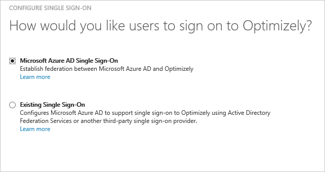
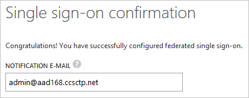

# Tutorial: Azure Active Directory integration with Optimizely
In this tutorial, you learn how to integrate Optimizely with Azure Active Directory (Azure AD).

Integrating Optimizely with Azure AD provides you with the following benefits:

* You can control in Azure AD who has access to Optimizely
* You can enable your users to automatically get signed-on to Optimizely (Single Sign-On) with their Azure AD accounts
* You can manage your accounts in one central location - the Azure classic portal

If you want to know more details about SaaS app integration with Azure AD, see [What is application access and single sign-on with Azure Active Directory](active-directory-appssoaccess-whatis.md).

## Prerequisites
To configure Azure AD integration with Optimizely, you need the following items:

* An Azure AD subscription
* A **Optimizely** single-sign on enabled subscription

> [!NOTE]
> To test the steps in this tutorial, we do not recommend using a production environment.
> 
> 

To test the steps in this tutorial, you should follow these recommendations:

* You should not use your production environment, unless this is necessary.
* If you don't have an Azure AD trial environment, you can get a one-month trial [here](https://azure.microsoft.com/pricing/free-trial/).

## Scenario Description
In this tutorial, you test Azure AD single sign-on in a test environment. 
The scenario outlined in this tutorial consists of two main building blocks:

1. Adding Optimizely from the gallery
2. Configuring and testing Azure AD single sign-on

## Adding Optimizely from the gallery
To configure the integration of Optimizely into Azure AD, you need to add Optimizely from the gallery to your list of managed SaaS apps.

**To add Optimizely from the gallery, perform the following steps:**

1. In the **Azure classic portal**, on the left navigation pane, click **Active Directory**. 
   
    
2. From the **Directory** list, select the directory for which you want to enable directory integration.
3. To open the applications view, in the directory view, click **Applications** in the top menu.
   
    
4. Click **Add** at the bottom of the page.
   
    
5. On the **What do you want to do** dialog, click **Add an application from the gallery**.
   
    
6. In the search box, type **Optimizely**.
   
    
7. In the results pane, select **Optimizely**, and then click **Complete** to add the application.
   
    

## Configuring and testing Azure AD single sign-on
In this section, you configure and test Azure AD single sign-on with Optimizely based on a test user called "Britta Simon".

For single sign-on to work, Azure AD needs to know what the counterpart user in Optimizely is to a user in Azure AD. In other words, a link relationship between an Azure AD user and the related user in Optimizely needs to be established.
This link relationship is established by assigning the value of the **user name** in Azure AD as the value of the **Username** in Optimizely.

To configure and test Azure AD single sign-on with Optimizely, you need to complete the following building blocks:

1. **[Configuring Azure AD Single Sign-On](#configuring-azure-ad-single-single-sign-on)** - to enable your users to use this feature.
2. **[Creating an Azure AD test user](#creating-an-azure-ad-test-user)** - to test Azure AD single sign-on with Britta Simon.
3. **[Creating an Optimizely test user](#creating-an-optimizely-test-user)** - to have a counterpart of Britta Simon in Optimizely that is linked to the Azure AD representation of her.
4. **[Assigning the Azure AD test user](#assigning-the-azure-ad-test-user)** - to enable Britta Simon to use Azure AD single sign-on.
5. **[Testing Single Sign-On](#testing-single-sign-on)** - to verify whether the configuration works.

### Configuring Azure AD Single Sign-On
The objective of this section is to enable Azure AD single sign-on in the Azure classic portal and to configure single sign-on in your Optimizely application.

Optimizely application expects the SAML assertions to contain an attribute named "email". The value of "email" should be an Optimizely recognized email that can get authenticated by Azure AD. Please configure the "email" claim for this application. You can manage the values of these attributes from the **"Atrributes"** tab of the application. The following screenshot shows an example for this. 

 

**To configure Azure AD single sign-on with Optimizely, perform the following steps:**

1. In the Azure classic portal, on the **Optimizely** application integration page, in the menu on the top, click **Attributes**.
   
    
2. On the SAML token attributes dialog, add the "email" attribute.
   
    a. Click **add user attribute** to open the **Add User Attribute** dialog. 
   
    
   
    b. In the **Attribute Name** textbox, type the attribute name "email".
   
    c. From the **Attribute Value** list, select the attribute value "userprincipalname" or any value that contains an email recognized by Azure AD and Optimizely.
   
    d. Click **Complete**.
3. In the menu on the top, click **Quick Start**.
   
    
4. In the classic portal, on the **Optimizely** application integration page, click **Configure single sign-on** to open the **Configure Single Sign-On**  dialog.
   
     
5. On the **How would you like users to sign on to Optimizely** page, select **Azure AD Single Sign-On**, and then click **Next**.
   
    
6. On the **Configure App Settings** dialog page, perform the following steps: 
   
    

    a. In the **Sign On URL** textbox, type: `https://app.optimizely.net/contoso`

    b. In the **Identifier** textbox, type: `urn:auth0:optimizely:contoso`

    c. Click **Next**. 

    > [AZURE.NOTE] The values for the **Sign On URL** and **Identifier** are only placeholders for the actual values. You can find instructions for aquiring the actual values from Optimizely later in this tutorial.

1. On the **Configure single sign-on at Optimizely** page, perform the following steps:
   
    
   
    a. Click **Download certificate**, and then save the file on your computer.
   
    b. Copy the **Single Sign-On Service URL**.
2. To get SSO configured for your application, contact your Optimizely Account Manager and provide the following information:
   
   * Your downloaded certificate 
   * The Single Sign-On Service URL
     
     In response to your email, Optimizely provides you with the Sign On URL (SP-initiated SSO) and the Identifier (Service Provider Entity ID) values.
3. Go back to **Configure App Settings** dialog page, and then perform the following steps:
   
    
   
    a. In the **Sign On URL** textbox, type the **SP-initiated SSO URL** provided by Optimizely.
   
    b. In the **Identifier** textbox, type the **Service Provider Entity ID** provided by Optimizely.
   
    c. Click **Next**.
4. On the **Configure single sign-on at Optimizely** page, perform the following steps:
   
   
   
   a. Select the single sign-on configuration confirmation.
   
   b. Click **Next**.
5. On the **Single sign-on confirmation** page, click **Complete**.  
   
   
6. In a different browser window, sign-on to your Optimizely application.
7. Click you account name in the top right corner and then **Account Settings**.
   
   
8. In the Account tab, check the box **Enable SSO** under Single Sign On in the **Overview** section.
   
   

### Creating an Azure AD test user
In this section, you create a test user in the classic portal called Britta Simon.
In the Users list, select **Britta Simon**.

**To create a test user in Azure AD, perform the following steps:**

1. In the **Azure classic portal**, on the left navigation pane, click **Active Directory**.
   
     
2. From the **Directory** list, select the directory for which you want to enable directory integration.
3. To display the list of users, in the menu on the top, click **Users**.
   
     
4. To open the **Add User** dialog, in the toolbar on the bottom, click **Add User**.
   
     
5. On the **Tell us about this user** dialog page, perform the following steps:
   
     
   
    a. As Type Of User, select New user in your organization.
   
    b. In the User Name **textbox**, type **BrittaSimon**.
   
    c. Click **Next**.
6. On the **User Profile** dialog page, perform the following steps:
   
    
   
   a. In the **First Name** textbox, type **Britta**.  
   
   b. In the **Last Name** textbox, type, **Simon**.
   
   c. In the **Display Name** textbox, type **Britta Simon**.
   
   d. In the **Role** list, select **User**.
   
   e. Click **Next**.
7. On the **Get temporary password** dialog page, click **create**.
   
     
8. On the **Get temporary password** dialog page, perform the following steps:
   
     
   
    a. Write down the value of the **New Password**.
   
    b. Click **Complete**.   

### Creating an Optimizely test user
In this section, you create a user called Britta Simon in Optimizely.

1. On the home page, select **Collaborators** tab
2. Click **New Collaborator** to add a new collaborator to the project.
   
    
3. Fill in the email address and assign them a role. Click **Invite**.

    

1. They will receive an email invite. Using the email address. they will have to log into Optimizely.

### Assigning the Azure AD test user
In this section, you enable Britta Simon to use Azure single sign-on by granting her access to Optimizely.

 

**To assign Britta Simon to Optimizely, perform the following steps:**

1. On the classic portal, to open the applications view, in the directory view, click **Applications** in the top menu.
   
     
2. In the applications list, select **Optimizely**.
   
     
3. In the menu on the top, click **Users**.
   
     
4. In the All Users list, select **Britta Simon**.
5. In the toolbar on the bottom, click **Assign**.
   
    

### Testing Single Sign-On
The objective of this section is to test your Azure AD single sign-on configuration using the Access Panel.

When you click the Optimizely tile in the Access Panel, you should get automatically signed-on to your Optimizely application.

## Additional Resources
* [List of Tutorials on How to Integrate SaaS Apps with Azure Active Directory](active-directory-saas-tutorial-list.md)
* [What is application access and single sign-on with Azure Active Directory?](active-directory-appssoaccess-whatis.md)

<!--Image references-->

[1]: ./media/active-directory-saas-optimizely-tutorial/tutorial_general_01.png
[2]: ./media/active-directory-saas-optimizely-tutorial/tutorial_general_02.png
[3]: ./media/active-directory-saas-optimizely-tutorial/tutorial_general_03.png
[4]: ./media/active-directory-saas-optimizely-tutorial/tutorial_general_04.png

[5]: ./media/active-directory-saas-optimizely-tutorial/tutorial_general_05.png
[6]: ./media/active-directory-saas-optimizely-tutorial/tutorial_general_06.png
[7]:  ./media/active-directory-saas-optimizely-tutorial/tutorial_general_050.png
[10]: ./media/active-directory-saas-optimizely-tutorial/tutorial_general_060.png
[11]: ./media/active-directory-saas-optimizely-tutorial/tutorial_general_070.png
[20]: ./media/active-directory-saas-optimizely-tutorial/tutorial_general_100.png

[200]: ./media/active-directory-saas-optimizely-tutorial/tutorial_general_200.png
[201]: ./media/active-directory-saas-optimizely-tutorial/tutorial_general_201.png
[203]: ./media/active-directory-saas-optimizely-tutorial/tutorial_general_203.png
[204]: ./media/active-directory-saas-optimizely-tutorial/tutorial_general_204.png
[205]: ./media/active-directory-saas-optimizely-tutorial/tutorial_general_205.png
