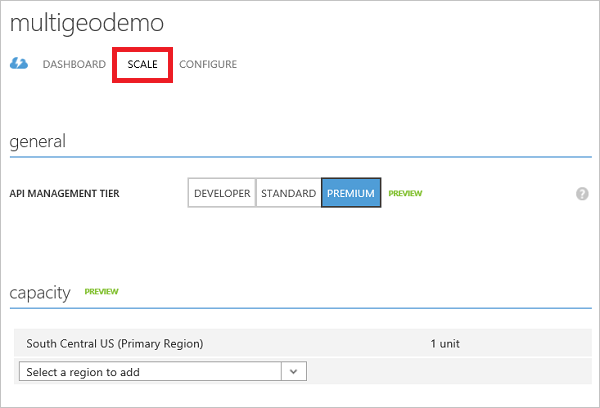
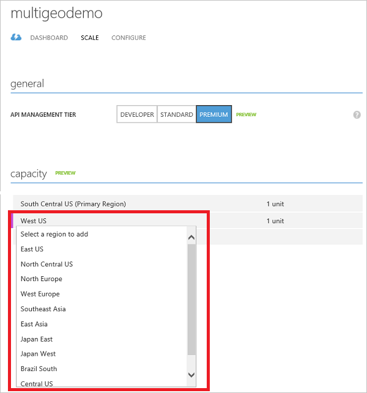
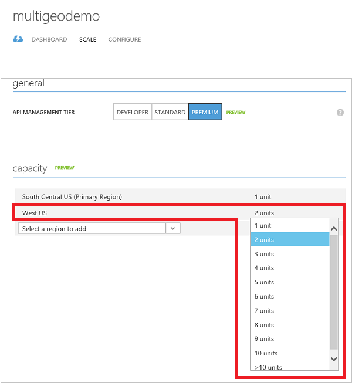
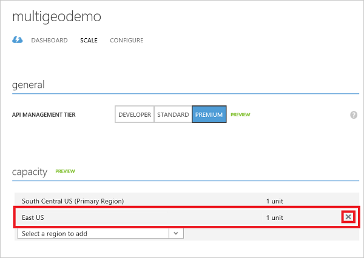

# How to deploy an Azure API Management service instance to multiple Azure regions
API Management supports multi-region deployment which enables API publishers to distribute a single API management service across any number of desired Azure regions. This helps reduce request latency perceived by geographically distributed API consumers and also improves service availability if one region goes offline. 

When an API Management service is created initially, it contains only one [unit](http://azure.microsoft.com/pricing/details/api-management/) and resides in a single Azure region, which is designated as the Primary Region. Additional regions can be easily added through Azure Classic Portal. API Management gateway server is deployed to each region and call traffic will be routed to the closest gateway. If a region goes offline, the traffic is automatically re-directed to the next closest gateway. 

> [!IMPORTANT]
> Multi-region deployment is only available in the **[Premium](http://azure.microsoft.com/pricing/details/api-management/)** tier.
> 
> 

## Deploy an API Management service instance to a new region
To get started, click **Manage** in the Azure Classic Portal for your API Management service. This takes you to the API Management publisher portal.

> If you have not yet created an API Management service instance, see [Create an API Management service instance](api-management-get-started.md#create-service-instance) in the [Get started with Azure API Management](api-management-get-started.md) tutorial.
> 
> 

Navigate to the **Scale** tab in Azure Classic Portal for your API Management service instance. 

To deploy to a new region, click on the drop-down list below the primary region and pick a region from the list.

Once the region is selected, pick the number of units for the new region from the unit drop-down list.

Once the desired regions and units are configured, click **Save**.

## Delete an API Management service instance from a region
To remove an API Management service instance from a region, navigate to the **Scale** tab in Azure Classic Portal for your API Management service instance. 

Click the **X** to the right of the desired region to remove.  

Once the desired regions are removed, click **Save**.

[api-management-management-console]: ./media/api-management-howto-deploy-multi-region/api-management-management-console.png

[api-management-scale-service]: ./media/api-management-howto-deploy-multi-region/api-management-scale-service.png
[api-management-add-region]: ./media/api-management-howto-deploy-multi-region/api-management-add-region.png
[api-management-select-units]: ./media/api-management-howto-deploy-multi-region/api-management-select-units.png
[api-management-remove-region]: ./media/api-management-howto-deploy-multi-region/api-management-remove-region.png

[Create an API Management service instance]: api-management-get-started.md#create-service-instance
[Get started with Azure API Management]: api-management-get-started.md

[Deploy an API Management service instance to a new region]: #add-region
[Delete an API Management service instance from a region]: #remove-region

[unit]: http://azure.microsoft.com/pricing/details/api-management/
[Premium]: http://azure.microsoft.com/pricing/details/api-management/

