# Get started with the FTP Connector and add it to your Logic App
> [!NOTE]
> This version of the article applies to logic apps 2014-12-01-preview schema version. For the 2015-08-01-preview schema version, click [FTP API](../connectors/connectors-create-api-ftp.md).
> 
> 

Connect to an FTP server to move data or files. Key features of the FTP connector include:

* Pulling files from the FTP server on demand
* Running polls based on a configurable schedule
* Polling the FTP server and triggering the logic flow based on new documents in the FTP Server
* Specifying the FTP server as an IP address, port, password, and host name
* Ability to run sends on demand
* Ability to delete files on FTP Server on demand

You can add the FTP connector to your business workflow and process data as part of this workflow within a Logic App. 

## Create a new FTP connector
To create a new FTP connector, follow the steps mentioned below.

* Launch Azure portal
* Open Azure marketplace using +New (at the bottom of the page) -> Web+Mobile --> Azure Marketplace:  
  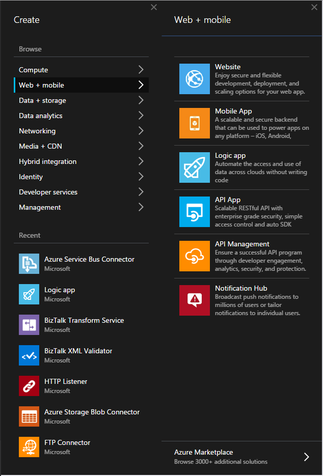
* Click on API Apps
* Search for FTP, and select FTP Connector:  
  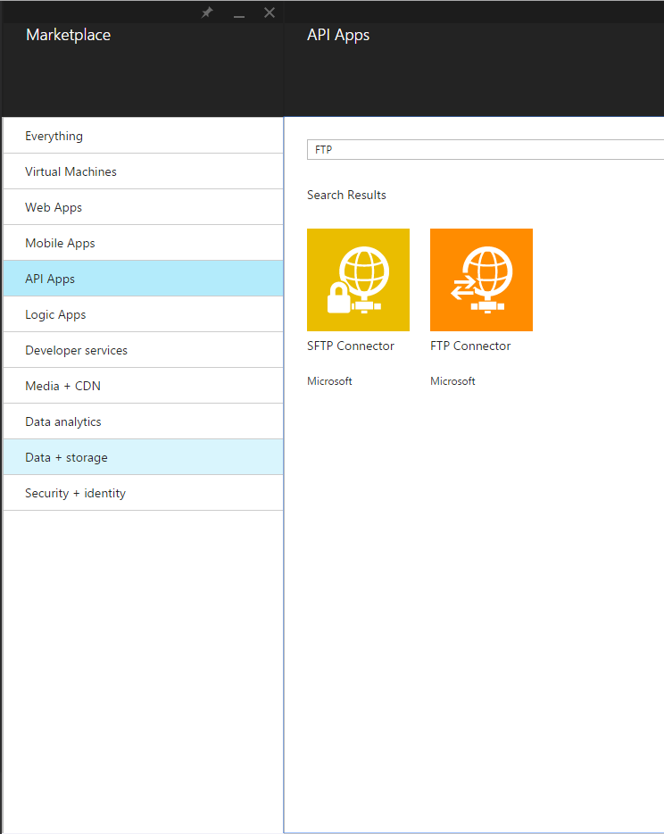
* Click on Create
* In the FTP connector blade that opens up, provide the following data:  
  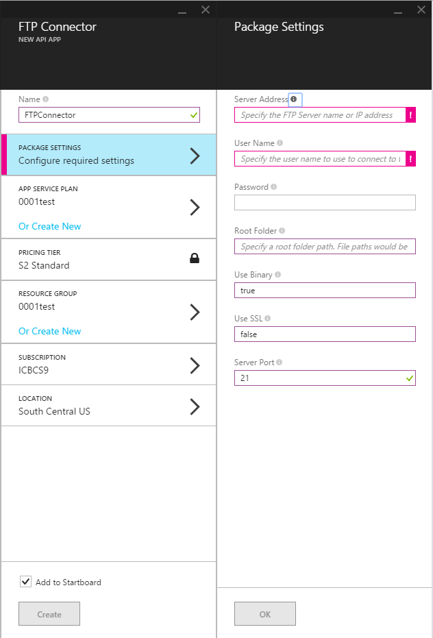
* **Location** - choose the geographic location where you would like the connector to be deployed
* **Subscription** - choose a subscription you want this connector to be created in
* **Resource group** - select or create a resource group where the connector should reside
* **Web hosting plan** - select or create a web hosting plan
* **Pricing tier** - choose a pricing tier for the connector
* **Name** - give a name for your FTP Connector
* **Package settings**
  * **Server Address** - Specify the FTP Server name or IP address
  * **User Name** - Specify the user name to connect to the FTP Server
  * **Password** - Specify the password to connect to the FTP Server
  * **Root Folder** - Specify a root folder path
  * **Use Binary** - Specify true to use Binary transfer mode, false for ASCII
  * **Use SSL** - Specify true to use FTP over a secure SSL/TLS channel
  * **Server Port** - Specify the FTP Server port number
* Click on Create. A new FTP Connector will be created.

## Use FTP Connector in Logic App
Once the FTP connector has been created, it can be consumed from the flow.

Create a new flow through +New -> Web+Mobile -> LogicApp. Provide the metadata for the flow including resource group:  
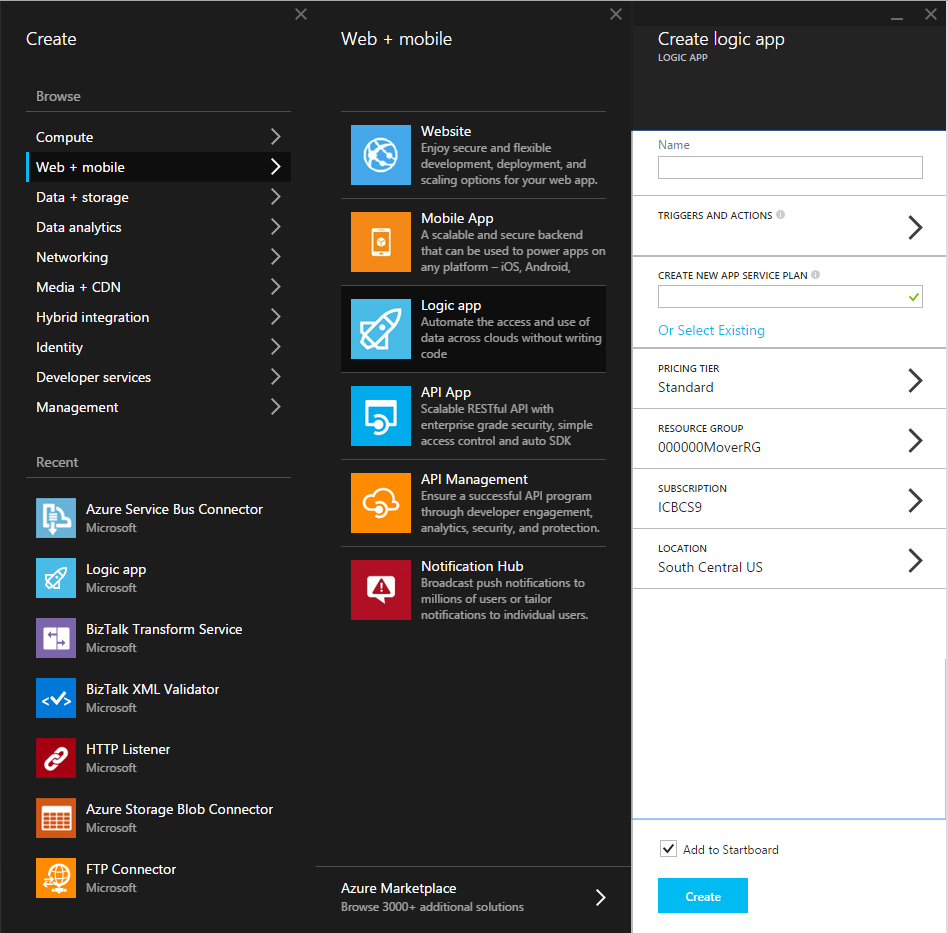

Click on *triggers and actions*. The flow designer opens:  
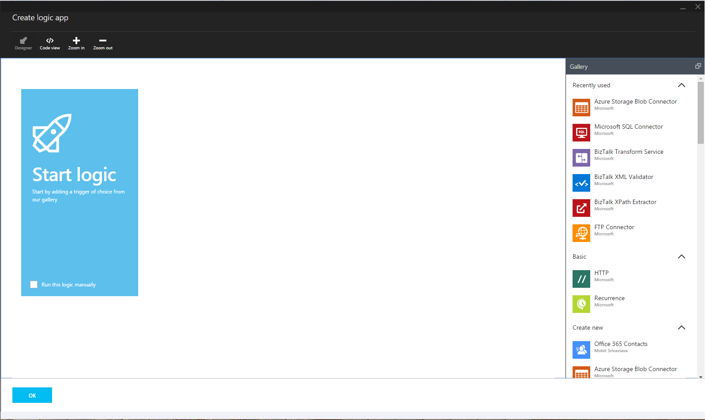

FTP Connector can be used as both trigger and action.

### Trigger
In the empty flow designer, click on FTP connector from the right gallery pane:  
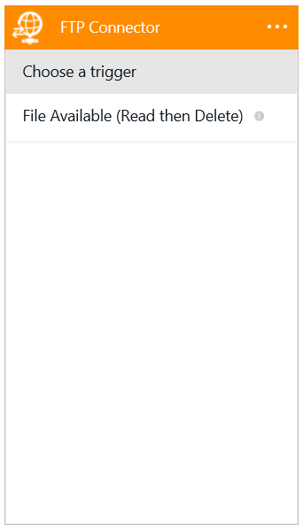

FTP Connector has one trigger - 'File Available (Read then Delete)'. This trigger:

* Polls the folder path for new files
* Instantiates the logic flow whenever for every new file
* Deletes the file from the folder path after the logic flow has been instantiated

Click on 'File Available (Read then Delete)' trigger:  
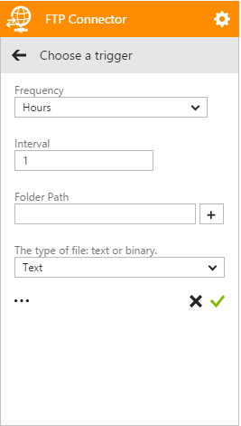

The inputs help you configure a particular folder path to be polled on a scheduled frequency. The basic inputs are

* Frequency - Specifies the frequency of the FTP poll
* Interval - Specifies the interval for the scheduled frequency
* Folder Path - Specifies the folder path in the FTP Server
* Type of file - Specifies whether the file type is text or binary

Clicking on the elipses '...' shows the advanced inputs:  
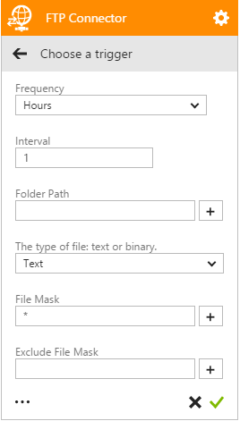

The advanced inputs include:

* File mask - Specifies the file mask while polling
* Exclude file mask - Specifies the file masks to exclude while polling

Provide the inputs and click on the check mark to complete input configuration:  
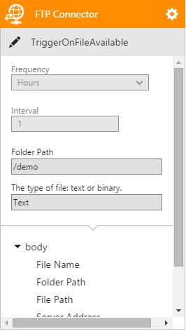

Note that the configured FTP trigger shows both input parameters configured as well as the outputs.

#### Using the output of FTP trigger in subsequent actions
The output of FTP Connector can be used as the input of some other actions in the flow.

You can click on '...' in the input dialog of action and select the output of FTP from the drop down box directly.

You can also write an expression directly in the input box of action. The flow expression to refer to the output of ftp trigger is given below:

    @triggers('ftpconnector').outputs.body.Content

### Actions
Click on FTP connector from the right pane. The FTP connector lists down the actions supported:  
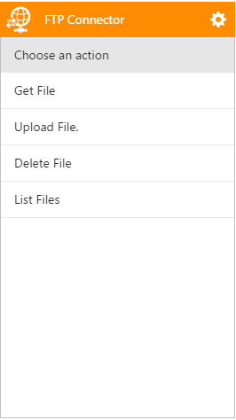

FTP Connector supports the following actions:

* **Get File** - Get the contents of a specific file
* **Upload File** - Uploads file to the FTP folder path
* **Delete File** - Deletes file from the FTP folder path
* **List Files** - Lists all the files in the FTP folder path

Lets take one example - Upload File. Click on Upload File.

The basic inputs are displayed first:  
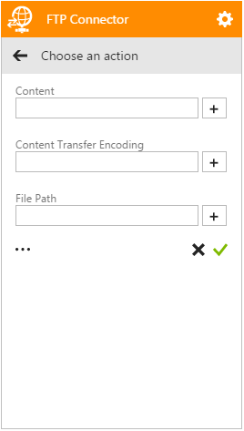

* **Content** - Specifies the content of the file to be uploaded
* **Content Transfer Encoding** - Specify none or base64
* **File Path** - Specifies the file path of the file to be uploaded

Click on ... for advanced inputs:  
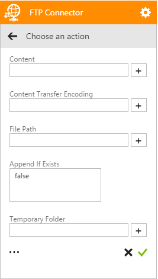

* **Append If Exists** - True or False 'Append If Exist'. When enabled, the data is appended to the file if it exists. When disabled, the file is overwritten if it exists
* **Temporary Folder** - Optional. If provided, the adapter will upload the file to the 'Temporary Folder Path' and once the upload is done the file will be moved to 'Folder Path'. The 'Temporary Folder Path' should be on the same physical disk as the 'Folder Path' to make sure that the move operation is atomic. Temporary folder can be used only when 'Append If Exist' property is disabled.

Provide the inputs and click on the check mark to complete input configuration:  
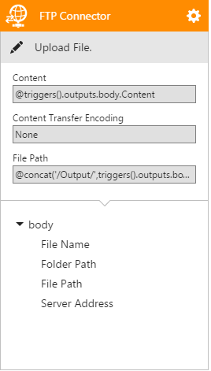

The 'File Path' parameter is set to:

    @concat('/Output/',triggers().outputs.body.FileName)

Note that the configured FTP Upload File action shows both input parameters as well as output parameters.

#### Using the outputs of previous actions as input to FTP action
Note that in the configured screenshot, Content is value is set to an expression.

    @triggers().outputs.body.Content

You can set it to any value that you want. This is just an example. The expression takes the output of the logic app trigger and uses it as the content of the file to be uploaded. Lets say you want to use the output of a previous action, say transform. In that case, the expression would be

    @actions('transformservice').outputs.body.OutputXML

## Do more with your Connector
Now that the connector is created, you can add it to a business workflow using a Logic App. See [What are Logic Apps?](app-service-logic-what-are-logic-apps.md).

> [!NOTE]
> If you want to get started with Azure Logic Apps before signing up for an Azure account, go to [Try Logic App](https://tryappservice.azure.com/?appservice=logic), where you can immediately create a short-lived starter logic app in App Service. No credit cards required; no commitments.
> 
> 

View the Swagger REST API reference at [Connectors and API Apps Reference](http://go.microsoft.com/fwlink/p/?LinkId=529766).

You can also review performance statistics and control security to the connector. See [Manage and Monitor your built-in API Apps and Connectors](app-service-logic-monitor-your-connectors.md).

<!-- Image reference -->
[1]: ./media/app-service-logic-connector-ftp/LaunchAzureMarketplace.PNG
[2]: ./media/app-service-logic-connector-ftp/SelectFTPConnector.PNG
[3]: ./media/app-service-logic-connector-ftp/CreateFTPConnector.PNG
[4]: ./media/app-service-logic-connector-ftp/CreateLogicApp.PNG
[5]: ./media/app-service-logic-connector-ftp/LogicAppEmptyFlowDesigner.PNG
[6]: ./media/app-service-logic-connector-ftp/ChooseFTPTrigger.PNG
[7]: ./media/app-service-logic-connector-ftp/BasicInputsFTPTrigger.PNG
[8]: ./media/app-service-logic-connector-ftp/AdvancedInputsFTPTrigger.PNG
[9]: ./media/app-service-logic-connector-ftp/ConfiguredFTPTrigger.PNG
[10]: ./media/app-service-logic-connector-ftp/ListOfFTPActions.PNG
[11]: ./media/app-service-logic-connector-ftp/BasicInputsUploadFile.PNG
[12]: ./media/app-service-logic-connector-ftp/AdvancedInputsUploadFile.PNG
[13]: ./media/app-service-logic-connector-ftp/ConfiguredUploadFile.PNG

