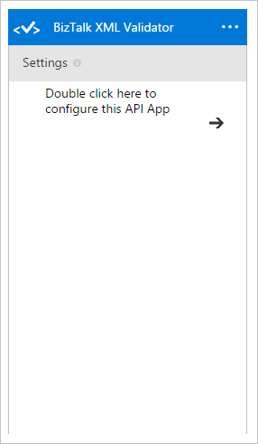
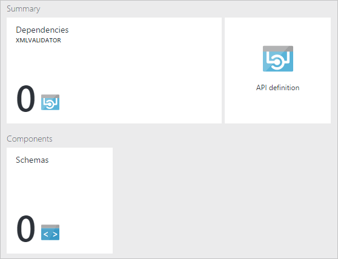
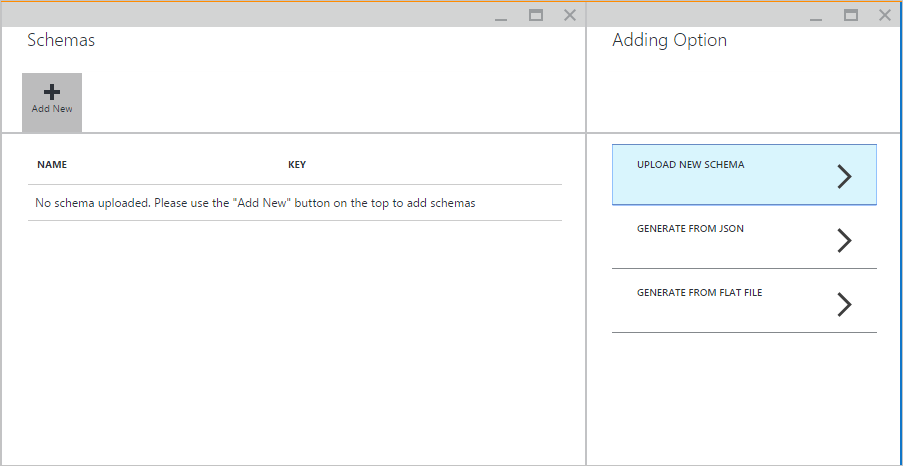
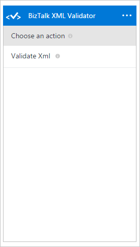
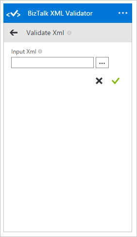

# BizTalk XML Validator
[!INCLUDE [app-service-logic-version-message](../../includes/app-service-logic-version-message.md)]

Use the BizTalk XML Validator connector in your app to validate XML data against predefined XML schemas. Users can use existing schemas or generate schemas based on a flat file instance, JSON instance, or existing connectors.

## Using the BizTalk XML Validator
To use the BizTalk XML Validator, first create an instance of the BizTalk XML Validator API app. This can be done either inline while creating a logic app or by selecting the BizTalk XML Validator API app from the Azure Marketplace.

### Configure BizTalk XML Validator
BizTalk XML Validator takes schemas as part of its configuration. Users can launch the API App configuration blade by either launching the API App directly from the Azure portal, or by double clicking the API App on the designer surface:  

In the API App blade, users can configure schemas by selecting *Schemas*:  

Users can upload schemas from disk or generate one from a flat file instance or a JSON instance:  

### Using the BizTalk Flat File Encoder in the design surface
Once configured, users can select *->* and choose from an action from a list of actions:  

#### Validate Xml
Validate Xml action validates a given XML input against pre-configured schemas:  

| Parameter | Type | Description of the parameter |
| --- | --- | --- |
| Input Xml |string |Input Xml to be validated |

The action returns the output as an object. The output contains the model representing the response from the XML Validator. It consists of the result, schema name, root node, and error description.

<!-- References -->
[1]: ./media/app-service-logic-xml-validator/XmlValidator.ClickToConfigure.PNG
[2]: ./media/app-service-logic-xml-validator/XmlValidator.SchemasPart.PNG
[3]: ./media/app-service-logic-xml-validator/XmlValidator.SchemaUpload.PNG
[4]: ./media/app-service-logic-xml-validator/XmlValidator.ListOfActions.PNG
[5]: ./media/app-service-logic-xml-validator/XmlValidator.ValidateXml.PNG
