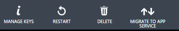

# <a name="article-top"></a>Migrate your existing Azure Mobile Service to Azure App Service
With the [general availability of Azure App Service](/blog/announcing-general-availability-of-app-service-mobile-apps/), Azure Mobile Services sites can be easily migrated in-place to take advantage of all the
features of the Azure App Service.  This document explains what to expect when migrating your site from Azure Mobile Services to Azure App Service.

## <a name="what-does-migration-do"></a>What does migration do to your site
Migration of your Azure Mobile Service will turn your Mobile Service into an [Azure App Service](../app-service/app-service-value-prop-what-is.md) app without affecting the code in any way.  Your Notification
Hubs, SQL data connection, authentication settings, scheduled jobs, and domain name will remain unchanged.  Mobile clients using your Azure Mobile Service
will continue to operate normally.  Migration will restart your service once it is transferred to Azure App Service.

[!INCLUDE [app-service-mobile-migrate-vs-upgrade](../../includes/app-service-mobile-migrate-vs-upgrade.md)]

## <a name="why-migrate"></a>Why you should migrate your site
Microsoft is recommending that you migrate your Azure Mobile Service to take advantage of the features of Azure App Service, including:

* New host features, including [WebJobs](../app-service-web/websites-webjobs-resources.md) and [custom domain names](../app-service-web/web-sites-custom-domain-name.md).
* Connectivity to your on-premise resources using [VNet](../app-service-web/web-sites-integrate-with-vnet.md) in addition to [Hybrid Connections](../app-service-web/web-sites-hybrid-connection-get-started.md).
* Monitoring and troubleshooting with New Relic or [Application Insights](../application-insights/app-insights-overview.md).
* Built-in DevOps tooling, including [staging slots](../app-service-web/web-sites-staged-publishing.md), roll-back and in-production testing.
* [Auto-scale](../app-service-web/web-sites-scale.md), load balancing and [performance monitoring](../app-service-web/web-sites-monitor.md).

For more information on the benefits of Azure App Service, see the [Mobile Services vs. App Service](app-service-mobile-value-prop-migration-from-mobile-services.md) topic.

## <a name="before-you-begin"></a>Before you begin
Before beginning any major work on your site, you should [Back up your Mobile Service](../mobile-services/mobile-services-disaster-recovery.md) scripts and SQL database.

If you wish to test the migration process before migrating your production site, duplicate your production Azure Mobile Service within a new [Azure Region](complete with a copy of the data source.md) and test the migration against the new URL.  You will also need a test client implementation that points to the test site to properly test the migrated site.

## <a name="migrating-site"></a>Migrating your sites
The migration process will migrate all sites within a single Azure Region.

To migrate your site:

1. Log onto the [Azure Classic Portal](https://manage.windowsazure.com).
2. Select a Mobile Service in the region you wish to migrate.
3. Click on the **Migrate to App Service** button.
   
   
4. Read the Migrate to App Service dialog.
5. Enter the name of your Mobile Service in the box provided.  For example, if your domain name is contoso.azure-mobile.net, then enter *contoso* in the box provided.
6. Click on the tick button.

You can monitor the status of the migration in the activity monitor and your site will be listed as *migrating* in the Azure Classic Portal.

  

Each migration can take anywhere from 3 to 15 minutes per mobile service being migrated.  Your site will remain available during the migration but will be
restarted at the end of the migration process.  The site will be unavailable during the restart process, which may last a couple of seconds.

## <a name="finalizing-migration"></a>Finalizing the Migration
You should plan to test your site from a mobile client at the conclusion of the migration process.  Ensure you can perform all common client actions
without changes to the mobile client.  In addition, you should ensure that the changes you made to effect the migration (such as changing the pricing
tier) are reverted if necessary.

### <a name="update-app-service-tier"></a>Select an appropriate App Service pricing tier
You have more flexibility in pricing after you migrate to Azure App Service.

1. Log into the [Azure Portal](https://portal.azure.com).
2. Select **All resources** or **App Services** then click on the name of your migrated Mobile Service.
3. The Settings blade will open by default - if it doesn't, click on **Settings**.
4. Click on **App Service Plan** in the Settings menu.
5. Click on the **Pricing Tier** tile.
6. Click on the tile appropriate to your requirements, then click on **Select**.  You may need to click on **View all** to see the available pricing tiers.

As a starting point, we recommend the following:

| Mobile Service Pricing Tier | App Service Pricing Tier |
|:--- |:--- |
| Free |F1 Free |
| Basic |B1 Basic |
| Standard |S1 Standard |

Note that there is considerable flexibility in choosing the right pricing tier for your application.  Refer to [App Service Pricing](https://azure.microsoft.com/en-us/pricing/details/app-service/) for
full details on the pricing of your new App Service.

> [!TIP]
> The App Service Standard tier contains access to many features that you may want to use, including [staging slots](../app-service-web/web-sites-staged-publishing.md),
> automatic backups and auto-scaling.  Check out the new capabilities while you are there!
> 
> 

### <a name="review-migration-scheduler-jobs"></a>Review the Migrated Scheduler Jobs
Scheduler Jobs will not be visible until approximately 30 minutes after migration.  Any scheduled jobs will continue to run in the background.
To view your scheduled jobs:

1. Log into the [Azure Portal](https://portal.azure.com).
2. Select **Browse>**, enter **Schedule** in the *Filter* box, then select **Scheduler Collections**.

There are a limited number of free scheduler jobs available post-migration.  You should review your usage and the [Azure Scheduler Plans](../scheduler/scheduler-plans-billing.md).

### <a name="configure-cors"></a>Configure CORS if needed
Cross-origin resource sharing is a technique to allow a website to access a Web API on a different domain.  If you were using Azure Mobile
Services with an associated website then you will need to configure CORS as part of the migration.  If you were accessing Azure Mobile
Services exclusively from mobile devices, then CORS does not need to be configured except in rare cases.

Your migrated CORS settings are available as the **MS_CrossDomainWhitelist** App Setting.  To migrate your site to the App Service CORS facility:

1. Log into the [Azure Portal](https://portal.azure.com).
2. Select **All resources** or **App Services** then click on the name of your migrated Mobile Service.
3. The Settings blade will open by default - if it doesn't, click on **Settings**.
4. Click on **CORS** in the API menu.
5. Enter any Allowed Origins in the box provided, pressing Enter after each one.
6. Once your list of Allowed Origins is correct, click on the Save button.

This is an optional task, but provides for a better management experience going forward.

> [!TIP]
> One of the advantages of using an Azure App Service is that you can run your web site and mobile service on the same site.  See
> the [next steps](#next-steps) section for more information.
> 
> 

### <a name="download-publish-profile"></a>Download a new Publishing Profile
The publishing profile of your site is changed when migrating to Azure App Service.  You will need a new publishing profile if you intend to publsh
your site from within Visual Studio.  To download the new publishing profile:

1. Log into the [Azure Portal](https://portal.azure.com).
2. Select **All resources** or **App Services** then click on the name of your migrated Mobile Service.
3. Click on **Get publish profile**.

The PublishSettings file will be downloaded to your computer.  It will normally be called *sitename*.PublishSettings.  You can then import the publish settings into your existing project:

1. Open Visual Studio and your Azure Mobile Service project.
2. Right-click on your project in the **Solution Explorer** and select **Publish...**
3. Click on **Import**
4. Click on **Browse** and select your downloaded publish settings file.  Click on **OK**
5. Click on **Validate Connection** to ensure the publish settings work.
6. Click on **Publish** to publish your site.

## <a name="working-with-your-site"></a>Working with your site post-migration
You will start working with your new App Service in the [Azure Portal](https://portal.azure.com) post-migration.  The following are some notes on specific operations that
you used to perform in the [Azure Classic Portal](https://manage.windowsazure.com), together with their App Service equivalent.

### <a name="publishing-your-site"></a>Downloading and Publishing your migrated site
Your site is available via git or ftp and can be re-published with a number of different mechanisms, including WebDeploy, TFS, Mercurial, GitHub,
 and FTP.  The deployment credentials are migrated with the rest of your site.  If you did not set your deployment credentials or you do not remember
 them, you can reset them:

1. Log into the [Azure Portal](https://portal.azure.com).
2. Select **All resources** or **App Services** then click on the name of your migrated Mobile Service.
3. The Settings blade will open by default - if it doesn't, click on **Settings**.
4. Click on **Deployment credentials** in the PUBLISHING menu.
5. Enter the new deployment credentials in the boxes provided, then click on the Save button.

You can use these credentials to clone the site with git or set up automated deployments from GitHub, TFS or Mercurial.  For more
information, see the [Azure App Service deployment documentation](../app-service-web/web-sites-deploy.md).

### <a name="appsettings"></a>Application Settings
Most settings for a migrated mobile service are available via App Settings.  You can get a list of the app settings from the [Azure Portal](https://portal.azure.com).
To view or change your app settings:

1. Log into the [Azure Portal](https://portal.azure.com).
2. Select **All resources** or **App Services** then click on the name of your migrated Mobile Service.
3. The Settings blade will open by default - if it doesn't, click on **Settings**.
4. Click on **Application settings** in the GENERAL menu.
5. Scroll to the App Settings section and find your app setting.
6. Click on the value of the app setting to edit the value.  Click on **Save** to save the value.

You can update multiple app settings at the same time.

> [!TIP]
> You will notice that there are two Application Settings with the same value.  For example, you may see *ApplicationKey* and
> *MS_ApplicationKey*.  You only need to alter the app setting prefixed by **MS_**. However, it is a good idea to update both app settings at
> the same time.
> 
> 

### <a name="authentication"></a>Authentication
All authentication settings are available as App Settings in your migrated site.  To update your authentication settings, you must alter the
appropriate app settings.  The following table shows the appropriate app settings for your authentication provider:

| Provider | Client ID | Client Secret | Other Settings |
|:--- |:--- |:--- |:--- |
| Microsoft Account |**MS_MicrosoftClientID** |**MS_MicrosoftClientSecret** |**MS_MicrosoftPackageSID** |
| Facebook |**MS_FacebookAppID** |**MS_FacebookAppSecret** | |
| Twitter |**MS_TwitterConsumerKey** |**MS_TwitterConsumerSecret** | |
| Google |**MS_GoogleClientID** |**MS_GoogleClientSecret** | |
| Azure AD |**MS_AadClientID** | |**MS_AadTenants** |

Note: **MS_AadTenants** is stored as a comma-separated list of tenant domains (the "Allowed Tenants" fields in the Mobile Services portal).

> [!WARNING]
> **Do not use the authentication mechanisms in the Settings menu**
> 
> Azure App Service provides a separate "no-code" Authentication and Authorization system under the *Authentication / Authorization*
> Settings menu and the (deprecated)  *Mobile Authentication* option under the Settings menu.  These options are incompatible with a migrated Azure
> Mobile Service.  You can [upgrade your site](app-service-mobile-net-upgrading-from-mobile-services.md) to take advantage of the Azure App Service authentication.
> 
> 

### <a name="easytables"></a>Data
The *Data* tab in Mobile Services has been replaced by *Easy Tables* within the Azure Portal.  To access Easy Tables:

1. Log into the [Azure Portal](https://portal.azure.com).
2. Select **All resources** or **App Services** then click on the name of your migrated Mobile Service.
3. The Settings blade will open by default - if it doesn't, click on **Settings**.
4. Click on **Easy tables** in the MOBILE menu.

You can add a new table by clicking on the **Add** button or access your existing tables by clicking on a table name.  There are a variety of operations
you can do from this blade, including:

* Changing table permissions
* Editing the operational scripts
* Managing the table schema
* Deleting the table
* Clearing the table contents
* Deleting specific rows of the table

### <a name="easyapis"></a>API
The *API* tab in Mobile Services has been replaced by *Easy APIs* within the Azure Portal.  To access Easy APIs:

1. Log into the [Azure Portal](https://portal.azure.com).
2. Select **All resources** or **App Services** then click on the name of your migrated Mobile Service.
3. The Settings blade will open by default - if it doesn't, click on **Settings**.
4. Click on **Easy APIs** in the MOBILE menu.

Your migrated APIs will already be listed in the blade.  You can also add a new API from this blade.  To manage a specific API, click on the API.
From the new blade, you can adjust the permissions and edit the scripts for the API.

### <a name="on-demand-jobs"></a>Scheduler Jobs
All scheduler jobs are available through the Scheduler Job Collections section.  To access your scheduler jobs:

1. Log into the [Azure Portal](https://portal.azure.com).
2. Select **Browse>**, enter **Schedule** in the *Filter* box, then select **Scheduler Collections**.
3. Select the Job Collection for your site.  It will be named *sitename*-Jobs.
4. Click on **Settings**.
5. Click on **Scheduler Jobs** under MANAGE.

Scheduled jobs will be listed with the frequency you specified prior to migration.  On-demand jobs will be disabled.  To run an on-demand job:

1. Select the job you wish to run.
2. If necessary, click on **Enable** to enable the job.
3. Click on **Settings**, then **Schedule**.
4. Select a Recurrence of **Once**, then click on **Save**

Your on-demand jobs are located in `App_Data/config/scripts/scheduler post-migration`.  We recommend that you convert all on-demand jobs to [WebJobs](../app-service-web/websites-webjobs-resources.md).
You should write new scheduler jobs as [WebJobs](../app-service-web/websites-webjobs-resources.md).

### <a name="notification-hubs"></a>Notification Hubs
Mobile Services uses Notification Hubs for push notifications.  The following App Settings are used to link the Notification Hub to your Mobile Service
after migration:

| Application Setting | Description |
|:--- |:--- |
| **MS_PushEntityNamespace** |The Notification Hub Namespace |
| **MS_NotificationHubName** |The Notification Hub Name |
| **MS_NotificationHubConnectionString** |The Notification Hub Connection String |
| **MS_NamespaceName** |An alias for MS_PushEntityNamespace |

Your Notification Hub will be managed through the [Azure Portal](https://portal.azure.com).  Note the Notification Hub name (you can find this using the App Settings):

1. Log into the [Azure Portal](https://portal.azure.com).
2. Select **Browse**>, then select **Notification Hubs**
3. Click on the Notification Hub name associated with the mobile service.

> [!NOTE]
> Your notification hub will not be visible if it a "Mixed" type.  "Mixed" type notification hubs utilize both Notification Hubs and
> legacy Service Bus features.  You will need to [convert your Mixed namespaces](https://azure.microsoft.com/en-us/blog/updates-from-notification-hubs-independent-nuget-installation-model-pmt-and-more/).  Once the conversion is complete, your notification hub will
> appear in the [Azure Portal](https://portal.azure.com) .
> 
> 

For more information, review the [Notification Hubs](../notification-hubs/notification-hubs-overview.md) documentation.

> [!TIP]
> Notification Hubs management features in the [Azure Portal](https://portal.azure.com) is still in preview.  The [Azure Classic Portal](https://manage.windowsazure.com) remains available for
> managing all your Notification Hubs.
> 
> 

### <a name="legacy-push"></a>Legacy Push Settings
If you configured push on your mobile service prior to the introduction on Notification Hubs, you are using *legacy push*.  If you are using push and you do not see a Notification Hub listed in your configuration, then it is likely you are using *legacy push*.  This feature will be migrated with all the other features and is still available.  However, we recommend that you upgrade to Notification Hubs soon after the migration is complete.

In the interim, all the legacy push settings (with the notable exception of the APNS certificate) are available in App Settings.  The APNS certificate can be replaced by replacing the appropriate file on the site.  This can be done through any of the deployment options available for Azure App Service.

### <a name="app-settings"></a>Other App Settings
The following additional app settings are migrated from your Mobile Service and available under *Settings* > *App Settings*:

| Application Setting | Description |
|:--- |:--- |
| **MS_MobileServiceName** |The name of your app |
| **MS_MobileServiceDomainSuffix** |The domain prefix. i.e azure-mobile.net |
| **MS_ApplicationKey** |Your application key |
| **MS_MasterKey** |Your app master key |

The application key and master key should be identical to the Application Keys from your original Mobile Service.  In particular, the Application Key is
sent by mobile clients to validate their use of the mobile API.

### <a name="cliequivalents"></a>Command Line Equivalents
You will no longer be able to utilize the *azure mobile* command to manage your Azure Mobile Services site.  Instead, many functions have been replaced
with the *azure site* command.  Use the below table to find equivalents for common commands:

| *Azure Mobile* Command | Equivalent *Azure Site* command |
|:--- |:--- |
| mobile locations |site location list |
| mobile list |site list |
| mobile show *name* |site show *name* |
| mobile restart *name* |site restart *name* |
| mobile redeploy *name* |site deployment redeploy *commitId* *name* |
| mobile key set *name* *type* *value* |site appsetting delete *key* *name* <br/> site appsetting add *key*=*value* *name* |
| mobile config list *name* |site appsetting list *name* |
| mobile config get *name* *key* |site appsetting show *key* *name* |
| mobile config set *name* *key* |site appsetting delete *key* *name* <br/> site appsetting add *key*=*value* *name* |
| mobile domain list *name* |site domain list *name* |
| mobile domain add *name* *domain* |site domain add *domain* *name* |
| mobile domain delete *name* |site domain delete *domain* *name* |
| mobile scale show *name* |site show *name* |
| mobile scale change *name* |site scale mode *mode* *name* <br /> site scale instances *instances* *name* |
| mobile appsetting list *name* |site appsetting list *name* |
| mobile appsetting add *name* *key* *value* |site appsetting add *key*=*value* *name* |
| mobile appsetting delete *name* *key* |site appsetting delete *key* *name* |
| mobile appsetting show *name* *key* |site appsetting delete *key* *name* |

Update authentication or push notification settings by updating the appropriate Application Setting.
Edit files and publish your site via ftp or git.

### <a name="diagnostics"></a>Diagnostics and Logging
Diagnostic Logging is normally disabled in an Azure App Service.  To enable diagnostic logging:

1. Log into the [Azure Portal](https://portal.azure.com).
2. Select **All resources** or **App Services** then click on the name of your migrated Mobile Service.
3. The Settings blade will open by default - if it doesn't, click on **Settings**.
4. Select **Diagnostic Logs** under the FEATURES menu.
5. Click **ON** for the following logs: **Application Logging (Filesystem)**, **Detailed error messages** and **Failed request tracing**
6. Click **File System** for Web server logging
7. Click on **Save**

To view the logs:

1. Log into the [Azure Portal](https://portal.azure.com).
2. Select **All resources** or **App Services** then click on the name of your migrated Mobile Service.
3. Click on the **Tools** button
4. Select **Log Stream** under the OBSERVE menu.

Logs will stream into the window provided as they are generated.  You can also download the logs for later analysis using your deployment credentials.  See
the [Logging](../app-service-web/web-sites-enable-diagnostic-log.md) documentation for more information.

## <a name="known-issues"></a>Known Issues
### Deleting a Migrated Mobile App Clone will cause a site outage
If you clone your migrated mobile service using Azure PowerShell then delete the clone, the DNS entry for your production service will be removed.  As a result of this, your site will no longer be accessible from the Internet.  

Resolution:  We are working on this issue.  If you wish to clone your site, please do so through the portal.

### Changing web.config does not work
If you have an ASP.NET site, changes to the `Web.config` file will not work.  The Azure App Service builds a suitable `Web.config` file during startup to support the Mobile Services runtime.  You can override certain settings (such as custom headers) by using an XML transform file.  Create a file in called `applicationHost.xdt` - this file must end up in the `D:\home\site` directory on the Azure Service.  This can be achieved via a custom deployment script or directly using Kudu.  An example document is shown below:

```
<?xml version="1.0" encoding="utf-8"?>
<configuration xmlns:xdt="http://schemas.microsoft.com/XML-Document-Transform">
  <system.webServer>
    <httpProtocol>
      <customHeaders>
        <add name="X-Frame-Options" value="DENY" xdt:Transform="Replace" />
        <remove name="X-Powered-By" xdt:Transform="Insert" />
      </customHeaders>
    </httpProtocol>
    <security>
      <requestFiltering removeServerHeader="true" xdt:Transform="SetAttributes(removeServerHeader)" />
    </security>
  </system.webServer>
</configuration>
```

For more information, consult the [XDT Transform Samples](https://github.com/projectkudu/kudu/wiki/Xdt-transform-samples) documentation on GitHub.

### Migrated Mobile Services cannot be added to Traffic Manager
When you create a Traffic Manager profile, you cannot directly choose a migrated mobile servie to the profile.  You need to use an "external endpoint".  The external endpoint can only be added through PowerShell.  Refer to the [Traffic Manager tutorial](https://azure.microsoft.com/blog/azure-traffic-manager-external-endpoints-and-weighted-round-robin-via-powershell/) for more information.

## <a name="next-steps"></a>Next Steps
Not that your application is migrated to App Service, there are even more features you can leverage:

* Deployment [staging slots](../app-service-web/web-sites-staged-publishing.md) allow you to stage changes to your site and perform A/B testing.
* [WebJobs](../app-service-web/websites-webjobs-resources.md) provide a replacement for On-demand scheduled jobs.
* You can [continuously deploy](../app-service-web/app-service-continuous-deployment.md) your site by linking your site to GitHub, TFS or Mercurial.
* You can use [Application Insights](../application-insights/app-insights-overview.md) to monitor your site.
* Serve a website and a Mobile API from the same code.

### <a name="upgrading-your-site"></a>Upgrading your Mobile Services site to Azure Mobile Apps SDK
* For Node.js-based server projects, the new [Mobile Apps Node.js SDK](https://github.com/azure/azure-mobile-apps-node) provides a number of new features. For instance, you can now do local development and debugging, use any Node.js version above 0.10, and customize with any Express.js middleware.
* For .NET-based server projects, the new [Mobile Apps SDK NuGet packages](https://www.nuget.org/packages/Microsoft.Azure.Mobile.Server/) has more flexibility on NuGet dependencies, supports the new App Service authentication features, and composes with any ASP.NET project, including MVC. To learn more about upgrading, see [Upgrade your existing .NET Mobile Service to App Service](app-service-mobile-net-upgrading-from-mobile-services.md).

<!-- Images -->
[0]: ./media/app-service-mobile-migrating-from-mobile-services/migrate-to-app-service-button.PNG
[1]: ./media/app-service-mobile-migrating-from-mobile-services/migration-activity-monitor.png
[2]: ./media/app-service-mobile-migrating-from-mobile-services/triggering-job-with-postman.png

<!-- Links -->
[App Service pricing]: https://azure.microsoft.com/en-us/pricing/details/app-service/
[Application Insights]: ../application-insights/app-insights-overview.md
[Auto-scale]: ../app-service-web/web-sites-scale.md
[Azure App Service]: ../app-service/app-service-value-prop-what-is.md
[Azure App Service deployment documentation]: ../app-service-web/web-sites-deploy.md
[Azure Classic Portal]: https://manage.windowsazure.com
[Azure Portal]: https://portal.azure.com
[Azure Region]: https://azure.microsoft.com/en-us/regions/
[Azure Scheduler Plans]: ../scheduler/scheduler-plans-billing.md
[continuously deploy]: ../app-service-web/app-service-continuous-deployment.md
[convert your Mixed namespaces]: https://azure.microsoft.com/en-us/blog/updates-from-notification-hubs-independent-nuget-installation-model-pmt-and-more/
[curl]: http://curl.haxx.se/
[custom domain names]: ../app-service-web/web-sites-custom-domain-name.md
[Fiddler]: http://www.telerik.com/fiddler
[general availability of Azure App Service]: /blog/announcing-general-availability-of-app-service-mobile-apps/
[Hybrid Connections]: ../app-service-web/web-sites-hybrid-connection-get-started.md
[Logging]: ../app-service-web/web-sites-enable-diagnostic-log.md
[Mobile Apps Node.js SDK]: https://github.com/azure/azure-mobile-apps-node
[Mobile Services vs. App Service]: app-service-mobile-value-prop-migration-from-mobile-services.md
[Notification Hubs]: ../notification-hubs/notification-hubs-overview.md
[performance monitoring]: ../app-service-web/web-sites-monitor.md
[Postman]: http://www.getpostman.com/
[Back up your Mobile Service]: ../mobile-services/mobile-services-disaster-recovery.md
[staging slots]: ../app-service-web/web-sites-staged-publishing.md
[VNet]: ../app-service-web/web-sites-integrate-with-vnet.md
[WebJobs]: ../app-service-web/websites-webjobs-resources.md
[XDT Transform Samples]: https://github.com/projectkudu/kudu/wiki/Xdt-transform-samples
