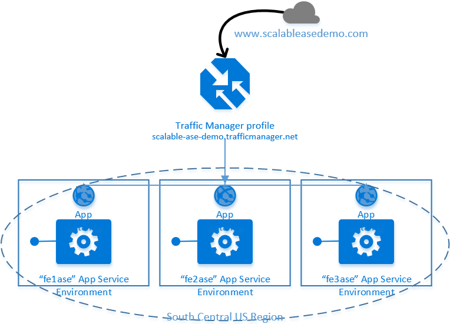
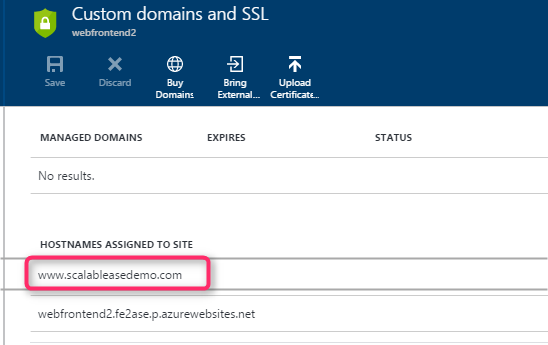
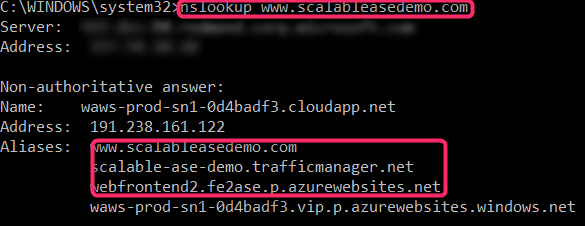

# Geo Distributed Scale with App Service Environments
## Overview
Application scenarios which require very high scale can exceed the compute resource capacity available to a single deployment of an app.  Voting applications, sporting events, and televised entertainment events are all examples of scenarios that require extremely high scale. High scale requirements can be met by horizontally scaling out apps, with multiple app deployments being made within a single region, as well as across regions, to handle extreme load requirements.

App Service Environments are an ideal platform for horizontal scale out.  Once an App Service Environment configuration has been selected that can support a known request rate, developers can deploy additional App Service Environments in "cookie cutter" fashion to attain a desired peak load capacity.

For example suppose an app running on an App Service Environment configuration has been tested to handle 20K requests per second (RPS).  If the desired peak load capacity is 100K RPS, then five (5) App Service Environments can be created and configured to ensure the application can handle the maximum projected load.

Since customers typically access apps using a custom (or vanity) domain, developers need a way to distribute app requests across all of the App Service Environment instances.  A great way to accomplish this is to resolve the custom domain using an [Azure Traffic Manager profile](https://azure.microsoft.com/documentation/articles/traffic-manager-manage-profiles/).  The Traffic Manager profile can be configured to point at all of the individual App Service Environments.  Traffic Manager will automatically handle distributing customers across all of the App Service Environments based on the load balancing settings in the Traffic Manager profile.  This approach works regardless of whether all of the App Service Environments are deployed in a single Azure region, or deployed worldwide across multiple Azure regions.

Furthermore, since customers access apps through the vanity domain, customers are unaware of the number of App Service Environments running an app.  As a result developers can quickly and easily add, and remove, App Service Environments based on observed traffic load.

The conceptual diagram below depicts an app horizontally scaled out across three App Service Environments within a single region.

 

The remainder of this topic walks through the steps involved with setting up a distributed topology for the sample app using multiple App Service Environments.

## Planning the Topology
Before building out a distributed app footprint, it helps to have a few pieces information ahead of time.

* **Custom domain for the app:**  What is the custom domain name that customers will use to access the app?  For the sample app the custom domain name is *www.scalableasedemo.com*
* **Traffic Manager domain:**  A domain name needs to be chosen when creating an [Azure Traffic Manager profile](https://azure.microsoft.com/documentation/articles/traffic-manager-manage-profiles/).  This name will be combined with the *trafficmanager.net* suffix to register a domain entry that is managed by Traffic Manager.  For the sample app, the name chosen is *scalable-ase-demo*.  As a result the full domain name that is managed by Traffic Manager is *scalable-ase-demo.trafficmanager.net*.
* **Strategy for scaling the app footprint:**  Will the application footprint be distributed across multiple App Service Environments in a single region?  Multiple regions?  A mix-and-match of both approaches?  The decision should be based on expectations of where customer traffic will originate, as well as how well the rest of an app's supporting back-end infrastructure can scale.  For example, with a 100% stateless application, an app can be massively scaled using a combination of multiple App Service Environments per Azure region,  multiplied by App Service Environments deployed across multiple Azure regions.  With 15+ public Azure regions available to choose from, customers can truly build a world-wide hyper-scale application footprint.  For the sample app used for this article, three App Service Environments were created in a single Azure region (South Central US).
* **Naming convention for the App Service Environments:**  Each App Service Environment requires a unique name.  Beyond one or two App Service Environments it is helpful to have a naming convention to help identify each App Service Environment.  For the sample app a simple naming convention was used.  The names of the three App Service Environments are *fe1ase*, *fe2ase*, and *fe3ase*.
* **Naming convention for the apps:**  Since multiple instances of the app will be deployed, a name is needed for each instance of the deployed app.  One little-known but very convenient feature of App Service Environments is that the same app name can be used across multiple App Service Environments.  Since each App Service Environment has a unique domain suffix, developers can choose to re-use the exact same app name in each environment.  For example a developer could have apps named as follows:  *myapp.foo1.p.azurewebsites.net*, *myapp.foo2.p.azurewebsites.net*, *myapp.foo3.p.azurewebsites.net*, etc...  For the sample app though each app instance also has a unique name.  The app instance names used are *webfrontend1*, *webfrontend2*, and *webfrontend3*.

## Setting up the Traffic Manager Profile
Once multiple instances of an app are deployed on multiple App Service Environments, the  individual app instances can be registered with Traffic Manager.  For the sample app a Traffic Manager profile is needed for *scalable-ase-demo.trafficmanager.net* that can route customers to any of the following deployed app instances:

* **webfrontend1.fe1ase.p.azurewebsites.net:**  An instance of the sample app deployed on the first App Service Environment.
* **webfrontend2.fe2ase.p.azurewebsites.net:**  An instance of the sample app deployed on the second App Service Environment.
* **webfrontend3.fe3ase.p.azurewebsites.net:**  An instance of the sample app deployed on the third App Service Environment.

The easiest way to register multiple Azure App Service endpoints, all running in the **same** Azure region, is with the preview Powershell [Azure Resource Manager (ARM) Traffic Manager support](https://azure.microsoft.com/documentation/articles/traffic-manager-powershell-arm/).  

The first step is to create an Azure Traffic Manager profile.  The code below shows how the profile was created for the sample app:

    $profile = New-AzureTrafficManagerProfile –Name scalableasedemo -ResourceGroupName yourRGNameHere -TrafficRoutingMethod Weighted -RelativeDnsName scalable-ase-demo -Ttl 30 -MonitorProtocol HTTP -MonitorPort 80 -MonitorPath "/"

Notice how the *RelativeDnsName* parameter was set to *scalable-ase-demo*.  This is how the domain name *scalable-ase-demo.trafficmanager.net* is created and associated with a Traffic Manager profile.

The *TrafficRoutingMethod* parameter defines the load balancing policy Traffic Manager will use to determine how to spread customer load across all of the available endpoints.  In this example the *Weighted* method was chosen.  This will result in customer requests being spread across all of the registered application endpoints based on the relative weights associated with each endpoint. 

With the profile created, each app instance is added to the profile as an *external endpoint*.  The code below shows the Urls for each of the three app instances being added to the profile.

    Add-AzureTrafficManagerEndpointConfig –EndpointName webfrontend1 –TrafficManagerProfile $profile –Type ExternalEndpoints –Target webfrontend1.fe1ase.p.azurewebsites.net –EndpointStatus Enabled –Weight 10
    Add-AzureTrafficManagerEndpointConfig –EndpointName webfrontend2 –TrafficManagerProfile $profile –Type ExternalEndpoints –Target webfrontend2.fe2ase.p.azurewebsites.net –EndpointStatus Enabled –Weight 10
    Add-AzureTrafficManagerEndpointConfig –EndpointName webfrontend3 –TrafficManagerProfile $profile –Type ExternalEndpoints –Target webfrontend3.fe3ase.p.azurewebsites.net –EndpointStatus Enabled –Weight 10

    Set-AzureTrafficManagerProfile –TrafficManagerProfile $profile

Notice how there is one call to *Add-AzureTrafficManagerEndpointConfig* for each individual app instance.  The *Target* parameter in each Powershell command points at the fully qualified domain name (FQDN) of each of the three deployed app instances. The different FQDNs are the values that will be used to walk the DNS CNAME chain for *scalable-ase-demo.trafficmanager.net* in order to spread traffic load across all endpoints registered in the Traffic Manager profile.

All of the three endpoints use the same value (10) for the *Weight* parameter.  This results in Traffic Manager spreading customer requests across all three app instances relatively evenly. 

*Note:*  Since ARM Traffic Manager support is currently in preview, Azure App Service endpoints have to set the *Type* parameter to *ExternalEndpoints*.  In the future Azure App Service endpoints will be natively supported as an endpoint type by the ARM variant of Traffic Manager.

## Pointing the App's Custom Domain at the Traffic Manager Domain
The final step necessary is to point the custom domain of the app at the Traffic Manager domain.  For the sample app this means pointing *www.scalableasedemo.com* at *scalable-ase-demo.trafficmanager.net*.  This step needs to be completed with the domain registrar that manages the custom domain.  

Using your registrar's domain management tools, a CNAME records needs to be created which points the custom domain at the Traffic Manager domain.  The picture below shows an example of what this CNAME configuration looks like:

 

Although not covered in this topic, remember that each individual app instance needs to have the custom domain registered with it as well.  Otherwise if a request makes it to an app instance, and the application does not have the custom domain registered with the app, the request will fail.  

In this example the custom domain is *www.scalableasedemo.com*, and each application instance has the custom domain associated with it.

 

For a recap of of registering a custom domain with Azure App Service apps, see the following article on [registering custom domains](https://azure.microsoft.com/en-us/documentation/articles/web-sites-custom-domain-name/).

## Trying out the Distributed Topology
The end result of the Traffic Manager and DNS configuration is that requests for *www.scalableasedemo.com* will flow through the following sequence:

1. A browser or device will make a DNS lookup for *www.scalableasedemo.com*
2. The CNAME entry at the domain registrar causes the DNS lookup to be redirected to Azure Traffic Manager.
3. A DNS lookup is made for *scalable-ase-demo.trafficmanager.net* against one of the Azure Traffic Manager DNS servers.
4. Based on the load balancing policy (the *TrafficRoutingMethod* parameter used earlier when creating the Traffic Manager profile), Traffic Manager will select one of the configured endpoints and return the FQDN of that endpoint to the browser or device.
5. Since the FQDN of the endpoint is the Url of an app instance running on an App Service Environment, the browser or device will ask a Microsoft Azure DNS server to resolve the FQDN to an IP address. 
6. The browser or device will send the HTTP/S request to the IP address.  
7. The request will arrive at one of the app instances running on one of the App Service Environments.

The console picture below shows a DNS lookup for the sample app's custom domain successfully resolving to an app instance running on one of the three sample App Service Environments (in this case the second of the three App Service Environments):

 

## Additional Links and Information
All articles and How-To's for App Service Environments are available in the [README for Application Service Environments](../app-service/app-service-app-service-environments-readme.md).

Documentation on the preview Powershell [Azure Resource Manager (ARM) Traffic Manager support](https://azure.microsoft.com/documentation/articles/traffic-manager-powershell-arm/).  

[!INCLUDE [app-service-web-whats-changed](../../includes/app-service-web-whats-changed.md)]

[!INCLUDE [app-service-web-try-app-service](../../includes/app-service-web-try-app-service.md)]

<!-- LINKS -->
[AzureTrafficManagerProfile]:  https://azure.microsoft.com/documentation/articles/traffic-manager-manage-profiles/
[ARMTrafficManager]:  https://azure.microsoft.com/documentation/articles/traffic-manager-powershell-arm/
[RegisterCustomDomain]:  https://azure.microsoft.com/en-us/documentation/articles/web-sites-custom-domain-name/

<!-- IMAGES -->
[ConceptualArchitecture]: ./media/app-service-app-service-environment-geo-distributed-scale/ConceptualArchitecture-1.png
[CNAMEforCustomDomain]:  ./media/app-service-app-service-environment-geo-distributed-scale/CNAMECustomDomain-1.png
[DNSLookup]:  ./media/app-service-app-service-environment-geo-distributed-scale/DNSLookup-1.png
[CustomDomain]:  ./media/app-service-app-service-environment-geo-distributed-scale/CustomDomain-1.png 
