# Create a Hello World Web App for Azure in IntelliJ
This tutorial shows how to create and deploy a basic Hello World application to Azure as a Web App by using the [Azure Toolkit for IntelliJ](../azure-toolkit-for-intellij.md). A basic JSP example is shown for simplicity, but highly similar steps would be appropriate for a Java servlet, as far as Azure deployment is concerned.

When you have completed this tutorial, your application will look similar to the following illustration when you view it in a web browser:

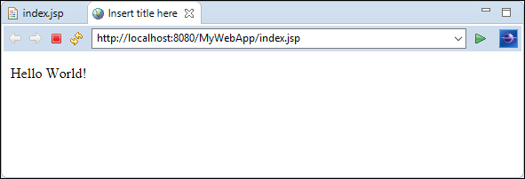

## Prerequisites
* A Java Developer Kit (JDK), v 1.8 or later.
* IntelliJ IDEA Ultimate Edition. This can be downloaded from [https://www.jetbrains.com/idea/download/index.html](https://www.jetbrains.com/idea/download/index.html).
* A distribution of a Java-based web server or application server, such as Apache Tomcat or Jetty.
* An Azure subscription, which can be acquired from [https://azure.microsoft.com/free/](https://azure.microsoft.com/free/) or [http://azure.microsoft.com/pricing/purchase-options/](http://azure.microsoft.com/pricing/purchase-options/).
* The Azure Toolkit for IntelliJ. For more information, see [Installing the Azure Toolkit for IntelliJ](../azure-toolkit-for-intellij-installation.md).

## To Create a Hello World Application
First, we'll start off with creating a Java project.

1. Start IntelliJ, and at the menu click **File**, then **New**, and then click **Project**.
   
   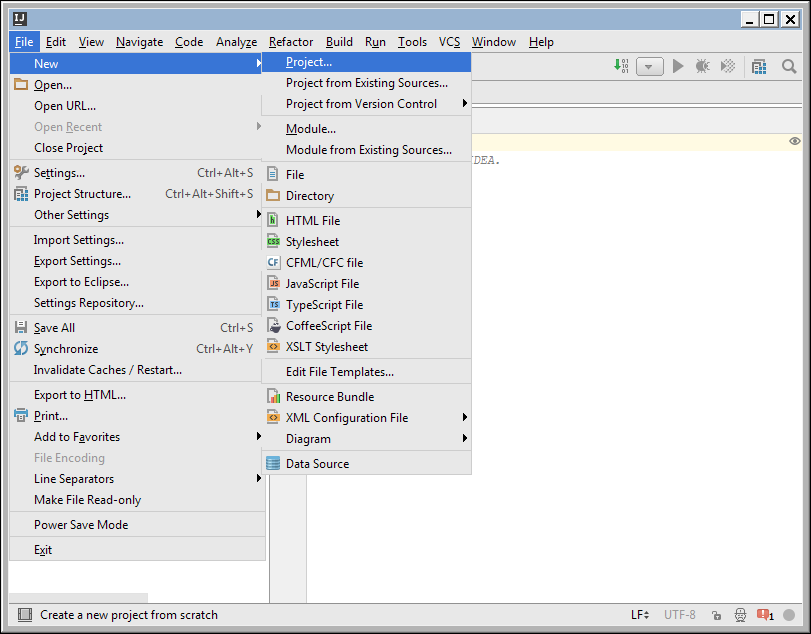
2. In the New Project dialog box, select **Java**, then **Web Application**, and then click **Next**.
   
   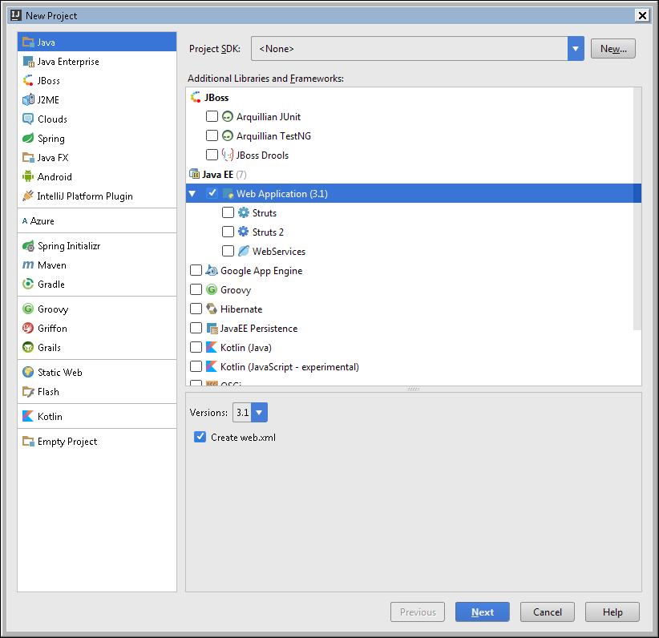
   
   If prompted to continue with no SDK assigned, click **Yes**.
   
   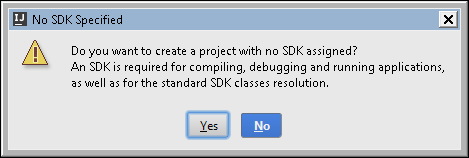
3. For purposes of this tutorial, name the project **Java-Web-App-On-Azure**, and then click **Finish**.
   
   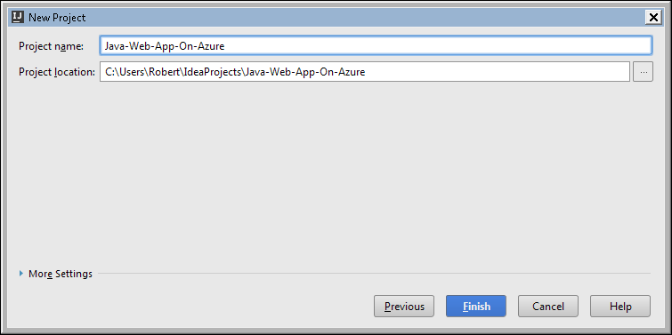
4. Within IntelliJ's Project Explorer view, expand **Java-Web-App-On-Azure**, then expand **web**, and then double-click **index.jsp**.
   
   
5. When your index.jsp file opens in IntelliJ, add in text to dynamically display **Hello World!** within the existing `<body>` element. Your updated `<body>` content should resemble the following example:
   
   `<body><b><% out.println("Hello World!"); %></b></body>` 
6. Save index.jsp.

## To Deploy your Application to an Azure Web App Container
There are several ways by which you can deploy a Java web application to Azure. This tutorial describes one of the simplest: your application will be deployed to an Azure Web App Container - no special project type nor additional tools are needed. The JDK and the web container software will be provided for you by Azure, so there is no need to upload your own; all you need is your Java Web App. As a result, the publishing process for your application will take seconds, not minutes.

1. In IntelliJ's Project Explorer, right-click the **Java-Web-App-On-Azure** project. When the context menu appears, select **Azure**, and then click **Publish as Azure Web App...**
   
   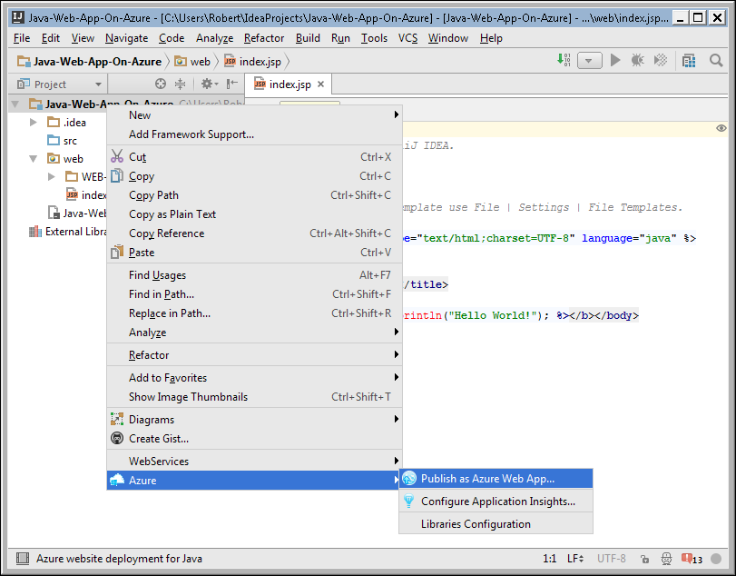
2. If you have not already signed into Azure from IntelliJ, you will be prompted to sign into your Azure account:
   
   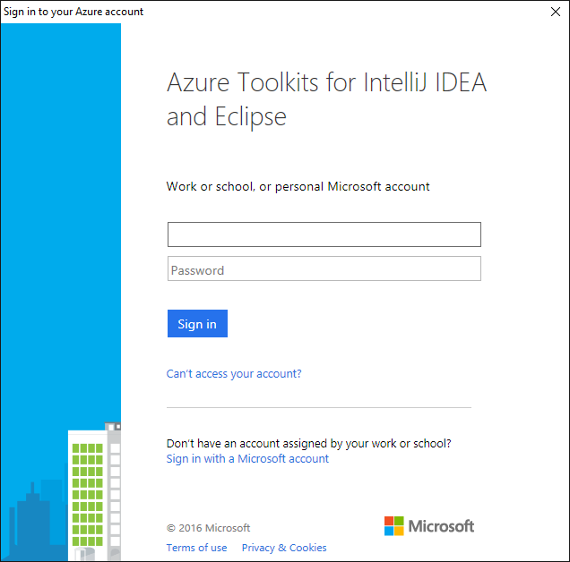
   
   Note: If you have multiple Azure accounts, some of the prompts during the sign in process may be shown more than once, even if they appear to be the same. When this happens, continue following the sign in instructions.
3. After you have successfully signed into your Azure account, the **Manage Subscriptions** dialog box will display a list of subscriptions that are associated with your credentials. If there are multiple subscriptions listed and you want to work with only a specific subset of them, you may optionally uncheck the ones you do want to use. When you have selected your subscriptions, click **Close**.
   
   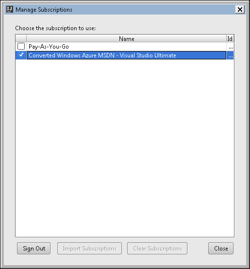
4. When the **Deploy to Azure Web App Container** dialog box appears, it will display any Web App containers that you have previously created; if you have not created any containers, the list will be empty.   
   
   
5. If you have not created an Azure Web App Container before, or if you would like to publish your application to a new container, use the following steps. Otherwise, select an existing Web App Container and skip to step 6 below.
   
   1. Click **+**
      
        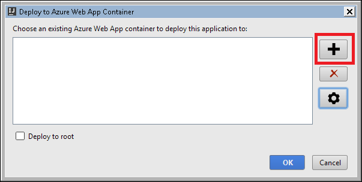
   2. The **New Web App Container** dialog box will be displayed, which will be used for the next several steps.
      
        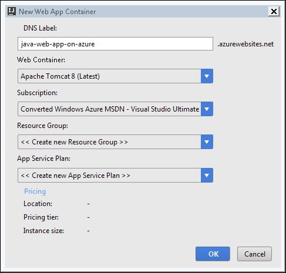
   3. Enter a **DNS Label** for your Web App Container; this will form the leaf DNS label of the host URL for your web application in Azure. Note: The name must be available and conform to Azure Web App naming requirements.
   4. In the **Web Container** drop-down menu, select the appropriate software for your application.
      
        Currently, you can choose from Tomcat 8, Tomcat 7 or Jetty 9. A recent distribution of the selected software will be provided by Azure, and it will run on a recent distribution of JDK 8 created by Oracle and provided by Azure.
   5. In the **Subscription** drop-down menu, select the subscription you want to use for this deployment.
   6. In the **Resource Group** drop-down menu, select the Resource Group with which you want to associate your Web App.
      
        Note: Azure Resource Groups allow you to group related resources together so that, for example, they can be deleted together.
      
        You can select an existing Resource Group (if you have any) and skip to step g below, or use the following these steps to create a new Resource Group:
      
      * Click **New...**
      * The **New Resource Group** dialog box will be displayed:
        
            ![][12]
      * In the the **Name** textbox, specify a name for your new Resource Group.
      * In the the **Region** drop-down menu, select the appropriate Azure data center location for your Resource Group.
      * Click **OK**.
   7. The **App Service Plan** drop-down menu lists the app service plans that are associated with the Resource Group that you selected.
      
        Note: An App Service Plan specifies information such as the location of your Web App, the pricing tier and the compute instance size. A single App Service Plan can be used for multiple Web Apps, which is why it is maintained separately from a specific Web App deployment.
      
        You can select an existing App Service Plan (if you have any) and skip to step h below, or use the following these steps to create a new App Service Plan:
      
      * Click **New...**
      * The **New App Service Plan** dialog box will be displayed:
        
            ![][13]
      * In the the **Name** textbox, specify a name for your new App Service Plan.
      * In the the **Location** drop-down menu, select the appropriate Azure data center location for the plan.
      * In the the **Pricing Tier** drop-down menu, select the appropriate pricing for the plan. For testing purposes you can choose **Free**.
      * In the the **Instance Size** drop-down menu, select the appropriate instance size for the plan. For testing purposes you can choose **Small**.
   8. Once you have completed all of the above steps, the New Web App Container dialog box should resemble the following illustration:
      
        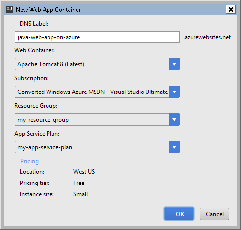
   9. Click **OK** to complete the creation of your new Web App container.
      
        Wait a few seconds for the list of the Web App containers to be refreshed, and your newly-created web app container should now be selected in the list.
6. You are now ready to complete the initial deployment of your Web App to Azure; click **OK** to deploy your Java application to the selected Web App container.
   
    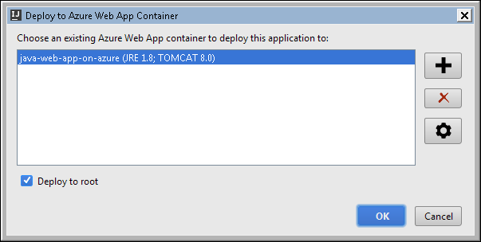
   
    Note: By default, your application will be deployed as a subdirectory of the application server. If you want it to be deployed as the root application, check the **Deploy to root** checkbox before clicking **OK**.
7. Next, you should see the **Azure Activity Log** view, which will indicate the deployment status of your Web App.
   
    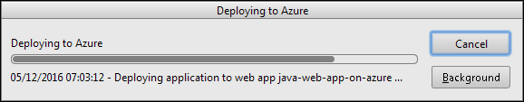
   
    The process of deploying your Web App to Azure should take only a few seconds to complete. When your application ready, you will see a link named **Published** in the **Status** column. When you click the link, it will take you to your deployed Web App's home page, or you can use the steps in the following section to browse to your web app.

## Browsing to your Web App on Azure
To brows to your Web App on Azure, you can use the **Azure Explorer** view.

If the **Azure Explorer** view is not already open, you can open it by clicking then **View** menu in IntelliJ, then click **Tool Windows**, and then click **Service Explorer**. If you have not previously logged in, it will prompt you to do so.

When the **Azure Explorer** view is displayed, use follow these steps to stop your Web App: 

1. Expand the **Azure** node.
2. Expand the **Web Apps** node. 
3. Right-click the desired Web App.
4. When the context menu appears, click **Open in Browser**.
   
    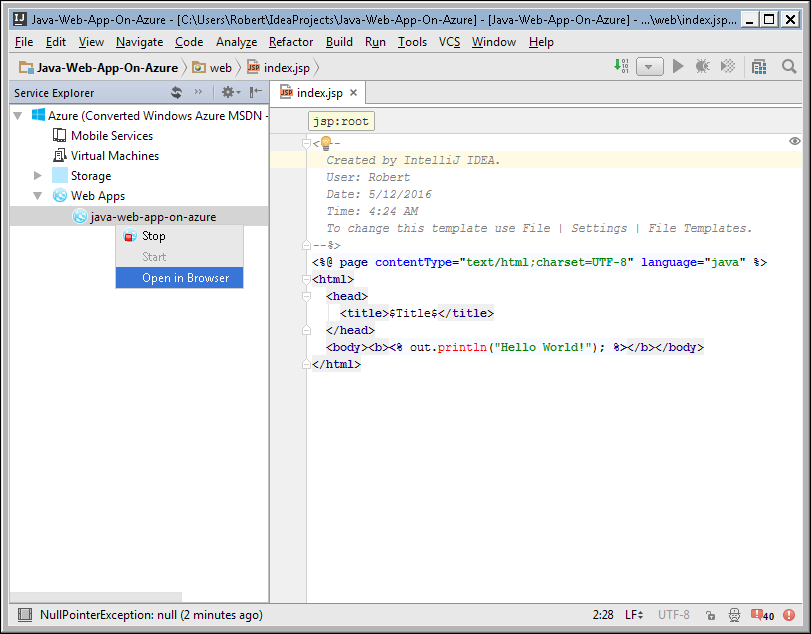

## Updating your Web App
Updating an existing running Azure Web App is a quick and easy process, and you have two options for updating:

* You can update the deployment of an existing Java Web App.
* You can publish an additional Java application to the same Web App Container.

In either case, the process is identical and takes only a few seconds:

1. In the IntelliJ project explorer, right-click the Java application you want to update or add to an existing Web App Container.
2. When the context menu appears, select **Azure** and then **Publish as Azure Web App...**
3. Since you have already logged in previously, you will see a list of your existing Web App containers. Select the one you want to publish or re-publish your Java application to and click **OK**.

A few seconds later, the **Azure Activity Log** view will show your updated deployment as **Published** and you will be able to verify your updated application in a web browser.

## Starting or Stopping an Existing Web App
To start or stop an existing Azure Web App container, (including all the deployed Java applications in it), you can use the **Azure Explorer** view.

If the **Azure Explorer** view is not already open, you can open it by clicking then **View** menu in IntelliJ, then click **Tool Windows**, and then click **Service Explorer**. If you have not previously logged in, it will prompt you to do so.

When the **Azure Explorer** view is displayed, use follow these steps to start or stop your Web App: 

1. Expand the **Azure** node.
2. Expand the **Web Apps** node. 
3. Right-click the desired Web App.
4. When the context menu appears, click **Start** or **Stop**. Note that the menu choices are context-aware, so you can only stop a running web app or start a web app which is not currently running.
   
    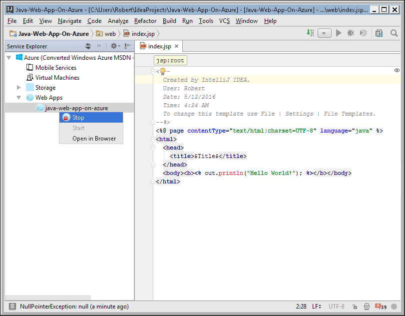

## Next Steps
For more information about the Azure Toolkits for Java IDEs, see the following links:

* [Azure Toolkit for Eclipse](../azure-toolkit-for-eclipse.md)
  * [Installing the Azure Toolkit for Eclipse](../azure-toolkit-for-eclipse-installation.md)
  * [Create a Hello World Web App for Azure in Eclipse](app-service-web-eclipse-create-hello-world-web-app.md)
  * [What's New in the Azure Toolkit for Eclipse](../azure-toolkit-for-eclipse-whats-new.md)
* [Azure Toolkit for IntelliJ](../azure-toolkit-for-intellij.md)
  * [Installing the Azure Toolkit for IntelliJ](../azure-toolkit-for-intellij-installation.md)
  * *Create a Hello World Web App for Azure in IntelliJ (This Article)*
  * [What's New in the Azure Toolkit for IntelliJ](../azure-toolkit-for-intellij-whats-new.md)

For more information about using Azure with Java, see the [Azure Java Developer Center](https://azure.microsoft.com/develop/java/).

For additional information about creating Azure Web Apps, see the [Web Apps Overview](app-service-web-overview.md).

[!INCLUDE [app-service-web-try-app-service](../../includes/app-service-web-try-app-service.md)]

<!-- URL List -->

[Azure Toolkit for Eclipse]: ../azure-toolkit-for-eclipse.md
[Azure Toolkit for IntelliJ]: ../azure-toolkit-for-intellij.md
[Create a Hello World Web App for Azure in Eclipse]: ./app-service-web-eclipse-create-hello-world-web-app.md
[Create a Hello World Web App for Azure in IntelliJ]: ./app-service-web-intellij-create-hello-world-web-app.md
[Installing the Azure Toolkit for Eclipse]: ../azure-toolkit-for-eclipse-installation.md
[Installing the Azure Toolkit for IntelliJ]: ../azure-toolkit-for-intellij-installation.md
[What's New in the Azure Toolkit for Eclipse]: ../azure-toolkit-for-eclipse-whats-new.md
[What's New in the Azure Toolkit for IntelliJ]: ../azure-toolkit-for-intellij-whats-new.md

[Azure Java Developer Center]: https://azure.microsoft.com/develop/java/
[Web Apps Overview]: ./app-service-web-overview.md

<!-- IMG List -->

[01]: ./media/app-service-web-intellij-create-hello-world-web-app/01-Web-Page.png
[02]: ./media/app-service-web-intellij-create-hello-world-web-app/02-File-New-Project.png
[03a]: ./media/app-service-web-intellij-create-hello-world-web-app/03-New-Project-Dialog.png
[03b]: ./media/app-service-web-intellij-create-hello-world-web-app/03-No-SDK-Specified.png
[04]: ./media/app-service-web-intellij-create-hello-world-web-app/04-New-Project-Dialog.png
[05]: ./media/app-service-web-intellij-create-hello-world-web-app/05-Open-Index-Page.png
[06]: ./media/app-service-web-intellij-create-hello-world-web-app/06-Azure-Publish-Context-Menu.png
[07]: ./media/app-service-web-intellij-create-hello-world-web-app/07-Azure-Log-In-Dialog.png
[08]: ./media/app-service-web-intellij-create-hello-world-web-app/08-Manage-Subscriptions.png
[09]: ./media/app-service-web-intellij-create-hello-world-web-app/09-App-Containers.png
[10]: ./media/app-service-web-intellij-create-hello-world-web-app/10-Add-App-Container.png
[11]: ./media/app-service-web-intellij-create-hello-world-web-app/11-New-App-Container.png
[12]: ./media/app-service-web-intellij-create-hello-world-web-app/12-New-Resource-Group.png
[13]: ./media/app-service-web-intellij-create-hello-world-web-app/13-New-App-Service-Plan.png
[14]: ./media/app-service-web-intellij-create-hello-world-web-app/14-New-App-Container.png
[15]: ./media/app-service-web-intellij-create-hello-world-web-app/15-Deploy-To-Azure.png
[16]: ./media/app-service-web-intellij-create-hello-world-web-app/16-Progress-Indicator.png
[17]: ./media/app-service-web-intellij-create-hello-world-web-app/17-Browse-Web-App.png
[18]: ./media/app-service-web-intellij-create-hello-world-web-app/18-Stop-Web-App.png
