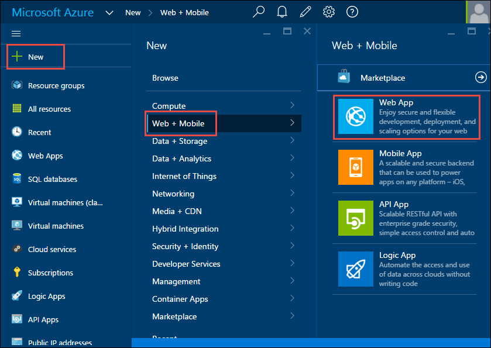
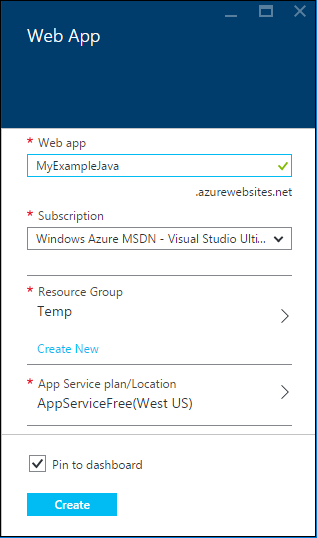
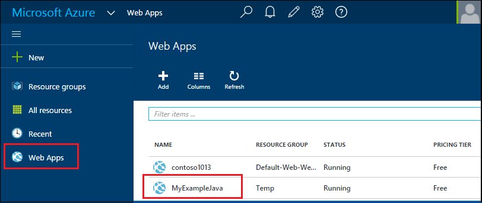
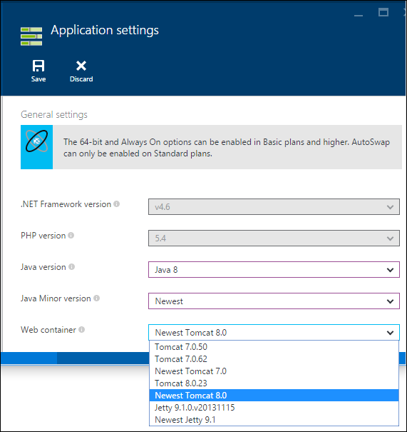
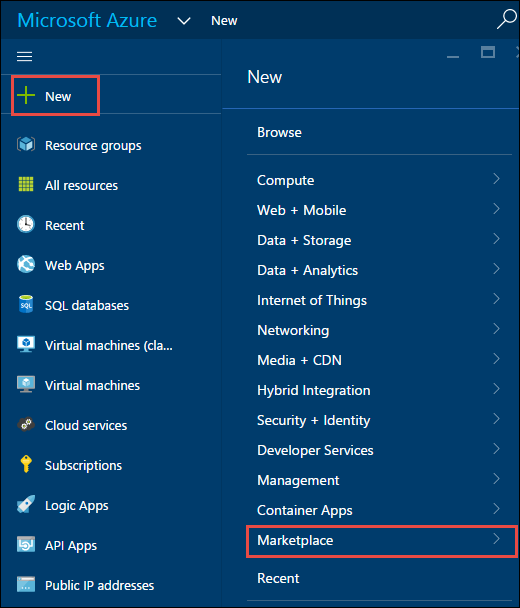
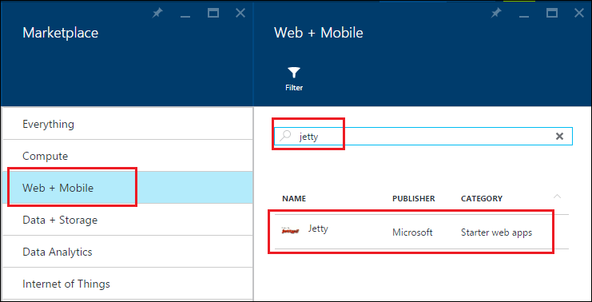
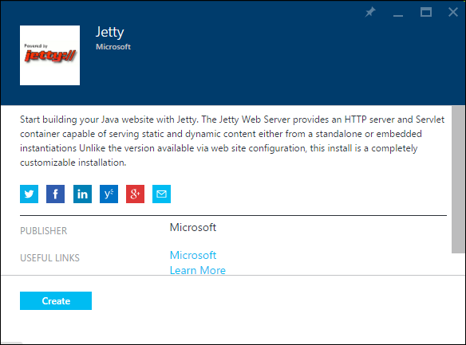
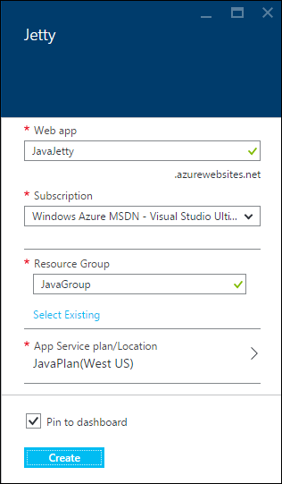
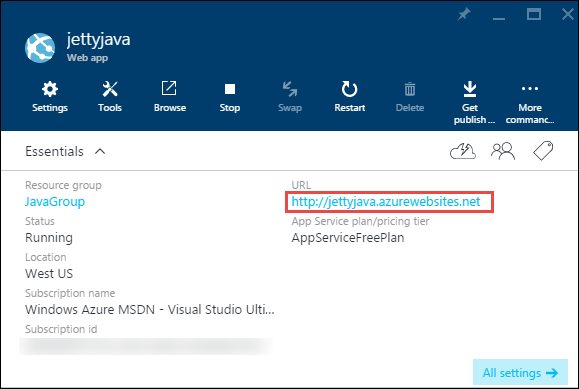

# Create a Java web app in Azure App Service
[!INCLUDE [tabs](../../includes/app-service-web-get-started-nav-tabs.md)]

This tutorial shows how to create a Java [web app in Azure App Service](http://go.microsoft.com/fwlink/?LinkId=529714) by using the [Azure Portal](https://portal.azure.com/). The Azure Portal is a web interface that you can use to manage your Azure resources.

> [!NOTE]
> To complete this tutorial, you need a Microsoft Azure account. If you don't have an account, you can [activate your Visual Studio subscriber benefits](http://go.microsoft.com/fwlink/?LinkId=623901) or [sign up for a free trial](http://go.microsoft.com/fwlink/?LinkId=623901).
> 
> If you want to get started with Azure App Service before you sign up for an Azure account, go to [Try App Service](http://go.microsoft.com/fwlink/?LinkId=523751). There, you can immediately create a short-lived starter web app in App Service; no credit card is required, and no commitments.
> 
> 

## Java application options
There are several ways you can set up a Java application in an App Service web app. 

1. Create an app and then configure **Application settings**.
   
    App Service provides several Tomcat and Jetty versions, with default configuration. If the application that you will be hosting will work with one of the built-in versions, this method of setting up a web container is the easiest, and is perfect when all you want to do is upload a war file to a web container. For this method, you create an app in the Azure Portal, and then go to the **Application settings** blade for your app to choose your version of Java along with the desired Java web container. When you use this method both Java and your web container are run from Program Files. The other methods put the web container and potentially the JVM in your disk space. When you use this model, you don't have access to edit files in this part of the file system. This means you can't do things like configure the *server.xml* file or place library files in the */lib* folder. For more information, see the [Create and configure a Java web app](#appsettings) section later in this tutorial.
2. Use a template from the Azure Marketplace.
   
    The Azure Marketplace includes templates that automatically create and configure Java web apps with Tomcat or Jetty web containers. The web containers that the templates create are configurable. For more information, see the [Use a Java template from the Azure Marketplace](#marketplace) section of this tutorial.
3. Create an app and then manually copy and edit configuration files 
   
    You might want to host a custom Java application that does not deploy in any of the web containers provided by App Service. For example:
   
   * Your Java application requires a version of Tomcat or Jetty that isn't directly supported by App Service or provided in the gallery.
   * Your Java application takes HTTP requests and does not deploy as a WAR into a pre-existing web container.
   * You want to configure the web container from scratch yourself. 
   * You want to use a version of Java that isn’t supported in App Service and want to upload it yourself.
     
     For cases like these, you can create an app using the Azure Portal, and then provide the appropriate runtime files manually. In this case, the files will be counted against your storage space quotas for your App Service plan. For more information, see [Upload a custom Java web app to Azure](web-sites-java-custom-upload.md).

##  Create and configure a Java web app
This section shows how to create a web app and configure it for Java using the **Application settings** blade of the portal.

1. Sign in to the [Azure Portal](https://portal.azure.com/).
2. Click **New > Web + Mobile > Web App**.
   
    
3. Enter a name for the web app in the **Web app** box.
   
    This name must be unique in the azurewebsites.net domain because the URL of the web app will be {name}.azurewebsites.net. If the name you enter isn't unique, a red exclamation mark appears in the text box.
4. Select a **Resource Group** or create a new one.
   
    For more information about resource groups, see [Using the Azure Portal to manage your Azure resources](../azure-portal/resource-group-portal.md).
5. Select an **App Service plan/Location** or create a new one.
   
    For more information about App Service plans, see [Azure App Service plans overview](../app-service/azure-web-sites-web-hosting-plans-in-depth-overview.md).
6. Click **Create**.
   
    
7. When the web app has been created, click **Web Apps > {your web app}**.
   
    
8. In the **Web app** blade, click **Settings**.
9. Click **Application settings**.
10. Choose the desired **Java version**. 
11. Choose the desired **Java minor version**. If you select **Newest**, your app will use the newest minor version that is available in App Service for that Java major version. The **Newest** item is unique to Java apps created from the **Application settings**. If you create your Java app from the gallery, then you have to manage your own container and JVM changes. 
12. Choose the desired **Web container**. If you select a container name that starts with **Newest**, your app will be kept at the latest version of that web container major version that is available in App Service. 
    
    
13. Click **Save**.
    
    Within a few moments, your web app will become Java-based and configured to use the web container that you selected.
14. Click **Web apps > {your new web app}**.
15. Click the **URL** to browse to the new site.
    
    The web page confirms that you have created a Java-based web app.

##  Use a Java template from the Azure Marketplace
This section shows how to use the Azure Marketplace to create a Java web app. The same general flow can also be used to create a Java-based mobile or API app. 

1. Sign in to the [Azure Portal](https://portal.azure.com/)
2. Click **New > Marketplace**.
   
    
3. Click **Web + Mobile**.
   
    You might have to scroll left to see the **Marketplace** blade where you can select **Web + Mobile**.
4. In the search text box, enter the name of a Java application server, such as **Apache Tomcat** or **Jetty**, and then press Enter.
5. In the search results, click the Java application server.
   
    
6. In the first **Apache Tomcat** or **Jetty** blade, click **Create**.
   
    
7. In the next **Apache Tomcat** or **Jetty** blade, enter a name for the web app in the **Web app** box.
   
    This name must be unique in the azurewebsites.net domain because the URL of the web app will be {name}.azurewebsites.net. If the name you enter isn't unique, a red exclamation mark appears in the text box.
8. Select a **Resource Group** or create a new one.
   
    For more information about resource groups, see [Using the Azure Portal to manage your Azure resources](../azure-portal/resource-group-portal.md).
9. Select an **App Service plan/Location** or create a new one.
   
    For more information about App Service plans, see [Azure App Service plans overview](../app-service/azure-web-sites-web-hosting-plans-in-depth-overview.md).
10. Click **Create**.
    
    
    
    In a short time, typically less than a minute, Azure finishes creating the new web app.
11. Click **Web apps > {your new web app}**.
12. Click the **URL** to browse to the new site.
    
    
    
    Tomcat ships with a default set of pages; if you chose Tomcat, you would see a page similar to the following example.
    
    
    
    If you chose Jetty, you would see a page similar to the following example. Jetty doesn’t have a default page set, so the same JSP that is used for an empty Java site is reused here.
    
    

Now that you've created the web app with an app container, see the [Next steps](#next-steps) section for information about how to upload your application to the web app.

## Next steps
At this point, you have a Java application server running in your web app in Azure App Service. To deploy your own code to the web app, see [Add an application or webpage to your Java web app](web-sites-java-add-app.md).

For more information about developing Java applications in Azure, see the [Java Developer Center](/develop/java/).

<!-- URL List -->

[Add an application or webpage to your Java web app]: ./web-sites-java-add-app.md
[Azure App Service plans overview]: ../app-service/azure-web-sites-web-hosting-plans-in-depth-overview.md
[Azure Portal]: https://portal.azure.com/
[activate your Visual Studio subscriber benefits]: http://go.microsoft.com/fwlink/?LinkId=623901
[sign up for a free trial]: http://go.microsoft.com/fwlink/?LinkId=623901
[Try App Service]: http://go.microsoft.com/fwlink/?LinkId=523751
[web app in Azure App Service]: http://go.microsoft.com/fwlink/?LinkId=529714
[Java Developer Center]: /develop/java/
[Using the Azure Portal to manage your Azure resources]: ../azure-portal/resource-group-portal.md
[Upload a custom Java web app to Azure]: ./web-sites-java-custom-upload.md

<!-- IMG List -->

[newwebapp]: ./media/web-sites-java-get-started/newwebapp.png
[newwebapp2]: ./media/web-sites-java-get-started/newwebapp2.png
[selectwebapp]: ./media/web-sites-java-get-started/selectwebapp.png
[versions]: ./media/web-sites-java-get-started/versions.png
[newmarketplace]: ./media/web-sites-java-get-started/newmarketplace.png
[webmobilejetty]: ./media/web-sites-java-get-started/webmobilejetty.png
[jettyblade]: ./media/web-sites-java-get-started/jettyblade.png
[jettyportalcreate2]: ./media/web-sites-java-get-started/jettyportalcreate2.png
[jettyurl]: ./media/web-sites-java-get-started/jettyurl.png
[tomcat]: ./media/web-sites-java-get-started/tomcat.png
[jetty]: ./media/web-sites-java-get-started/jetty.png
