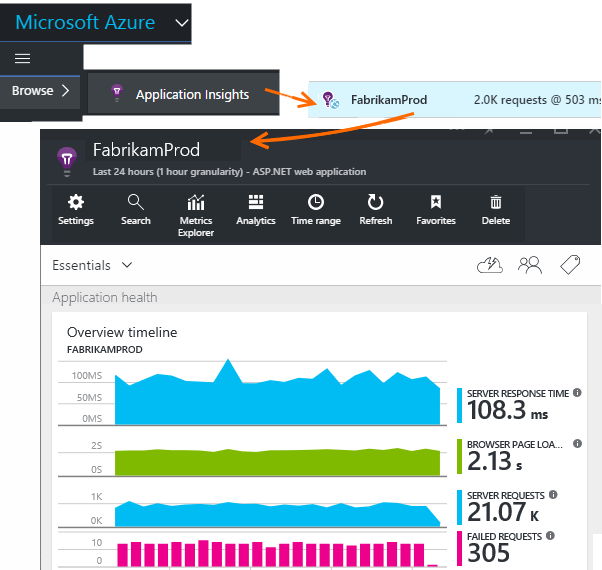
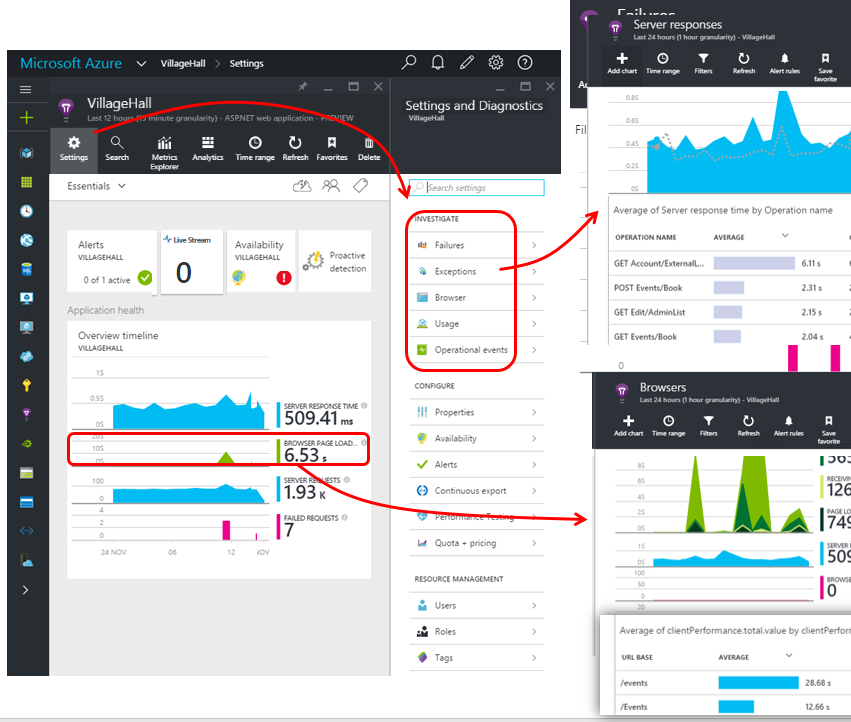
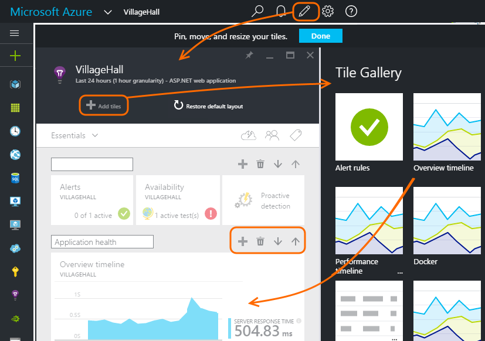
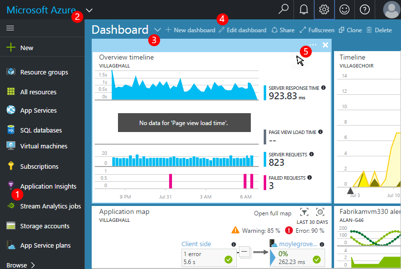
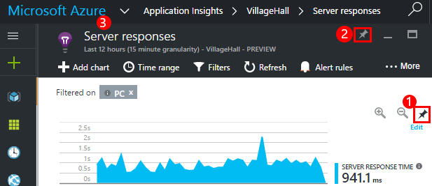
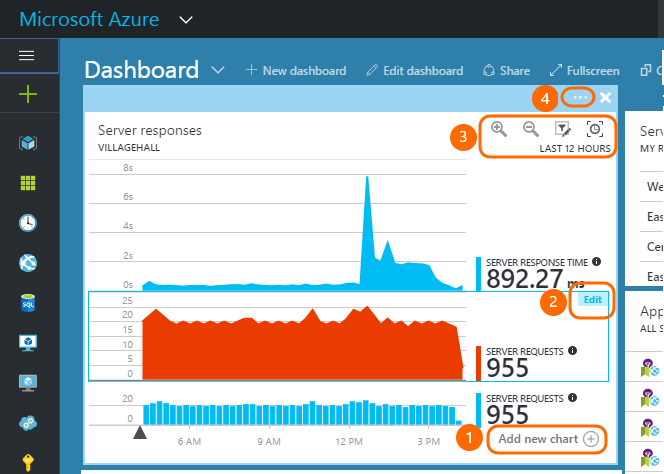
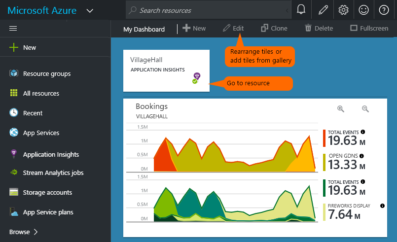
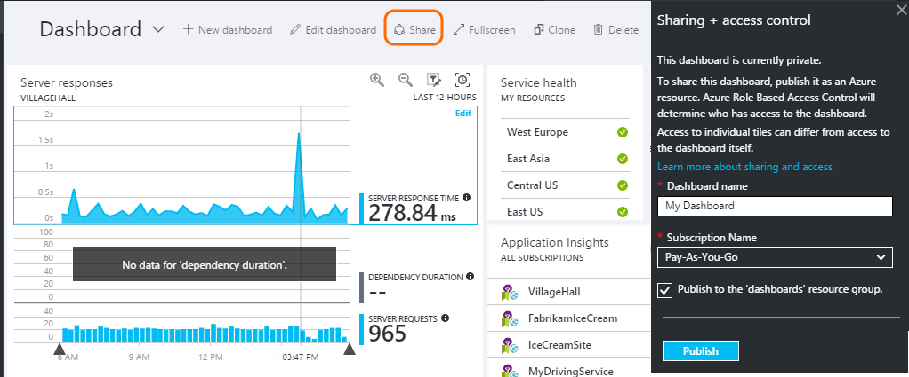
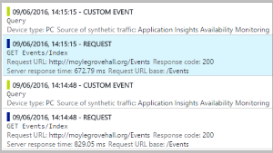
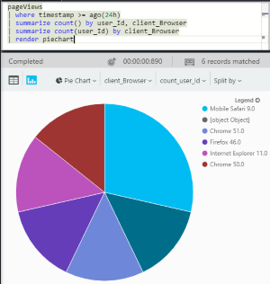

# Navigation and Dashboards in the Application Insights portal
After you have [set up Application Insights on your project](app-insights-overview.md), telemetry data about your app's performance and usage will appear in your project's Application Insights resource in the [Azure portal](https://portal.azure.com).

## Find your telemetry
Sign in to the [Azure portal](https://portal.azure.com) and browse to the Application Insights resource that you created for your app.

The overview page gives you some basic telemetry, plus links to more.
The contents depend on the type of your app, and can be customized.

## The app overview blade
The overview blade (page) for your app shows a summary of the key diagnostic metrics of your app, and is a gateway to the other features of the portal.

Click:

* **Any chart or tile** to see more detail about what's displayed on the chart.
* **Settings** to get to predefined blades of other metrics, as well as configuration pages.
* [**Metrics Explorer**](app-insights-metrics-explorer.md) to create metrics pages of your own choice.
* [**Search**](app-insights-diagnostic-search.md) to investigate specific instances of events such as requests, exceptions or log traces.
* [**Analytics**](app-insights-analytics.md) for powerful queries over your telemetry.
* [**Live Stream**](app-insights-metrics-explorer.md#live-stream) for a fixed set of near-instant metrics, useful when deploying a new build or debugging.

### Customize the overview blade
Choose what you want to see on the overview. In Customize, you can insert section titles, drag tiles and charts around, remove items, and add new tiles and charts from the gallery.

## Dashboards
The first thing you see after you sign in to the [Microsoft Azure portal](https://portal.azure.com) is a dashboard. Here you can bring together the charts that are most important to you across all your Azure resources, including telemetry from [Visual Studio Application Insights](app-insights-overview.md).

1. Edit, create and share dashboards using the dashboard toolbar.
2. Return to the current dashboard, or switch to other recent views.
3. Switch dashboards.
4. Create, edit and share dashboards.
5. Hover over a tile and then use its top bar to move, customize, or remove it.

## Add to a dashboard
When you're looking at a blade or set of charts that's particularly interesting, you can pin a copy of it to the dashboard. You'll see it next time you return there.

1. Pin chart to dashboard. A copy of the chart appears on the dashboard.
2. Pin the whole blade to the dashboard - it appears on the dashboard as a tile that you can click through.
3. Click the top left corner to return to the current dashboard. Then you can use the drop-down menu to return to the current view.

Notice that charts are grouped into tiles: a tile can contain more than one chart. You pin the whole tile to the dashboard.

## Adjust a tile on the dashboard
Once a tile is on the dashboard, you can adjust it.

1. Add a chart to the tile. 
2. Set the metric, group-by dimension and style (table, graph) of a chart.
3. Set the timespan and filter properties for the charts on the tile. You can set the chart's own timespan, or inherit from the timespan of the dashboard.
4. Set tile title.

Tiles pinned from metric explorer blades have more editing options than tiles pinned from an  Overview blade.

The original tile that you pinned isn't affected by your edits.

## Switch between dashboards
You can save more than one dashboard and switch between them. When you pin a chart or blade, they're added to the current dashboard.

For example, you might have one dashboard for displaying full screen in the team room, and another for general development.

On the dashboard, a blade appears as a tile: click it to go to the blade. A chart replicates the chart in its original location.

## Share dashboards with your team
When you've created a dashboard, you can share it with other users. 

Learn about [Roles and access control](app-insights-resources-roles-access-control.md).

## Settings
The Settings button on the overview blade is not only about configuration, but also provides a way into several types of chart.

* **Audit logs** - Review alerts and actions that have been performed on your app resource.
* [New support request](app-insights-get-dev-support.md) - Options for help with any aspect of Azure. For Application Insights, you can also get help by using the smiley button at top right of the window.
* [Application map](app-insights-dependencies.md#application-map) - Active map showing the components of your application, derived from the dependency information.
* [Live Metrics Stream](app-insights-metrics-explorer.md#live-metrics-stream) - Key metrics with a latency of about 1s, for monitoring a new release.
* **Failures** - Failed requests, failed dependency calls, and exceptions. [Editable metrics blade](app-insights-metrics-explorer.md).
* **Performance** - Response time, dependency response times. [Editable metrics blade](app-insights-metrics-explorer.md).
* [Servers](app-insights-web-monitor-performance.md) - Performance counters. Available if you [install Status Monitor](app-insights-monitor-performance-live-website-now.md).
* **Browser** - Page view and AJAX performance. Available if you [instrument your web pages](app-insights-javascript.md).
* **Usage** - Page view, user and session counts. Available if you [instrument your web pages](app-insights-javascript.md).
* **Getting started** - inline tutorial.
* **Properties** - instrumentation key, subscription and resource id.
* [Availability](app-insights-monitor-web-app-availability.md) - web test configuration and results.
* [Alerts](app-insights-alerts.md) - metric alert configuration.
* [Continuous export](app-insights-export-telemetry.md) - configure export of telemetry to Azure storage.
* [Performance testing](app-insights-monitor-web-app-availability.md#performance-tests) - set up a synthetic load on your website.
* [Quota and pricing](app-insights-pricing.md) and [ingestion sampling](app-insights-sampling.md).
* **API Access** - currently used to create [release annotations](app-insights-annotations.md) and for the Data Access API.
* [**Work Items**](app-insights-diagnostic-search.md#create-work-item) - connect to a work tracking system so that you can create bugs while inspecting telemetry.
* [**Users**](app-insights-resources-roles-access-control.md) - Manage who has access to your app resource.
* [**Roles**](app-insights-resources-roles-access-control.md) - manage what users can do.
* [**Tags**](../resource-group-using-tags.md) - organize Azure resources.
* [**Locks**](../resource-group-lock-resources.md) - lock Azure resources
* [**Export template**](app-insights-powershell.md) - export a definition of the Azure resource so that you can use it as a template to create new resources.

## What's next?
|  |  |
| --- | --- |
| [Metrics explorer](app-insights-metrics-explorer.md) Filter and segment metrics | |
| [Diagnostic search](app-insights-diagnostic-search.md) Find and inspect events, related events, and create bugs | |
| [Analytics](app-insights-analytics.md) Powerful query language | |

