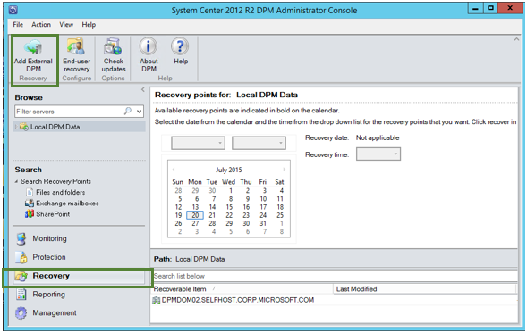
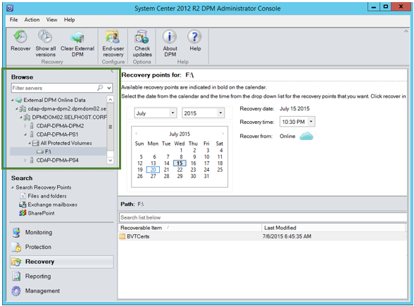
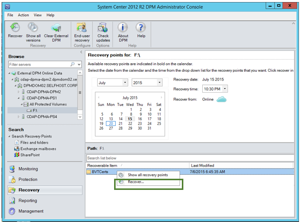
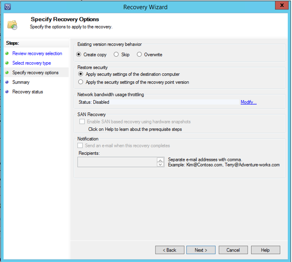
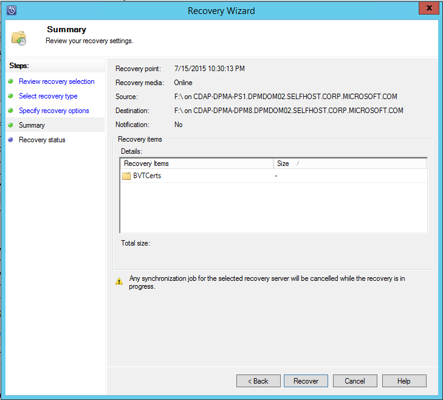
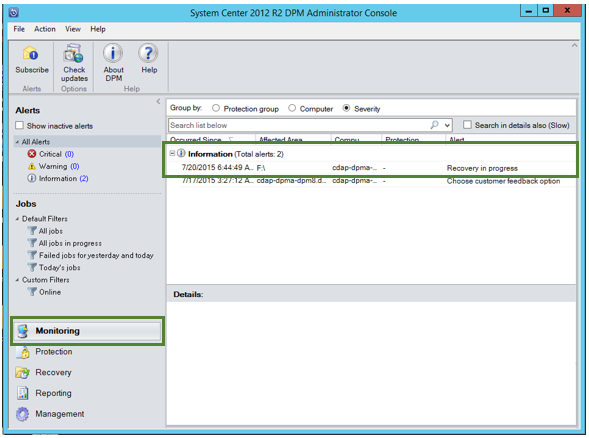
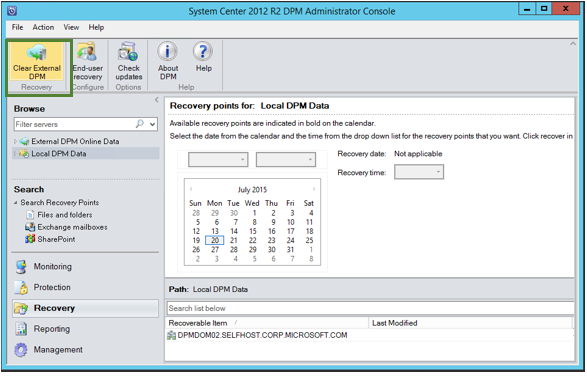

# Recovering data from another DPM server in the backup vault
You can now recover the data you've protected to an Azure Backup vault from any DPM server registered to that vault. The process for doing so is completely integrated into the DPM management console and is similar to the other recovery workflows.

To recover data from another DPM server inthe backup vault you'll need [System Center Data Protection Manager UR7](https://support.microsoft.com/en-us/kb/3065246) and the [latest Azure Backup agent](http://aka.ms/azurebackup_agent).

## Recover data from another DPM Server
To recover data from another DPM server:

1. From the **Recovery** tab of the DPM management console, click **'Add External DPM'** (at the top left of the screen).
   
    
2. Download new **vault credentials** from the vault associated with the **DPM server** where the data is being recovered, choose the DPM server from the list of DPM servers registered with the backup vault, and provide the **encryption passphrase** associated with the DPM server whose data is being recovered.
   
    
   
   > [!NOTE]
   > Only DPM servers associated with the same registration vault can recover each other’s data.
   > 
   > 
   
    Once the External DPM server is successfully added, you can browse the data of external DPM server and local DPM server from the **Recovery** tab.
3. Browse the available list of production servers protected by the external DPM server and select the appropriate data source.
   
    
4. Select **the month and year** from the **Recovery points** drop down, select the required **Recovery date** for when the recovery point was created, and select the **Recovery time**.
   
    A list of files and folders will appear in the bottom pane which can be browsed and recovered to any location.
   
    
5. Right click the appropriate item and click **Recover**.
   
    
6. Review the **Recover Selection**. Verify the data and time of the backup copy being recovered, as well as the source from which the backup copy was created. If the selection is incorrect, click **Cancel** to navigate back to recovery tab to select appropriate recovery point. If the selection is correct, click **Next**.
   
    
7. Select **Recover to an alternate location**. **Browse** to the correct location for the recovery.
   
    
8. Choose the option related to **create copy**, **Skip**, or **Overwrite**.
   
   * **Create copy** will create a copy of the file in the event there is a name collision.
   * **Skip** will skip recovering the file in the event there is a name collision.
   * **Overwrite** will overwrite the existing copying in the location specified in the event of a name collision.
     
     Choose the appropriate option to **Restore security**. You can apply the security settings of the destination computer where the data is being recovered or the security settings that were applicable to product at the time the recovery point was created.
     
     Identify whether a **Notification** will be sent once the recovery completes successfully.
     
     
9. The **Summary** screen lists the options chosen so far. Once you click **‘Recover’**, the data will be recovered to the appropriate on-premises location.
   
    
   
   > [!NOTE]
   > The recovery job can be monitored in the **Monitoring** tab of the DPM server.
   > 
   > 
   
    
10. You can click **Clear External DPM** on the **Recovery** tab of the DPM server to remove the view of the external DPM server.
    
    

## Troubleshooting Error Messages
| No. | Error Message | Troubleshooting steps |
|:---:|:--- |:--- |
| 1. |This server is not registered to the vault specified by the vault credential. |**Cause:** This error appears when the vault credential file selected does not belong to the backup vault associated with DPM server on which the recovery is attempted.   **Resolution:** Download the vault credential file from the backup vault to which the DPM server is registered. |
| 2. |Either the recoverable data is not available or the selected server is not a DPM server. |**Cause:** There are no other DPM servers with DPM 2012 R2 UR7 registered to the backup vault, or the DPM servers with DPM 2012 R2 UR7 have not yet uploaded the metadata, or the selected server is not DPM server (aka Windows Server or Windows Client).   **Resolution:** If there are other DPM servers registered to the backup vault, ensure SCDPM 2012 R2 UR7 and latest Azure Backup agent are installed.  If there are other DPM servers registered to the backup vault with DPM 2012 R2 UR7, wait for a day after installation of UR7 to start the recovery process. The nightly job will upload the metadata for all the previously protected backups to cloud. The data will be available for recovery. |
| 3. |No other DPM server is registered to this vault. |**Cause:** There are no other DPM servers with DPM 2012 R2 UR7 or above that are registered to the vault from which the recovery is being attempted. **Resolution:** If there are other DPM servers registered to the backup vault, ensure SCDPM 2012 R2 UR7 and latest Azure Backup agent are installed. If there are other DPM servers registered to the backup vault with DPM 2012 R2 UR7, wait for a day after installation of UR7 to start the recovery process. The nightly job will upload the metadata for all the previously protected backups to cloud. The data will be available for recovery. |
| 4. |The encryption passphrase provided does not match with passphrase associated with the following server: **<server name>** |**Cause:** The encryption passphrase used in the process of encrypting the data from the DPM server’s data that is being recovered does not match the encryption passphrase provided. The agent is unable to decrypt the data. Hence the recovery fails. **Resolution:** Please provide the exact same encryption passphrase associated with the DPM server whose data is being recovered. |

## Frequently asked questions:
1. **Why can’t I add an external DPM server from another DPM server after installing the UR7 and latest Azure Backup agent?**
   
    A) For the existing DPM servers with data sources that are protected to the cloud (by using an update rollup earlier than Update Rollup 7), you have to wait at least one day after installing the UR7 and latest Azure Backup agent to start *Add External DPM server*. This is needed to upload the metadata of the DPM protection groups to Azure. This occurs the first time through a nightly job.
2. **What is the minimum version of Azure Backup agent needed?**
   
    A) The Azure Backup agent minimum version to enable this feature is 2.0.8719.0.  Azure Backup agent version can be verified by navigating to Control Panel **>** All Control Panel items **>** Programs and features **>** Microsoft Azure Recovery Services Agent. If the version is less than 2.0.8719.0, download the [latest Azure Backup agent](https://go.microsoft.com/fwLink/?LinkID=288905) and install.
   
    

## Next Steps:
•    [Azure Backup FAQ](backup-azure-backup-faq.md)

