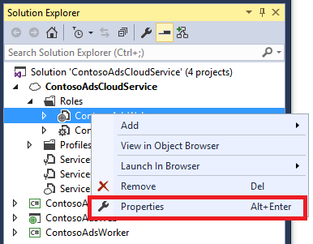
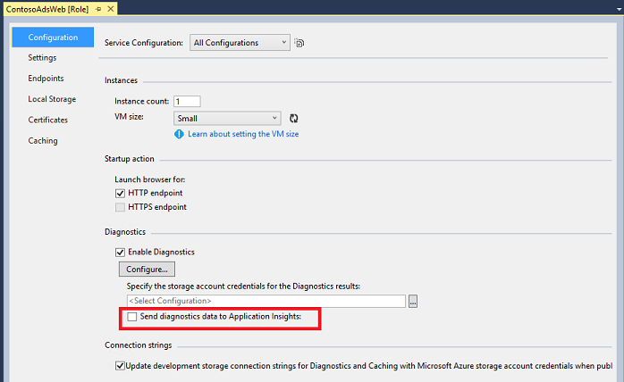
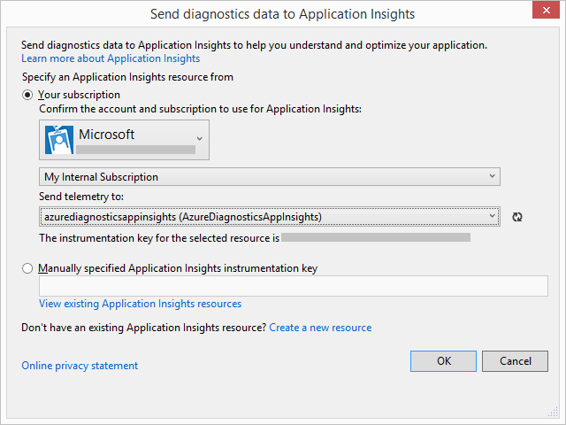
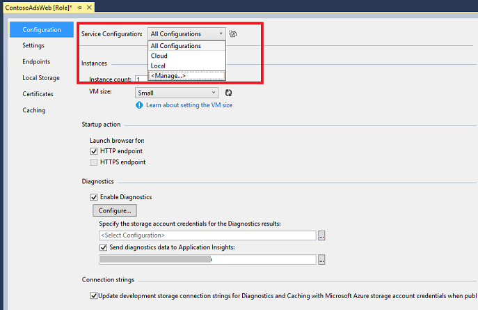
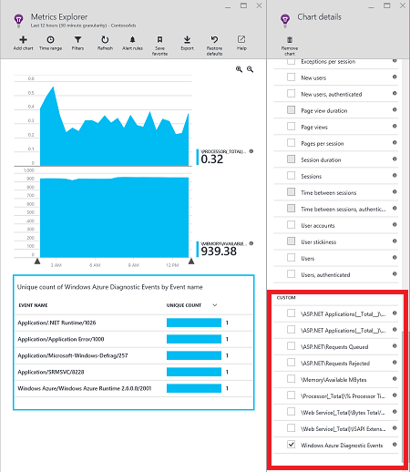
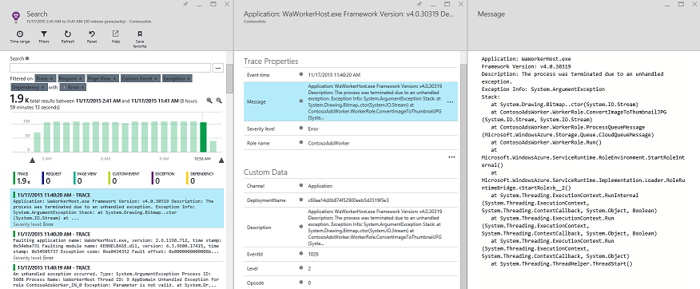

# Troubleshoot Cloud Services using Application Insights
With [Azure SDK 2.8](https://azure.microsoft.com/downloads/) and Azure diagnostics extension 1.5 you can now send your Azure Diagnostics data for your Cloud Service directly to Application Insights. The various types of logs collected by Azure Diagnostics including application logs, windows event logs, ETW logs and performance counters can now be sent to Application Insights and visualized in the Application Insights portal UI. When used along with the Application Insights SDK you can now get insights into metrics and logs coming from your application as well as the system and infrastructure level data coming from Azure Diagnostics.

## Configure Azure Diagnostics to send data to Application Insights
Follow these steps to setup your cloud service project to send Azure Diagnostics data to Application Insights.

1) In Visual Studio Solution Explorer right-click on a role and select **properties** to open the Role designer

2) In Role designer under the diagnostics section select the check box to **Send diagnostics data to Application Insights**

3) In the dialog that pops up select the Application Insights Resource that you would like to send the Azure diagnostics data to. The dialog allows you to select an existing Application Insights resource from your subscription or manually specify an instrumentation key for an Application Insights resource. If you don't have an existing Application Insights resource then you can create on by clicking on the **Create a new resource** link which will open a browser window to the Azure classic portal where you can create an Application Insights Resource. For more information on creating an Application Insights resource see [Create a new Application Insights resource](../application-insights/app-insights-create-new-resource.md)

4) Once you have added the Application Insights resource, the instrumentation key for that resource is stored as a service configuration setting with the name **APPINSIGHTS_INSTRUMENTATIONKEY**. You can change this configuration setting for each service configuration or environment by selecting a different configuration from the Service configuration drop down and specifying a new instrumentation key for that configuration.

The **APPINSIGHTS_INSTRUMENTATIONKEY** configuration setting is used by Visual Studio to configure the diagnostics extension with the appropriate Application Insights resource information during publishing. The configuration setting is a convenient way of defining different instrumentation keys for different service configurations. Visual Studio will translate that setting and insert it into the diagnostics extension public configuration when publishing. To simplify the process of configuring the diagnostics extension with PowerShell, the package output from Visual Studio also contains the public configuration XML with the appropriate Application Insights instrumentation key included. The public config files are created in the Extensions folder and follow the pattern PaaSDiagnostics.<RoleName>.PubConfig.xml. Any PowerShell based deployments can use this pattern to map each configuration to a Role.

5) Enabling the **Send diagnostics data to Application Insights** will automatically configure Azure diagnostics to send all performance counters and error level logs that are being collected by the Azure diagnostics agent to Application Insights. If you want to further configure what data is sent to Application Insights then you need to manually edit the *diagnostics.wadcfgx* file for each role. See [Configure Azure Diagnostics to send data to Application Insights](../azure-diagnostics-configure-applicationinsights.md) to learn more about manually updating the configuration.

Once the Cloud Service is configured to send Azure diagnostics data to application insights you can deploy it to Azure like you normally would making sure the Azure diagnostics extension is enabled. See [Publishing a Cloud Service using Visual Studio](../vs-azure-tools-publishing-a-cloud-service.md).  

## Viewing Azure diagnostics data in Application Insights
The Azure diagnostic telemetry will show up in the Application Insights resource configured for your cloud service.

The following is how the various Azure diagnostics log types map to Application Insights concepts:  

* Performance Counters are displayed as Custom Metrics in Application Insights
* Windows Event Logs are shown as Traces and Custom Events in Application Insights
* Application Logs, ETW Logs and any Diagnostics Infrastructure logs are shown as Traces in Application Insights.

To view Azure diagnostics data in Application Insights:

* Use [Metrics explorer](../application-insights/app-insights-metrics-explorer.md) to visualize any custom performance counters or counts of different types of windows event log events.

* Use [Search](../application-insights/app-insights-diagnostic-search.md) to search across the various trace logs sent by Azure Diagnostics. For example if you had an unhandled exception in a Role which caused the Role to crash and recycle that information would show up in the *Application* channel of *Windows Event Log*. You can use the Search functionality to look at the Windows Event Log error and get the full stack trace for the exception enabling you to find the root cause of the issue.

## Next Steps
* [Add the Application Insights SDK to your cloud service](../application-insights/app-insights-cloudservices.md) to send data about requests, exceptions, dependencies, and any custom telemetry from your application. Combined with the Azure Diagnostics data you can get a complete view of your application and system all in the same Application Insight resource.  

<!--Image references-->
[1]: ./media/cloud-services-dotnet-diagnostics-applicationinsights/solution-explorer-properties.png
[2]: ./media/cloud-services-dotnet-diagnostics-applicationinsights/role-designer-sendtoappinsights.png
[3]: ./media/cloud-services-dotnet-diagnostics-applicationinsights/select-appinsights-resource.png
[4]: ./media/cloud-services-dotnet-diagnostics-applicationinsights/role-designer-appinsights-serviceconfig.png
[5]: ./media/cloud-services-dotnet-diagnostics-applicationinsights/metrics-explorer-custom-metrics.png
[6]: ./media/cloud-services-dotnet-diagnostics-applicationinsights/search-windowseventlog-error.png
