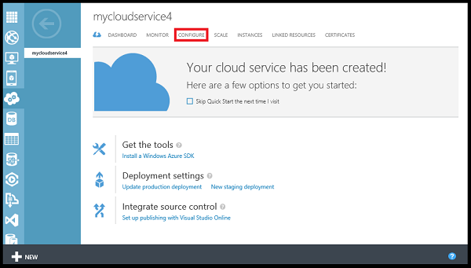

# How to Configure Cloud Services
> [!div class="op_single_selector"]
> * [Azure portal](cloud-services-how-to-configure-portal.md)
> * [Azure classic portal](cloud-services-how-to-configure.md)
> 
> 

You can configure the most commonly used settings for a cloud service in the Azure classic portal. Or, if you like to update your configuration files directly, download a service configuration file to update, and then upload the updated file and update the cloud service with the configuration changes. Either way, the configuration updates are pushed out to all role instances.

The Azure classic portal also allows you to [enable Remote Desktop Connection for a Role in Azure Cloud Services](cloud-services-role-enable-remote-desktop.md)

Azure can only ensure 99.95 percent service availability during the configuration updates if you have at least two role instances for every role. That enables one virtual machine to process client requests while the other is being updated. For more information, see [Service Level Agreements](https://azure.microsoft.com/support/legal/sla/).

## Change a cloud service
1. In the [Azure classic portal](http://manage.windowsazure.com/), click **Cloud Services**, click the name of the cloud service, and then click **Configure**.
   
    
   
    On the **Configure** page, you can configure monitoring, update role settings, and choose the guest operating system and family for role instances. 
2. In **monitoring**, set the monitoring level to Verbose or Minimal, and configure the diagnostics connection strings that are required for verbose monitoring.
3. For service roles (grouped by role), you can update the following settings:
   
   > **Settings**  
   > Modify the values of miscellaneous configuration settings that are specified in the *ConfigurationSettings* elements of the service configuration (.cscfg) file.
   > 
   > **Certificates**  
   > Change the certificate thumbprint that's being used in SSL encryption for a role. To change a certificate, you must first upload the new certificate (on the **Certificates** page). Then update the thumbprint in the certificate string displayed in the role settings.
   > 
4. In **operating system**, you can change the operating system family or version for role instances, or choose **Automatic** to enable automatic updates of the current operating system version. The operating system settings apply to web roles and worker roles, but do not affect Virtual Machines.
   
    During deployment, the most recent operating system version is installed on all role instances, and the operating systems are updated automatically by default. 
   
    If you need for your cloud service to run on a different operating system version because of compatibility requirements in your code, you can choose an operating system family and version. When you choose a specific operating system version, automatic operating system updates for the cloud service are suspended. You will need to ensure the operating systems receive updates.
   
    If you resolve all compatibility issues that your apps have with the most recent operating system version, you can enable automatic operating system updates by setting the operating system version to **Automatic**. 
   
    
5. To save your configuration settings, and push them to the role instances, click **Save**. (Click **Discard** to cancel the changes.) **Save** and **Discard** are added to the command bar after you change a setting.

## Update a cloud service configuration file
1. Download a cloud service configuration file (.cscfg) with the current configuration. On the **Configure** page for the cloud service, click **Download**. Then click **Save**, or click **Save As** to save the file.
2. After you update the service configuration file, upload and apply the configuration updates:
   
   1. On the **Configure** page, click **Upload**.
      
       
   2. In **Configuration file**, use **Browse** to select the updated .cscfg file.
   3. If your cloud service contains any roles that have only one instance, select the **Apply configuration even if one or more roles contain a single instance** check box to enable the configuration updates for the roles to proceed.
      
       Unless you define at least two instances of every role, Azure cannot guarantee at least 99.95 percent availability of your cloud service during service configuration updates. For more information, see [Service Level Agreements](https://azure.microsoft.com/support/legal/sla/).
   4. Click **OK** (checkmark). 

## Next steps
* Learn how to [deploy a cloud service](cloud-services-how-to-create-deploy.md).
* Configure a [custom domain name](cloud-services-custom-domain-name.md).
* [Manage your cloud service](cloud-services-how-to-manage.md).
* [Enable Remote Desktop Connection for a Role in Azure Cloud Services](cloud-services-role-enable-remote-desktop.md)
* Configure [ssl certificates](cloud-services-configure-ssl-certificate.md).

