# Testing the Performance of a Cloud Service Locally in the Azure Compute Emulator Using the Visual Studio Profiler
A variety of tools and techniques are available for testing the performance of cloud services.
When you publish a cloud service to Azure, you can have Visual Studio collect profiling
data and then analyze it locally, as described in [Profiling an Azure Application](http://msdn.microsoft.com/library/azure/hh369930.aspx).
You can also use diagnostics to track a variety of performance
counters, as described in [Using performance counters in Azure](http://msdn.microsoft.com/library/azure/hh411542.aspx).
You might also want to profile your application locally in the compute emulator before deploying it to the cloud.

This article covers the CPU Sampling method of profiling, which can be done locally in the emulator. CPU sampling is a method of profiling that is not very intrusive. At a designated sampling interval, the profiler takes a snapshot of the call stack. The data is collected over a period of time, and shown in a report. This method of profiling tends to indicate where in a computationally intensive application most of the CPU work is being done.  This gives you the opportunity to focus on the "hot path" where your application is spending the most time.

## 1: Configure Visual Studio for profiling
First, there are a few Visual Studio configuration options that might be helpful when profiling. To make sense of the profiling reports, you'll need symbols (.pdb files) for your application and also symbols for system libraries. You'll want to make sure that you reference the available symbol servers. To do this, on the **Tools** menu in Visual Studio, choose **Options**, then choose **Debugging**, then **Symbols**. Make sure that Microsoft Symbol Servers is listed under **Symbol file (.pdb) locations**.  You can also reference http://referencesource.microsoft.com/symbols, which might have additional symbol files.

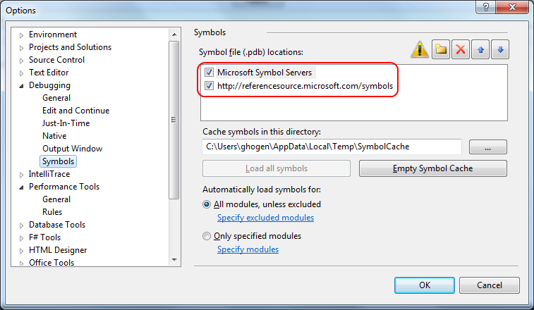

If desired, you can simplify the reports that the profiler generates by setting Just My Code. With Just My Code enabled, function call stacks are simplified so that calls entirely internal to libraries and the .NET Framework are hidden from the reports. On the **Tools** menu, choose **Options**. Then expand the **Performance Tools** node, and choose **General**. Select the checkbox for **Enable Just My Code for profiler reports**.

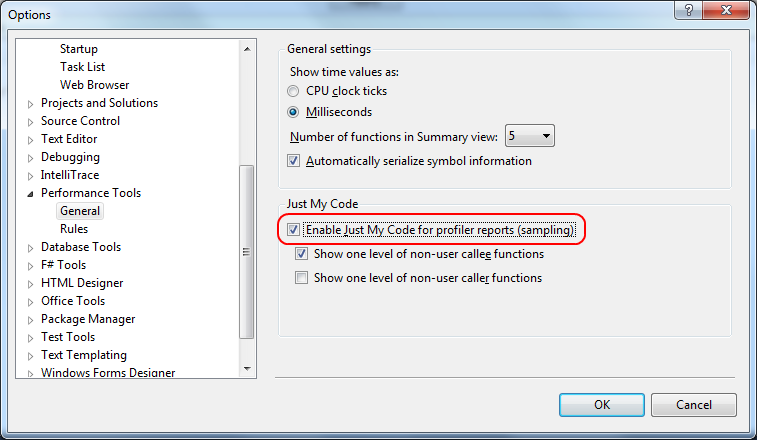

You can use these instructions with an existing project or with a new project.  If you create a new project to try the techniques described below, choose a C# **Azure Cloud Service** project, and select a **Web Role** and a **Worker Role**.

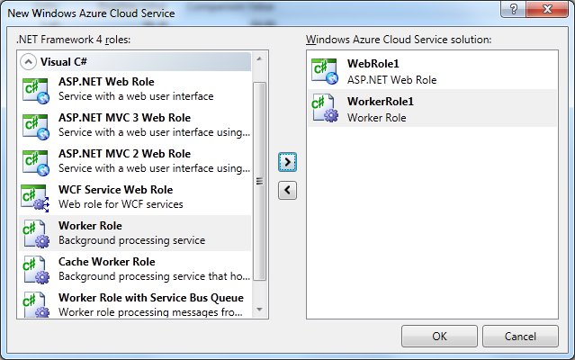

For example purposes, add some code to your project that takes
a lot of time and demonstrates some obvious performance problem. For example, add the following code to a worker role project:

    public class Concatenator
    {
        public static string Concatenate(int number)
        {
            int count;
            string s = "";
            for (count = 0; count < number; count++)
            {
                s += "\n" + count.ToString();
            }
            return s;
        }
    }

Call this code from the RunAsync method in the worker role's RoleEntryPoint-derived class. (Ignore the warning about the method running synchronously.)

        private async Task RunAsync(CancellationToken cancellationToken)
        {
            // TODO: Replace the following with your own logic.
            while (!cancellationToken.IsCancellationRequested)
            {
                Trace.TraceInformation("Working");
                Concatenator.Concatenate(10000);
            }
        }

Build and run your cloud service locally without debugging (Ctrl+F5), with the solution configuration set to **Release**. This ensures that all files and folders are created for running the application locally, and ensures that all the emulators are started. Start the Compute Emulator UI from the taskbar to verify that your worker role is running.

## 2: Attach to a process
Instead of profiling the application by starting it from the Visual Studio 2010 IDE, you must attach the profiler to a running process. 

To attach the profiler to a process, on the **Analyze** menu, choose **Profiler** and **Attach/Detach**.

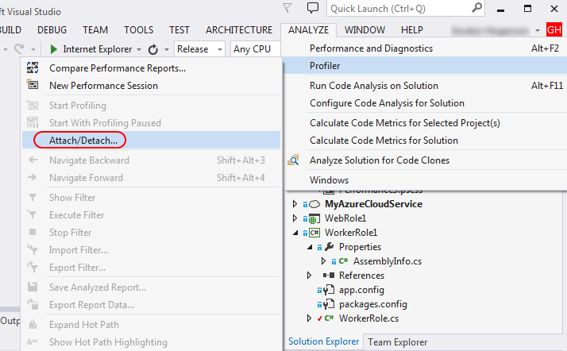

For a worker role, find the WaWorkerHost.exe process.

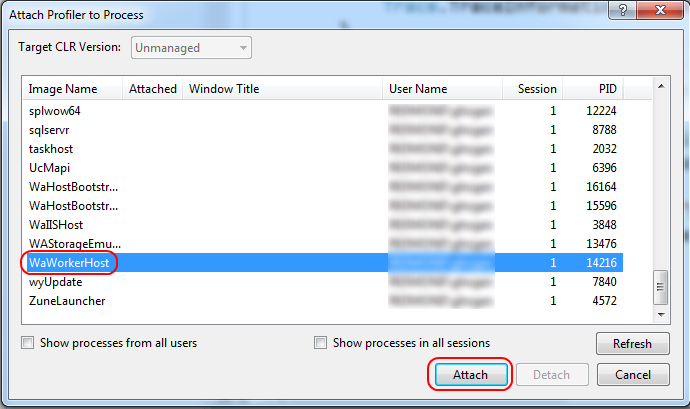

If your project folder is on a network drive, the profiler will ask you to provide another location to save the profiling reports.

 You can also attach to a web role by attaching to WaIISHost.exe.
 If there are multiple worker role processes in your application, you need to use the processID to distinguish them. You can query the processID programmatically by accessing the Process object. For example, if you add this code to the Run method of the RoleEntryPoint-derived class in a role, you can look at the
log in the Compute Emulator UI to know what process to connect to.

    var process = System.Diagnostics.Process.GetCurrentProcess();
    var message = String.Format("Process ID: {0}", process.Id);
    Trace.WriteLine(message, "Information");

To view the log, start the Compute Emulator UI.

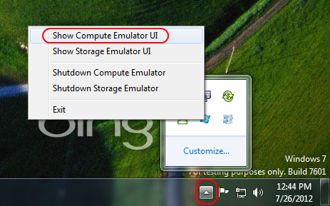

Open the worker role log console window in the Compute Emulator UI by clicking on the console window's title bar. You can see the process ID in the log.

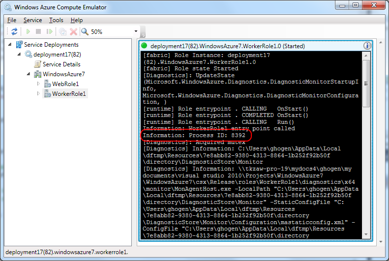

One you've attached, perform the steps in your application's UI (if needed) to reproduce the scenario.

When you want to stop profiling, choose the **Stop Profiling** link.

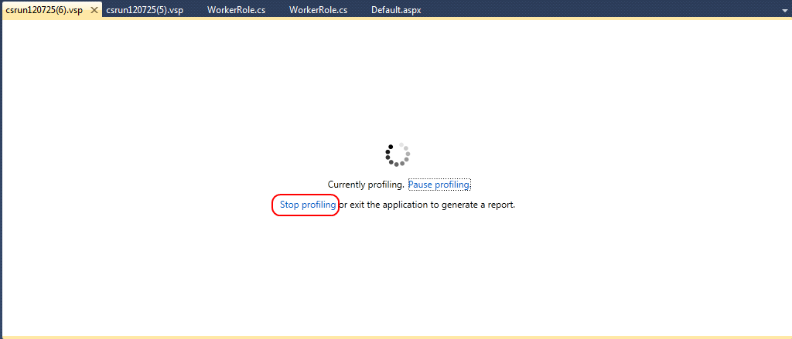

## 3: View performance reports
The performance report for your application is displayed.

At this point, the profiler stops executing, saves data in a .vsp file, and displays a report
that shows an analysis of this data.

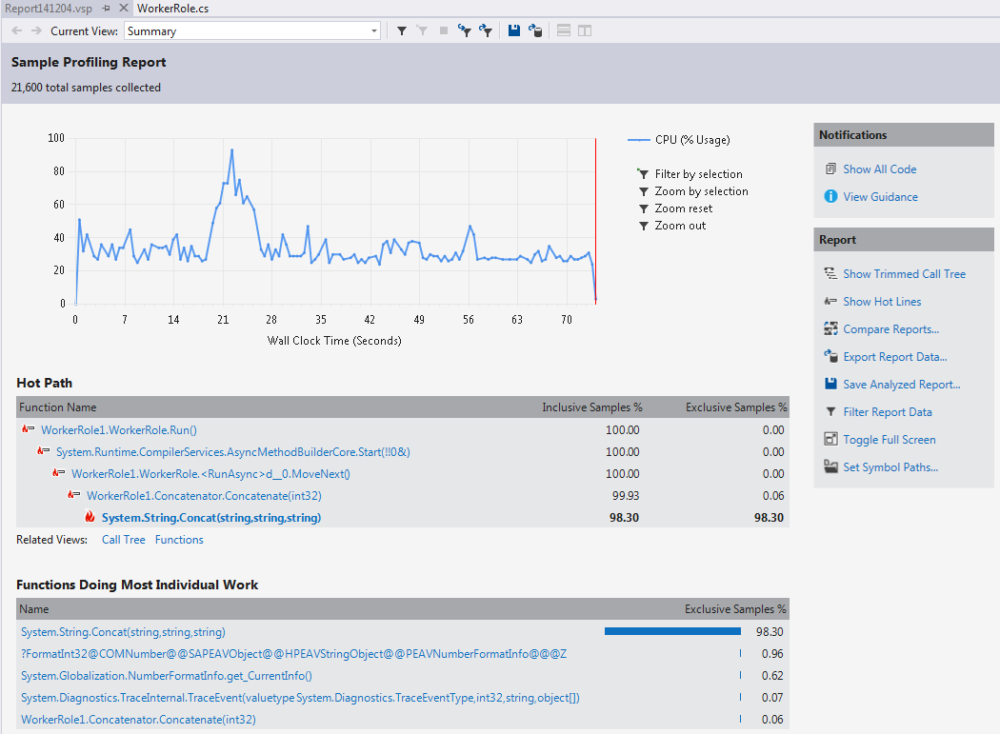

If you see String.wstrcpy in the Hot Path, click on Just My Code to change the view to show user code only.  If you see String.Concat, try pressing the Show All Code button.

You should see the Concatenate method and String.Concat taking up a large portion
of the execution time.

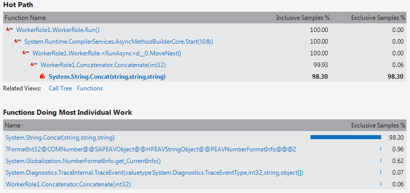

If you added the string concatenation code in this article, you should see a warning in the Task List for this. You may also see a warning that there is an excessive amount of garbage collection, which is due to the number of strings that are created and disposed.

## 4: Make changes and compare performance
You can also compare the performance before and after a code change.  Stop the running process, and edit the code to replace the string concatenation operation with the use of StringBuilder:

    public static string Concatenate(int number)
    {
        int count;
        System.Text.StringBuilder builder = new System.Text.StringBuilder("");
        for (count = 0; count < number; count++)
        {
             builder.Append("\n" + count.ToString());
        }
        return builder.ToString();
    }

Do another performance run, and then compare the performance. In the Performance Explorer, if the runs are in the same session, you can just select both reports, open the shortcut menu, and choose **Compare Performance Reports**. If you want to compare with a run in another performance session, open the **Analyze** menu, and choose **Compare Performance Reports**. Specify both files in the dialog box that appears.

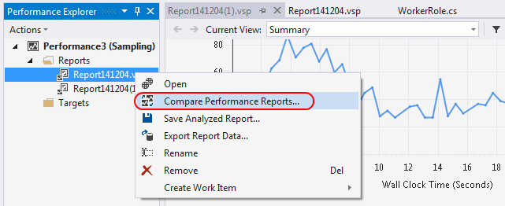

The reports highlight differences between the two runs.

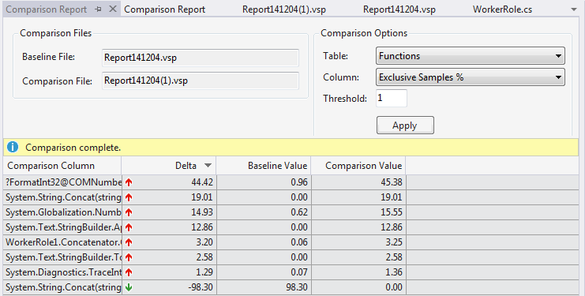

Congratulations! You've gotten started with the profiler.

## Troubleshooting
* Make sure you are profiling a Release build and start without debugging.
* If the Attach/Detach option is not enabled on the Profiler menu, run the Performance Wizard.
* Use the Compute Emulator UI to view the status of your application. 
* If you have problems starting applications in the emulator, or attaching the profiler, shut down the compute emulator and restart it. If that doesn't solve the problem, try rebooting. This problem can occur if you use the Compute Emulator to suspend and remove running deployments.
* If you have used any of the profiling commands from the
  command line, especially the global settings, make sure that VSPerfClrEnv /globaloff has been called and that VsPerfMon.exe has been shut down.
* If when sampling, you see the message "PRF0025: No data was collected," check that the process you attached to has CPU activity. Applications that are not doing any computational work might not produce any sampling data.  It's also possible that the process exited before any sampling was done. Check to see that the Run method for a role that you are profiling does not terminate.

## Next Steps
Instrumenting Azure binaries in the emulator is not supported in the Visual Studio profiler, but if you want to test memory allocation, you can choose that option when profiling. You can also choose concurrency profiling, which helps you determine whether threads are wasting time competing for locks, or tier interaction profiling, which helps you track down performance problems when interacting between tiers of an application, most frequently between the data tier and a worker role.  You can view the database queries that your app generates and use the profiling data to improve your use of the database. For information about tier interaction profiling, see the blog post [Walkthrough: Using the Tier Interaction Profiler in Visual Studio Team System 2010](http://blogs.msdn.com/b/habibh/archive/2009/06/30/walkthrough-using-the-tier-interaction-profiler-in-visual-studio-team-system-2010.aspx).

[1]: http://msdn.microsoft.com/library/azure/hh369930.aspx
[2]: http://msdn.microsoft.com/library/azure/hh411542.aspx
[3]: http://blogs.msdn.com/b/habibh/archive/2009/06/30/walkthrough-using-the-tier-interaction-profiler-in-visual-studio-team-system-2010.aspx
[4]: ./media/cloud-services-performance-testing-visual-studio-profiler/ProfilingLocally09.png
[5]: ./media/cloud-services-performance-testing-visual-studio-profiler/ProfilingLocally10.png
[6]: ./media/cloud-services-performance-testing-visual-studio-profiler/ProfilingLocally02.png
[7]: ./media/cloud-services-performance-testing-visual-studio-profiler/ProfilingLocally05.png
[8]: ./media/cloud-services-performance-testing-visual-studio-profiler/ProfilingLocally010.png
[9]: ./media/cloud-services-performance-testing-visual-studio-profiler/ProfilingLocally07.png
[10]: ./media/cloud-services-performance-testing-visual-studio-profiler/ProfilingLocally06.png
[11]: ./media/cloud-services-performance-testing-visual-studio-profiler/ProfilingLocally03.png
[12]: ./media/cloud-services-performance-testing-visual-studio-profiler/ProfilingLocally011.png
[14]: ./media/cloud-services-performance-testing-visual-studio-profiler/ProfilingLocally04.png 
[15]: ./media/cloud-services-performance-testing-visual-studio-profiler/ProfilingLocally013.png
[16]: ./media/cloud-services-performance-testing-visual-studio-profiler/ProfilingLocally012.png
[17]: ./media/cloud-services-performance-testing-visual-studio-profiler/ProfilingLocally08.png
