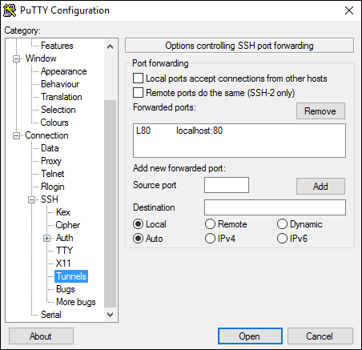

# Connect to an Azure Container Service cluster
The DC/OS and Docker Swarm clusters that are deployed by Azure Container Service expose REST endpoints. However, these endpoints are not open to the outside world. In order to manage these endpoints, you must create a Secure Shell (SSH) tunnel. After an SSH tunnel has been established, you can run commands against the cluster endpoints and view the cluster UI through a browser on your own system. This document walks you through creating an SSH tunnel from Linux, OS X, and Windows.

> [!NOTE]
> You can create an SSH session with a cluster management system. However, we don't recommend this. Working directly on a management system exposes the risk for inadvertent configuration changes.   
> 
> 

## Create an SSH tunnel on Linux or OS X
The first thing that you do when you create an SSH tunnel on Linux or OS X is to locate the public DNS name of load-balanced masters. To do this, expand the resource group so that each resource is being displayed. Locate and select the public IP address of the master. This will open up a blade that contains information about the public IP address, which includes the DNS name. Save this name for later use. <br />


Now open a shell and run the following command where:

**PORT** is the port of the endpoint that you want to expose. For Swarm, this is 2375. For DC/OS, use port 80.  
**USERNAME** is the user name that was provided when you deployed the cluster.  
**DNSPREFIX** is the DNS prefix that you provided when you deployed the cluster.  
**REGION** is the region in which your resource group is located.  
**PATH_TO_PRIVATE_KEY** [OPTIONAL] is the path to the private key that corresponds to the public key you provided when you created the Container Service cluster. Use this option with the -i flag.

```bash
# ssh sample

ssh -L PORT:localhost:PORT -f -N [USERNAME]@[DNSPREFIX]mgmt.[REGION].cloudapp.azure.com -p 2200
```
> The SSH connection port is 2200--not the standard port 22.
> 
> 

## DC/OS tunnel
To open a tunnel to the DC/OS-related endpoints, execute a command that is similar to the following:

```bash
# ssh sample

sudo ssh -L 80:localhost:80 -f -N azureuser@acsexamplemgmt.japaneast.cloudapp.azure.com -p 2200
```

You can now access the DC/OS-related endpoints at:

* DC/OS: `http://localhost/`
* Marathon: `http://localhost/marathon`
* Mesos: `http://localhost/mesos`

Similarly, you can reach the rest APIs for each application through this tunnel.

## Swarm tunnel
To open a tunnel to the Swarm endpoint, execute a command that looks similar to the following:

```bash
# ssh sample

ssh -L 2375:localhost:2375 -f -N azureuser@acsexamplemgmt.japaneast.cloudapp.azure.com -p 2200
```

Now you can set your DOCKER_HOST environment variable as follows. You can continue to use your Docker command-line interface (CLI) as normal.

```bash
export DOCKER_HOST=:2375
```

## Create an SSH tunnel on Windows
There are multiple options for creating SSH tunnels on Windows. This document will describe how to use PuTTY to do this.

Download PuTTY to your Windows system and run the application.

Enter a host name that is comprised of the cluster admin user name and the public DNS name of the first master in the cluster. The **Host Name** will look like this: `adminuser@PublicDNS`. Enter 2200 for the **Port**.


Select **SSH** and **Authentication**. Add your private key file for authentication.


Select **Tunnels** and configure the following forwarded ports:

* **Source Port:** Your preference--use 80 for DC/OS or 2375 for Swarm.
* **Destination:** Use localhost:80 for DC/OS or localhost:2375 for Swarm.

The following example is configured for DC/OS, but will look similar for Docker Swarm.

> [!NOTE]
> Port 80 must not be in use when you create this tunnel.
> 
> 



When you're finished, save the connection configuration, and connect the PuTTY session. When you connect, you can see the port configuration in the PuTTY event log.


When you've configured the tunnel for DC/OS, you can access the related endpoint at:

* DC/OS: `http://localhost/`
* Marathon: `http://localhost/marathon`
* Mesos: `http://localhost/mesos`

When you've configured the tunnel for Docker Swarm, you can access the Swarm cluster through the Docker CLI. You will first need to configure a Windows environment variable named `DOCKER_HOST` with a value of ` :2375`.

## Next steps
Deploy and manage containers with DC/OS or Swarm:

* [Work with Azure Container Service and DC/OS](container-service-mesos-marathon-rest.md)
* [Work with the Azure Container Service and Docker Swarm](container-service-docker-swarm.md)

