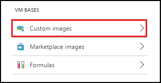
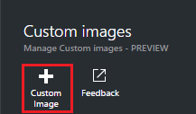
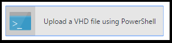

# Create a DevTest Labs custom image from a VHD file
## Overview
After you have [created a lab](devtest-lab-create-lab.md), you can [add virtual machines (VMs) to that lab](devtest-lab-add-vm-with-artifacts.md).
When you create a VM, you specify a *base*, which can be either a *custom image* or a *Marketplace image*. 
In this article, you'll see how to create a custom image from a VHD file.
Note that you'll need access to a valid VHD file to perform all the steps in this article.   

## Create a custom image
1. Sign in to the [Azure portal](http://go.microsoft.com/fwlink/p/?LinkID=525040).
2. Select **Browse**, and then select **DevTest Labs** from the list.
3. From the list of labs, select the desired lab.  
4. The selected lab's **Settings** blade will be displayed. 
5. On the lab **Settings** blade, select **Custom images**.
   
    
6. On the **Custom images** blade, select **+ Custom image**.
   
    
7. Enter the name of the custom image. This name is displayed in the list of base images when creating a new VM.
8. Enter the description of the custom image. This description is displayed in the list of base images when creating a new VM.
9. Select **VHD File**.
10. If you have access to a VHD file that is not listed, add it by following the instructions in the [Upload a VHD file](#upload-a-vhd-file) section, and return here when finished.
11. Select the desired VHD file.
12. Select **OK** to close the **VHD File** blade.
13. Select **OS Configuration**.
14. On the **OS Configuration** tab, select either **Windows** or **Linux**.
15. If **Windows** is selected, specify via the checkbox whether or not *Sysprep* has been run on the machine.
16. Select **OK** to close the **OS Configuration** blade.
17. Select **OK** to create the custom image.
18. Go to the [Next Steps](#next-steps) section.

## Upload a VHD file
In order to add a new custom image, you'll need to have access to a VHD file.

1. On the **VHD File** blade, select **Upload a VHD file using PowerShell**.
   
    
2. The next blade will display instructions for modifying and running a PowerShell script that uploads to your Azure subscription a VHD file. 
   **Note:** This process can be lengthy depending on the size of the VHD file and your connection speed.

## Related blog posts
* [Custom images or formulas?](https://blogs.msdn.microsoft.com/devtestlab/2016/04/06/custom-images-or-formulas/)
* [Copying Custom Images between Azure DevTest Labs](http://www.visualstudiogeeks.com/blog/DevOps/How-To-Move-CustomImages-VHD-Between-AzureDevTestLabs#copying-custom-images-between-azure-devtest-labs)

## Next steps
Once you have added a custom image for use when creating a VM, the next step is to [add a VM to your lab](devtest-lab-add-vm-with-artifacts.md).

