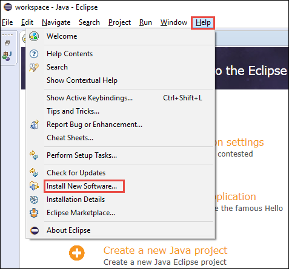
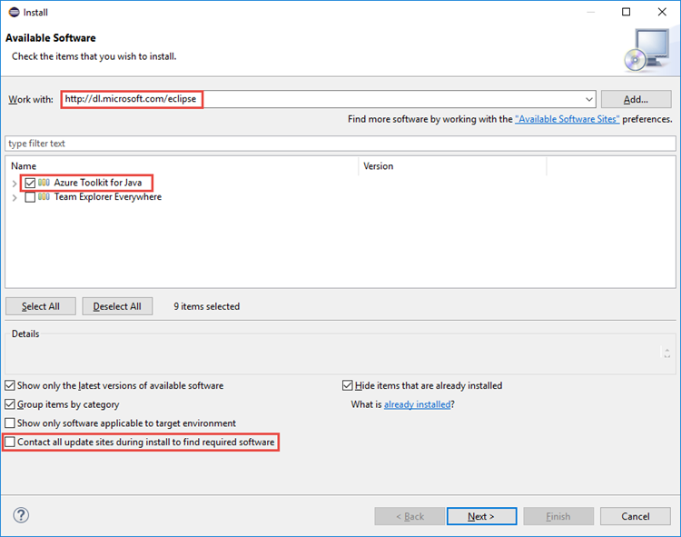
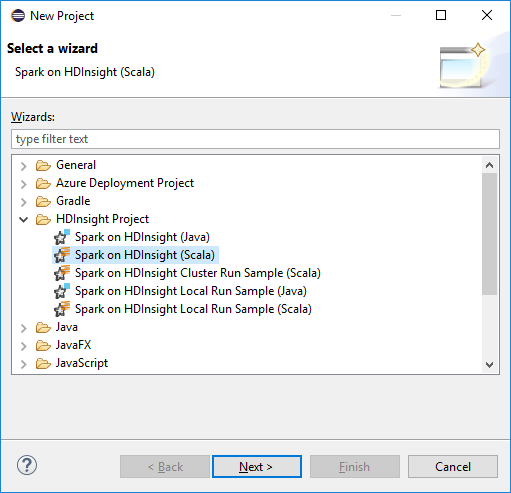
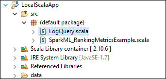

# Use HDInsight Tools Plugin for Eclipse to create Spark applications for HDInsight Spark Linux cluster
This article provides step-by-step guidance on developing Spark applications written in Scala and submitting it to an HDInsight Spark cluster using HDInsight plugin for Eclipse. You can use the plugin in a few different ways:

* To develop and submit a Scala Spark application on an HDInsight Spark cluster
* To access your Azure HDInsight Spark cluster resources
* To develop and run a Scala Spark application locally

> [!IMPORTANT]
> This tool can be used to create and submit applications only for an HDInsight Spark cluster on Linux.
> 
> 

## Prerequisites
* An Azure subscription. See [Get Azure free trial](https://azure.microsoft.com/documentation/videos/get-azure-free-trial-for-testing-hadoop-in-hdinsight/).
* An Apache Spark cluster on HDInsight Linux. For instructions, see [Create Apache Spark clusters in Azure HDInsight](hdinsight-apache-spark-jupyter-spark-sql.md).
* Oracle Java Development kit version 7 and version 8. 
  
  * **Java SDK 7** is used for compiling Spark projects as the HDInsight clusters support Java version 7. You can download Java SDK 7 from [here](http://www.oracle.com/technetwork/java/javase/downloads/jdk7-downloads-1880260.html).
  * **Java SDK 8** is used for Eclipse IDE runtime. You can download it from [here](http://www.oracle.com/technetwork/java/javase/downloads/jdk8-downloads-2133151.html).
* Eclipse IDE. This article uses Eclipse Neon. You can install it from [here](https://www.eclipse.org/downloads/).
* Scala IDE for Eclipse. 
  
  * **If you have Eclipse IDE installed**, you can add the Scala IDE plugin by going to **Help** -> **Install New SoftWare**, and add [http://download.scala-ide.org/sdk/lithium/e44/scala211/stable/site](http://download.scala-ide.org/sdk/lithium/e44/scala211/stable/site) as source to download Scala Plugin for Eclipse. 
  * **If you do not have Eclipse IDE installed**, you can install Scala IDE directly from [here](http://scala-ide.org/download/sdk.html). You can download the .zip file from this link, extract it, navigate to the **/eclipse** folder, and then run **eclipse.exe** file from there.
    
    > [!NOTE]
    > The steps in this document are based on using Eclipse IDE with Scala plugin installed.
    > 
* Spark SDK. You can download it from [here](http://go.microsoft.com/fwlink/?LinkID=723585&clcid=0x409).
* Install e(fx)clipse from [https://www.eclipse.org/efxclipse/install.html](https://www.eclipse.org/efxclipse/install.html).

## Install HDInsight Tools plugin for Eclipse
1. Launch Eclipse IDE. Navigate to the location where you downloaded and extracted the .zip package, navigate to the **/eclipse** folder under that, and then click **eclipse.exe**. From the welcome screen, , click **Help** and then click **Install New Software**.
   
    
2. In the next screen, in the **Work with** text box type **http://dl.microsoft.com/eclipse** and press **ENTER**. Select **Azure Toolkit for Java**, clear the check box for **Contact all update sites during install to find required software**, and then click **Next**.
   
    
3. In the **Install Details** dialog box review the components that will be installed and then click **Next**.
4. In the **Review Licenses** dialog box, accept the terms of the license, and then click **Finish**.
5. Once the installation is completed, you will be prompted to restart Eclipse. Click **Yes** from the dialog box to restart Eclipse.

## Log into your Azure subscription
1. Open the Azure Explorer. From the **Window** menu in the IDE, click **Show View** and then click **Other**. From the dialog box that opens, expand **Azure**, click **Azure Explorer**, and then click **OK**.
   
    
2. Right-click the **Azure** node in the **Azure Explorer**, and then click **Manage Subscriptions**.
3. In the **Manage Subscriptions** dialog box, click **Sign in** and enter your Azure credentials.
   
    
4. After you are logged in, the **Manage Subscriptions** dialog box lists all the Azure subscriptions associated with the credentials. Click **Close** in the dialog box.
5. In the Azure Explorer tab, expand **HDInsight** to see the HDInsight Spark clusters under your subscription.
   
    
6. You can further expand a cluster name node to see the resources (e.g. storage accounts) associated with the cluster.
   
    

## Set up a Spark Scala project for an HDInsight Spark cluster
1. From the Eclipse IDE work space, click **File**, click **New**, and then click **Project**. 
2. In the **New Project** wizard, expand **HDInsight**, select **Spark on HDInsight (Scala)**, and then click **Next**.
   
    
3. In the **New HDInsight Scala Project** dialog box, enter/select values as shown in the image below, and then click **Next**.
   
    
   
   * Enter a name for the project.
   * In the **JRE** box, make sure **Use an execution environment JRE** is set to **JavaSE-1.7**.
   * Make sure Spark SDK is set to the location where you downloaded the SDK. The link to the download location is included in the [Prerequisites](#prerequisites) earlier in this topic. You can also download the SDK from the link included in this dialog box, as shown in the image above.     
4. In the next dialog box, click the **Libraries** tab, and then double-click **JRE System Library [JavaSE-1.7]**.
   
    
5. In the **Edit Library** dialog box, make sure **Execution Environment** is set to  **JavaSE-1.7(jdk1.7.0_79)**. If this is not available as an option, follow the steps below.
   
   1. Select the **Alternate JRE** option and see if **JavaSE-1.7(jdk1.7.0_79)** is available.
   2. If not, click the **Installed JREs** button.
      
         
   3. In the **Installed JREs** dialog box, click **Add**.
      
             
   4. In the **JRE Type** dialog box, select **Standard VM**, and then click **Next**
      
             
   5. In the **JRE Definition** dialog box, click Directory, and then navigate to the location for JDK 7 installation, and select the root folder for **jdk1.7.0_79**.
      
             
   6. Click **Finish**. In the **Installed JREs** dialog box, select the newly added JRE, and then click **OK**.
      
          
   7. The newly added JRE should be listed for **Execution Environment**. Click **Finish**.
      
            
6. Back on the **Libraries** tab, double-click **Scala Library Container[2.11.8]**. In the **Edit Library** dialog box, select **Fixed Scala Library container:2.10.6**. 
   
    
   
    Click **Finish** until you exit the project settings dialog box.

## Create a Scala application for HDInsight Spark cluster
1. In the already open Eclipse IDE, from the **Package Explorer**, expand the project you created earlier, right-click **src**, point to **New**, and then click **Other**.
2. In the **Select a wizard** dialog box, expand **Scala Wizards**, click **Scala Object**, and then click **Next**.
   
    
3. In the **Create New File** dialog box, enter a name for the object, and then click **Finish**.
   
    
4. Paste the following code in the text editor.
   
        import org.apache.spark.SparkConf
        import org.apache.spark.SparkContext
   
        object MyClusterApp{
          def main (arg: Array[String]): Unit = {
            val conf = new SparkConf().setAppName("MyClusterApp")
            val sc = new SparkContext(conf)
   
            val rdd = sc.textFile("wasbs:///HdiSamples/HdiSamples/SensorSampleData/hvac/HVAC.csv")
   
            //find the rows which have only one digit in the 7th column in the CSV
            val rdd1 =  rdd.filter(s => s.split(",")(6).length() == 1)
   
            rdd1.saveAsTextFile("wasbs:///HVACOut")
          }        
        }
5. Run the application on an HDInsight Spark cluster.
   
   1. From the **Package Explorer**, right-click the project name, and then select **Submit Spark Application to HDInsight**.        
   2. In the **Spark Submission** dialog box, provide the following values.
      
      * For **Cluster Name**, select the HDInsight Spark cluster on which you want to run your application.
      * You need to either select an Artifact from the Eclipse project, or select one from hard disk.
      * Against the **Main class name** text box, enter the name of the object you specified in the code (see image below).
        
          
      * Because the application code in this example does not require any command line arguments or reference JARs or files, you can leave the remaining text boxes empty.
      * Click **Submit**.
   3. The **Spark Submission** tab should start displaying the progress. You can stop the application by clicking the red button in the "Spark Submission" window. You can also view the logs for this specific application run by clicking the globe icon (denoted by the blue box in the image).
      
       
      
      In the next section, you learn how to access the job output using the HDInsight plugin for Eclipse.

## Access and manage HDInsight Spark clusters using the HDInsight plugin for Eclipse
You can perform a variety of operations using the HDInsight plugin.

### Access the storage container for the cluster
1. From the Azure Explorer, expand **HDInsight** root node to see a list of HDInsight Spark clusters that are available.
2. Expand the cluster name to see the storage account and the default storage container for the cluster.
   
    
3. Click the storage container name associated with the cluster. In the right-pane, you should see a folder called **HVACOut**. Double-click to open the folder and you will see **part-*** files. Open one of those files to see the output of the application.

### Access the Spark History Server
1. From the **Azure Explorer**, right-click your Spark cluster name and then select **Open Spark History UI**. When prompted, enter the admin credentials for the cluster. You must have specified these while provisioning the cluster.
2. In the Spark History Server dashboard, you can look for the application you just finished running by using the application name. In the code above, you set the application name using `val conf = new SparkConf().setAppName("MyClusterApp")`. Hence, your Spark application name was **MyClusterApp**.

### Launch the Ambari portal
From the **Azure Explorer**, right-click your Spark cluster name and then select **Open Cluster Management Portal (Ambari)**. When prompted, enter the admin credentials for the cluster. You must have specified these while provisioning the cluster.

### Manage Azure subscriptions
By default, the HDInsight plugin lists the Spark clusters from all your Azure subscriptions. If required, you can specify the subscriptions for which you want to access the cluster. From the **Azure Explorer**, right-click the **Azure** root node, and then click **Manage Subscriptions**. From the dialog box, clear the check boxes against the subscription that you do not want to access and then click **Close**. You can also click **Sign Out** if you want to log off from your Azure subscription.

## Run a Spark Scala application locally
You can use the HDInsight Tools plugin for Eclipse to run Spark Scala applications locally on your workstation. Typically, such applications do not need access to cluster resources such as storage container and can be run and tested locally.

### Prerequisite
While running the local Spark Scala application on a Windows computer, you might get an exception as explained in [SPARK-2356](https://issues.apache.org/jira/browse/SPARK-2356) that occurs due to a missing **WinUtils.exe** on Windows OS. To work around this error, you must [download the executable from here](http://public-repo-1.hortonworks.com/hdp-win-alpha/winutils.exe) to a location like **C:\WinUtils\bin**. You must then add an environment variable **HADOOP_HOME** and set the value of the variable to **C\WinUtils**.

### Run a local Spark Scala application
1. Launch Eclipse and create a new project. In the new project dialog box, make the following choices, and then click **Next**.
   
    
   
   * From the left pane, select **HDInsight**.
   * From the right pane, select **Spark on HDInsight Local Run Sample (Scala)**.
   * Click **Next**.
2. To provide the project details, follow steps 3 through 6 as shown in the earlier section [Set up a Spark Scala application project for an HDInsight Spark cluster](#set-up-a-spark-scala-application-project-for-an-hdinsight-spark cluster).
3. The template adds a sample code (**LogQuery**) under the **src** folder that you can run locally on your computer.
   
    
4. Right click on the **LogQuery** application, point to **Run As**, and then click **1 Scala Application**. You will see an output like this in the **Console** tab at the bottom.
   
   

## Feedback & Known issues
Currently viewing Spark outputs directly is not supported and we are working on that.

If you have any suggestions or feedback, or if you encounter any problems when using this tool, feel free to drop us an email at hdivstool at microsoft dot com.

## See also
* [Overview: Apache Spark on Azure HDInsight](hdinsight-apache-spark-overview.md)

### Scenarios
* [Spark with BI: Perform interactive data analysis using Spark in HDInsight with BI tools](hdinsight-apache-spark-use-bi-tools.md)
* [Spark with Machine Learning: Use Spark in HDInsight for analyzing building temperature using HVAC data](hdinsight-apache-spark-ipython-notebook-machine-learning.md)
* [Spark with Machine Learning: Use Spark in HDInsight to predict food inspection results](hdinsight-apache-spark-machine-learning-mllib-ipython.md)
* [Spark Streaming: Use Spark in HDInsight for building real-time streaming applications](hdinsight-apache-spark-eventhub-streaming.md)
* [Website log analysis using Spark in HDInsight](hdinsight-apache-spark-custom-library-website-log-analysis.md)

### Create and run applications
* [Create a standalone application using Scala](hdinsight-apache-spark-create-standalone-application.md)
* [Run jobs remotely on a Spark cluster using Livy](hdinsight-apache-spark-livy-rest-interface.md)

### Tools and extensions
* [Use HDInsight Tools Plugin for IntelliJ IDEA to create and submit Spark Scala applicatons](hdinsight-apache-spark-intellij-tool-plugin.md)
* [Use HDInsight Tools Plugin for IntelliJ IDEA to debug Spark applications remotely](hdinsight-apache-spark-intellij-tool-plugin-debug-jobs-remotely.md)
* [Use Zeppelin notebooks with a Spark cluster on HDInsight](hdinsight-apache-spark-use-zeppelin-notebook.md)
* [Kernels available for Jupyter notebook in Spark cluster for HDInsight](hdinsight-apache-spark-jupyter-notebook-kernels.md)
* [Use external packages with Jupyter notebooks](hdinsight-apache-spark-jupyter-notebook-use-external-packages.md)
* [Install Jupyter on your computer and connect to an HDInsight Spark cluster](hdinsight-apache-spark-jupyter-notebook-install-locally.md)

### Manage resources
* [Manage resources for the Apache Spark cluster in Azure HDInsight](hdinsight-apache-spark-resource-manager.md)
* [Track and debug jobs running on an Apache Spark cluster in HDInsight](hdinsight-apache-spark-job-debugging.md)

