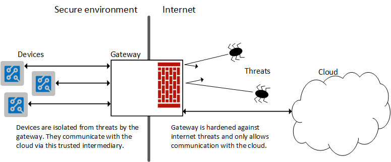
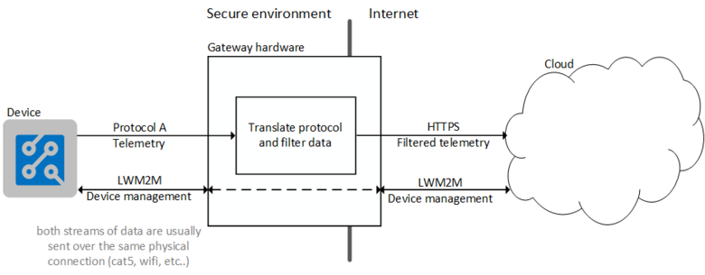

# Enable managed devices behind an IoT gateway
## Basic device isolation
Organizations often use IoT gateways to increase the overall security of their IoT solutions. Some devices need to send data to the cloud but are not capable of protecting themselves from threats on the internet. You can shield these devices from external threads by having them communicate with the outside world through a gateway.

The gateway sits on the border between a secure environment and the open internet. Devices talk to the gateway and the gateway passes the messages along to the correct cloud destination. The gateway is hardened against external threads, blocks unauthorized requests, allows authorized in-bound traffic, and forwards that in-bound traffic to the correct device.

You can also place devices that can protect themselves behind a gateway for an added layer of security. In this scenario you only need to keep the gateway OS patched against the latest vulnerabilities, instead of updating the OS on every device.

## Isolation plus intelligence
A hardened router is a sufficient gateway to simply isolate devices. However, IoT solutions often require that a gateway provides more intelligence than simply isolating devices. For example, you may want to manage your devices from the cloud. You are able use LWM2M, a standard device management protocol, for the cloud management part of the solution. However, the devices send telemetry using a non TCP/IP enabled protocol. Furthermore, the devices produce lots of data and you only want to upload a filtered subset of the telemetry. You can build a solution that incorporates an IoT gateway capable of dealing with two distinct streams of data. The gateway should:

* Understand the **Telemetry**, filter it, and then upload it to the cloud through the gateway. The gateway is no longer a simple router that simply forwards data between the device and the cloud.
* Simply exchange the **LWM2M device management data** between the devices and the cloud. The gateway does not need to understand the data coming into it, and only needs to make sure the data gets passed back and forth between the devices and the cloud.

The following figure illustrates this scenario:

## The solution: Azure IoT device management and the Gateway SDK
The public preview release of [Azure IoT device management](iot-hub-device-management-overview.md) and beta release of the [Azure IoT Gateway SDK](https://github.com/Azure/azure-iot-gateway-sdk/) enable this scenario. The gateway handles each stream of data as follows:

* **Telemetry**: You can use the Gateway SDK to build a pipeline that understands, filters, and sends telemetry data to the cloud. The Gateway SDK provides code that implements parts of this pipeline on behalf of the developer. You can find more information on the architecture of the SDK in the [IoT Gateway SDK - Get Started](iot-hub-linux-gateway-sdk-get-started.md) tutorial.
* **Device management**: Azure device management provides an LWM2M client that runs on the device as well as a cloud interface for issuing management commands to the device.
  
  You don't require any special logic on the gateway because it does not need to process the LWM2M data exchanged between the device and your IoT hub. You can enable internet connection sharing, a feature of many modern operating systems, on the gateway to enable the exchange of LWM2M data. You can can choose a suitable operating system for this scenario because the gateway SDK supports a variety of operating systems. Here are instructions for enabling internet connection sharing on [Windows 10](http://windows.microsoft.com/en-us/windows/using-internet-connection-sharing#1TC=windows-7) and [Ubuntu](https://help.ubuntu.com/community/Internet/ConnectionSharing), two of the many supported operating systems.

The following illustration shows the high level architecture used to enable this scenario using [Azure IoT device management](iot-hub-device-management-overview.md) and the [Azure IoT Gateway SDK](https://github.com/Azure/azure-iot-gateway-sdk/).

## Next steps
To learn about how to use the Gateway SDK, see the following tutorials:

* [IoT Gateway SDK - Get started using Linux](iot-hub-linux-gateway-sdk-get-started.md)
* [IoT Gateway SDK – send device-to-cloud messages with a simulated device using Linux](iot-hub-linux-gateway-sdk-simulated-device.md)

To learn more about device management with IoT Hub see [Introducing the Azure IoT Hub device management client library](iot-hub-device-management-library.md).

To further explore the capabilities of IoT Hub, see:

* [Designing your solution](iot-hub-guidance.md)
* [Developer guide](iot-hub-devguide.md)
* [Simulating a device with the Gateway SDK](iot-hub-linux-gateway-sdk-simulated-device.md)
* [Using the Azure Portal to manage IoT Hub](iot-hub-manage-through-portal.md)

<!-- Images and links -->
[1]: media/iot-hub-gateway-device-management/overview.png
[2]: media/iot-hub-gateway-device-management/manage.png
[Azure IoT Gateway SDK]: https://github.com/Azure/azure-iot-gateway-sdk/
[Windows 10]: http://windows.microsoft.com/en-us/windows/using-internet-connection-sharing#1TC=windows-7
[Ubuntu]: https://help.ubuntu.com/community/Internet/ConnectionSharing
[3]: media/iot-hub-gateway-device-management/manage_2.png
[lnk-gateway-get-started]: iot-hub-linux-gateway-sdk-get-started.md
[lnk-gateway-simulated]: iot-hub-linux-gateway-sdk-simulated-device.md
[lnk-device-management]: iot-hub-device-management-overview.md

[lnk-tutorial-twin]: iot-hub-device-management-device-twin.md
[lnk-tutorial-queries]: iot-hub-device-management-device-query.md
[lnk-tutorial-jobs]: iot-hub-device-management-device-jobs.md
[lnk-dm-gateway]: iot-hub-gateway-device-management.md
[lnk-library-c]: iot-hub-device-management-library.md

[lnk-design]: iot-hub-guidance.md
[lnk-devguide]: iot-hub-devguide.md
[lnk-gateway]: iot-hub-linux-gateway-sdk-simulated-device.md
[lnk-portal]: iot-hub-manage-through-portal.md