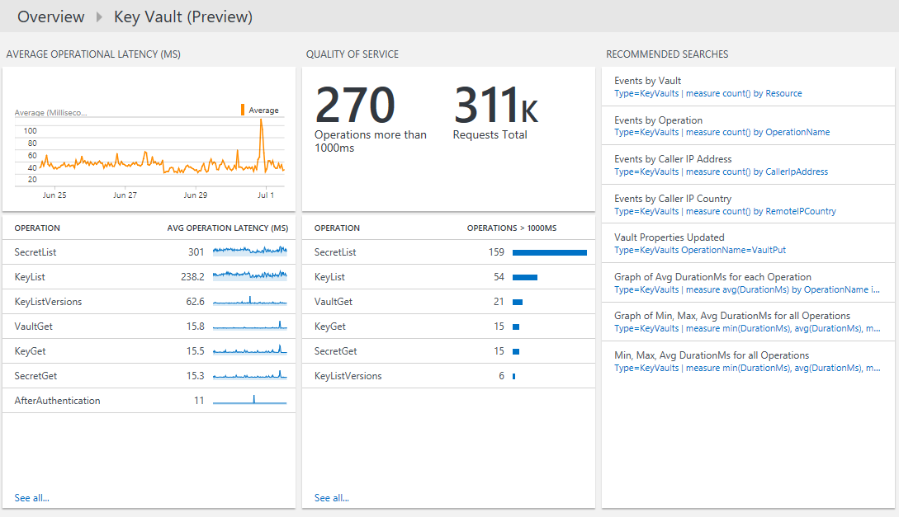

# Azure Key Vault (Preview) solution in Log Analytics
> [!NOTE]
> This is a [preview solution](log-analytics-add-solutions.md#log-analytics-preview-solutions-and-features).
> 
> 

You can use the Azure Key Vault solution in Log Analytics to review Azure Key Vault AuditEvent logs.

You can enable logging of audit events for Azure Key Vault. These logs are written to Azure Blob storage where they can then be indexed by Log Analytics for searching and analysis.

## Install and configure the solution
Use the following instructions to install and configure the Azure Key Vault solution:

1. Enable [diagnostics logging for Key Vault](../key-vault/key-vault-logging.md) resources that you want to monitor
2. Configure Log Analytics to read the logs from blob storage by using the process described in [JSON files in blob storage](log-analytics-azure-storage-json.md).
3. Enable the Azure Key Vault solution by using the process described in [Add Log Analytics solutions from the Solutions Gallery](log-analytics-add-solutions.md).  

## Review Azure Key Vault data collection details
Azure Key Vault solution collects diagnostics logs from Azure blob storage for Azure Key Vault.
No agent is required for data collection.

The following table shows data collection methods and other details about how data is collected for Azure Key Vault.

| Platform | Direct agent | Systems Center Operations Manager (SCOM) agent | Azure Storage | SCOM required? | SCOM agent data sent via management group | Collection frequency |
| --- | --- | --- | --- | --- | --- | --- |
| Azure | | | | | |10 minutes |

## Use Azure Key Vault
After you install the solution, you can view the summary of request statuses over time for your monitored Key Vaults by using the **Azure Key Vault** tile on the **Overview** page of Log Analytics.

After you click the **Overview** tile, you can view summaries of your logs and then drill in to details for the following categories:

* Volume of all key vault operations over time
* Failed operation volumes over time
* Average operational latency by operation
* Quality of service for operations with the number of operations that take more than 1000 ms and a list of operations that take more than 1000 ms

### To view details for any operation
1. On the **Overview** page, click the **Azure Key Vault** tile.
2. On the **Azure Key Vault** dashboard, review the summary information in one of the blades, and then click one to view detailed information about it in the log search page.
   
    On any of the log search pages, you can view results by time, detailed results, and your log search history. You can also filter by facets to narrow the results.

## Log Analytics records
The Azure Key Vault solution analyzes records that have a type of **KeyVaults** that are collected from [AuditEvent logs](../key-vault/key-vault-logging.md) in Azure Diagnostics.  Properties for these records are in the following table.  

| Property | Description |
|:--- |:--- |
| Type |*KeyVaults* |
| SourceSystem |*AzureStorage* |
| CallerIpAddress |IP address of the client who made the request |
| Category |For Key Vault logs, AuditEvent is the single, available value. |
| CorrelationId |An optional GUID that the client can pass to correlate client-side logs with service-side (Key Vault) logs. |
| DurationMs |Time it took to service the REST API request, in milliseconds. This does not include network latency, so the time that you measure on the client side might not match this time. |
| HttpStatusCode_d |HTTP status code returned by the request |
| Id_s |Unique ID of the request |
| Identity_o |Identity from the token that was presented when making the REST API request. This is usually a "user", a "service principal," or a combination "user+appId" as in the case of a request resulting from an Azure PowerShell cmdlet. |
| OperationName |Name of the operation, as documented in [Azure Key Vault Logging](../key-vault/key-vault-logging.md) |
| OperationVersion |REST API version requested by the client |
| RemoteIPLatitude |Latitude of the client who made the request |
| RemoteIPLongitude |Longitude of the client who made the request |
| RemoteIPCountry |Country of the client who made the request |
| RequestUri_s |Uri of the request |
| Resource |Name of the key vault |
| ResourceGroup |Resource group of the key vault |
| ResourceId |Azure Resource Manager Resource ID. For Key Vault logs, this is always the Key Vault resource ID. |
| ResourceProvider |*MICROSOFT.KEYVAULT* |
| ResultSignature |HTTP status |
| ResultType |Result of REST API request |
| SubscriptionId |Azure subscription ID of the subscription containing the Key Vault |

## Next steps
* Use [Log searches in Log Analytics](log-analytics-log-searches.md) to view detailed Azure Key Vault data.

