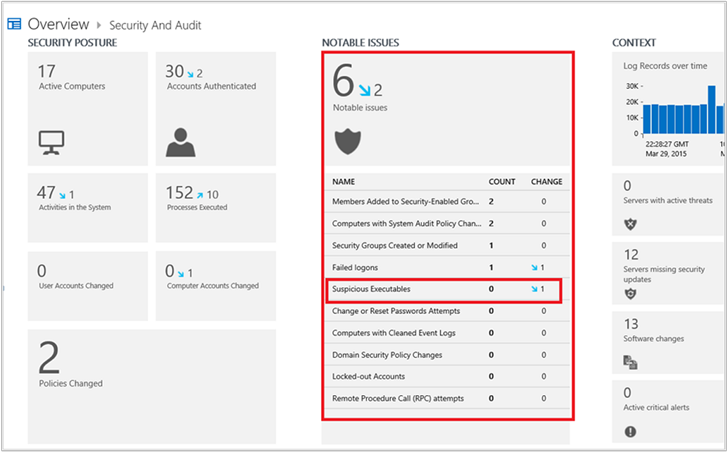
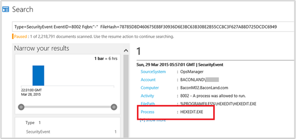
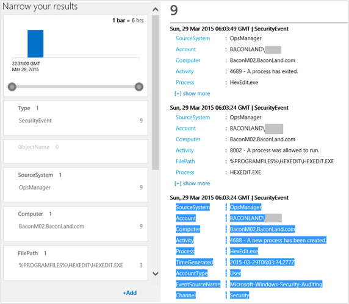
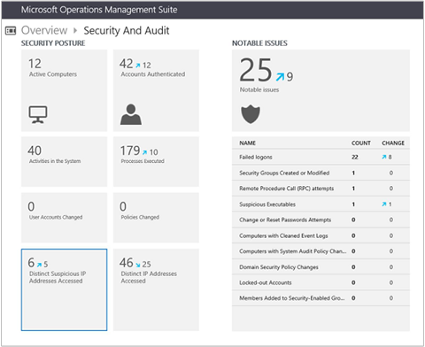
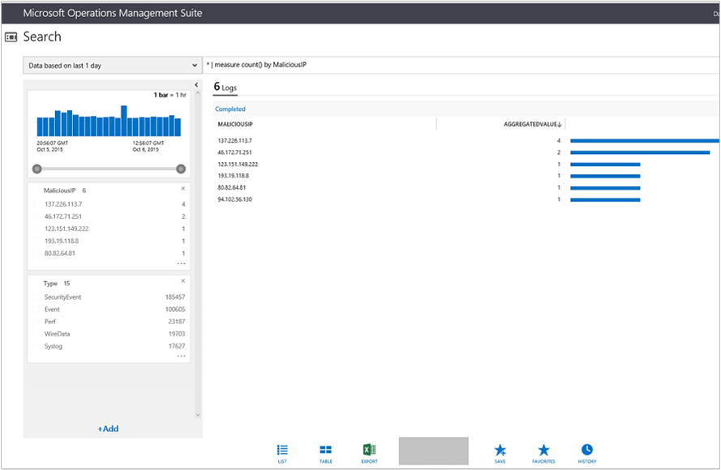
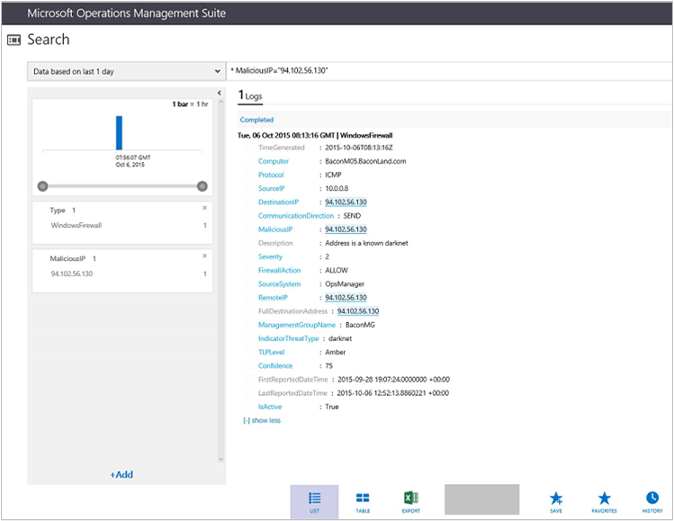

# Security and Audit solution in Log Analytics
The Security and Audit solution in Log Analytics provides a comprehensive view into your organization’s IT security posture with built-in search queries for notable issues that require your attention.

## Installing and configuring the solution
Use the following information to install and configure the solution.

* Add the Security and Audit solution to your OMS workspace using the process described in [Add Log Analytics solutions from the Solutions Gallery](log-analytics-add-solutions.md).  There is no further configuration required.

## Security and Audit data collection details
Security and Audit collects Windows security events, Windows application events, and Windows firewall logs using the agents that you have enabled.

The following table shows data collection methods and other details about how data is collected for the Security and Audit solution.

| data type | platform | Direct Agent | SCOM agent | Azure Storage | SCOM required? | SCOM agent data sent via management group | collection frequency |
| --- | --- | --- | --- | --- | --- | --- | --- |
| Windows security event logs |Windows | | | | | |For Azure storage: 10 min; for the agent: on arrival |
| Windows firewall logs |Windows | | | | | |on arrival |
| Windows event logs |Windows | | | | | |for Azure storage: 1 min; for the agent: on arrival |

## Best practices for forensic analysis
**Look for evidence**

When you conduct a forensic analysis using the Security and Audit solution, you're looking for evidence that potentially malicious users leave behind. Regardless of what users are doing in their IT environment, many of the activities they participate in generate security artifacts. You should note that logs are often wiped by attackers and it is often the first step they take in hiding their path.

However, whether users are accessing their own computers or accessing them remotely, evidence about their use is stored in event logs. OMS collects these artifacts *as soon as they occur*, before anyone can tamper with them, and allows you to perform different types of analysis by correlating data across multiple computers.

**Understand how to configure and collect audit events**

To get the most out of the Security and Audit solution, you should configure the level of audit events gathered by your Windows environment that will best suit your needs, using the following web resources.

* [How to Configure Security Policy Settings](https://technet.microsoft.com/library/dn135243&#40;v=ws.10&#41;.aspx)
* [Advanced Audit Policy Configuration](https://technet.microsoft.com/library/jj852202&#40;v=ws.10&#41;.aspx)
* [Audit Policy Recommendations](https://technet.microsoft.com/library/dn487457.aspx)

**Enable AppLocker**

You should also enable AppLocker events, to get rich information about process executions that occur in your IT environment. For more information, see [To Configure an AppLocker Policy for Audit Only](https://technet.microsoft.com/library/hh994622.aspx).

**Configure the audit level for Windows events**

The Windows computing environment gives you the ability to configure the capture-level of security-related records. For example, you can configure your environment so that anytime someone accesses a file, reads a file, or opens a file, an event is generated. The level of detail that you want to collect will vary, depending on your needs. However, every option that you enable comes with some sort of cost because you need to store all the information that you collect. For this reason, in many organization’s IT environments, people decide not to enable object read or object write data collection. Every time someone accesses any file, thousands of events might be generated, some of which are useless noise. Collection level that you decide upon depends on the your best judgment.

> [!NOTE]
> If you are using the direct agent and you have a proxy server in your organization, you should configure it to allow the agent to access OMS. For more information, see [Configure proxy and firewall settings in Log Analytics](log-analytics-proxy-firewall.md).
> 
> 

## Best practices for security breach pattern investigations
**Investigate abnormal activity patterns**

Security breaches usually originate from legitimate credentials and require a malicious user to attempt to get an elevated privilege through attacks. The Security and Audit solution does not focus on intrusion detection—instead,  it does help you to investigate and discover patterns of abnormal activities with Notable Issues. For example, you should investigate the following abnormal activities and any others that appear under **Notable Issues**.

* unusual logons on a computer from a user who doesn’t normally use it
* unusual network enumeration from atypical users or computers
* new users accounts created with administrative rights
* changes to logging or security policies
* suspicious executables

## Best practices for audit scenarios
Your organization might have computer and network compliance policies and regulations that you must abide by, requiring extensive auditing records. For example, if your organization is a finance company you might need to keep records that prove for any given point in time, which user performed a specific operation on the network. You might also be required to generate reports detailing the activity of a specific user, or selected server on-demand, and go back in time many months—sometimes even years back.

You can use the Security and Audit solution to collect auditing data throughout your IT environment, whether your computers are on premise or in the cloud. All auditing data is stored, indexed, and retained per your subscription. With a Premium subscription to OMS, an unlimited amount of data is stored for one year. Then you can view auditing data, perform searches, and correlate across different data types and computers to get comprehensive results for any time interval since the data was collected.

**Use Group Policy to collect auditing data**

Any auditing data that you want to collect and send to OMS is fully managed with Group Policy. You use it to define security configurations as part of a Group Policy Object (GPO), which are linked to Active Directory containers such as sites, domains, and organizational units, and they help you manage security settings. Policy data is logged and later sent to the OMS service.

**Use AppLocker to gather auditing data**

In addition to local policy settings, if you use AppLocker to gather auditing data, OMS will gather the data and then you can view it.

## Conduct a simple investigation for a suspicious executable
1. Sign in to OMS.
2. On the **Overview** page, review information displayed in the **Security and Audit** tile and then click it.  
    
3. On the **Security and Audit** page, review the information in the **NOTABLE ISSUES** blade. In the example image, you'll see 6 notable issues for today, with 2 from yesterday. In this example, there is 1 suspicious executable. Click **Suspicious Executables** in the **NOTABLE ISSUES** blade.  
    
4. Search displays the query and results for the suspicious executable that you clicked. In the example, there is 1 result and its file hash is displayed. Click the **FILEHASH** ID.  
    
5. Search displays additional information about the executable file, including its file path and process name. Click the **Process &lt;file name&gt;**. In the example, this is HEXEDIT.EXE.  
    
6. Search appends the name of the process in quotations marks to the query. "**HEXEDIT.EXE"**, in this example.  
    
7. In the Search query box, remove everything but the process name and quotation marks and then click the Search icon.  
    
8. Search displays detailed information about the process, including the computers where the process ran, the user account that the process ran under, and the date and time that an event was created for the process.
9. Using the information that you find, you can take corrective action as needed. For example, if you determine that the executable is malware then you'll want to take action to remove it from all the computer systems that it affects. After the executable is removed and OMS receives updated log and audit events for your computer systems, values on the NOTABLE ISSUES blade will change on the following day.

## Investigate malicious IP addresses
One method to safeguard your servers is to ensure that they aren’t communicating with any known malicious or suspicious IP addresses. In OMS, you have a centralized view showing all the known malicious IP’s that your managed servers and clients might be communicating with. Working with the Microsoft Threat Intelligence Center (MSTIC), OMS gets hourly updates about the latest known malicious IP’s and informs you if any of your servers might be compromised. The MSTIC team works with various threat intelligence partners to gather and provide this consolidated list to the OMS service.

The malicious IP view can be found inside the Security and Audit solution in the OMS portal, shown as **Distinct Suspicious IP Addresses Accessed**.

You can open the tile and view the complete list of distinct suspicious IP addresses that your devices might be communicating with. OMS scans all the data sources that you send to the service, including:

* Windows firewall logs
* IIS Logs
* WireData

OMS displays many fields related to suspicious IP addresses in log search results. Some of the most important include:

* **IndicatorThreatType**: Some examples are botnet, proxy, darknet, malware command and control node.
* **Description**: The threat type and our confidence level that the IP address is malicious. This is the same data that Microsoft uses to protect itself, which is made available to OMS users.

For a complete list of suspicious IP address fields, see [Malicious IP log search fields](#Malicious-IP-log-search-fields) below.

### To perform a malicious IP address investigation
In this example, we'll look at a possible malicious IP address using Windows firewall log data.

1. Sign in to OMS.
2. On the **Overview** page, review information displayed in the **Security and Audit** tile and then click it.  
      
3. On the **Security and Audit** page, review the summary information in the **Distinct Suspicious IP Addresses Accessed** tile.  
      
4. In this example, there are 6 suspicious IP addresses. Click the **Distinct Suspicious IP Addresses Accessed** tile.
5. Search displays the query and results for the malicious IP addresses that it found. In the example, there are 6 results and the IP addresses are displayed.  
      
6. In the image above, notice the last IP address. In this example it is **94.102.56.130**. Click that address.
7. Search displays detailed results, showing various threat indicator data. **Click show** more to see the full set of results.  
      
8. If you want to view a list of all the servers in your environment that might be communicating with a malicious IP, you can use the following log search query.
   
    ```
    IsActive=True | measure count() by Computer
    ```

### Taking corrective actions for malicious IP communication
If you are sure that a component or process in your network is communicating with known malicious IP addresses by sending your data, then the action you should take is clear:

* Verify that your resource is sending data to the malicious IP address.
* Possibly, remove or block the software from the computer that is sending your data and prevent communication to specific IP addresses for specific software.
* Determine whether user credentials that run an executable or process might be compromised by investigating any accounts that the questionable process runs under. Determine what other resources it might have accessed.
* Determine how the software was installed on the computer.
* Temporarily leave questionable software installed so that you can closely monitor its activity. After a thorough assessment, take corrective action, as necessary.

However, if you are *not certain* that your data is being sent to a known malicious IP addresses, or if the *confidence is questionable*, then  your corrective actions are less clear. In general, you might want to investigate using some of the steps listed above. In other cases, you might not want to take any action at all. Ultimately, you’re the most familiar with the IT infrastructure in your organization and you’re in the best position to determine how potential threats are dealt with.

Firewall logs show the direction that data moves. When your  firewall is configured to block outgoing (shown as send in the logs) communication to specific IPs, then attempted communication by potentially compromised software to malicious IPs appears as *blocked* in your log search results. This is a case where you should take additional action—although compromised software might be blocked to a specific IP address, the software might try to communicate with other unknown and potential malicious IP addresses in the future.  

Firewall logs also show when incoming data is blocked and you might see quite a bit of activity for this situation. Should you worry about this situation? Most likely, not. When your firewall logs show blocked incoming data, it validates that your firewall is doing what it should—safeguarding your infrastructure.

### Malicious IP threat intelligence
Microsoft shares data with a variety of organizations to create a summary view of all known indicators that might compromise data. The summary is intended to identify hits in data sets and to show extended threat details as links so that further details are easily viewed. You view this threat intelligence in the log search results for malicious IPs.

There are 3 methods that Microsoft receives threat data, which is aggregated to form a threat intelligence data set. These providers essentially break down into the following categories:

* Paid subscriptions – Companies that Microsoft has entered into an agreement to purchase their data.
* Partner data - Security intelligence firms. You can think of this data as ‘signal intelligence’, because it does not contain verbose reports, however the data is considered valid.
* Internal Microsoft processes – Primarily, the Microsoft Threat Intelligence Center (MSTIC).

#### Malicious IP log search fields
The following malicious IP address fields appear in log search results.  

| search field | description |
| --- | --- |
| **IsActive** |Designates that the indicator is active and should be considered a valid hit if it matches a found IP address. MSTIC maintains this indicator. |
| **Confidence** |Shows a value from 1 -100. MSTIC maintains this value and the algorithms that define it. This is a good value to filter your search results on. |
| **TLPLevel** |The traffic light protocol level. Values are: Green, Amber and Red. These values correspond to low business impact, medium business impact, and high business impact, respectively. |
| **IndicatorThreatType** |A brief description of the type of threat the indicator poses. Some include: Botnet, DDoS, Malware, Malicious URL, Malicious IP, Phishing, and Spam. |
| **Severity** |Shows a value from 0-5. This indicates how severe the threat is. |
| **MaliciousIP** |The IP address of the malicious host. |
| **CommunicationDirection** |Shows the direction that IP traffic is occurring to the malicious IP address. |

## Next steps
* [Search logs](log-analytics-log-searches.md) to view detailed security and audit data.

