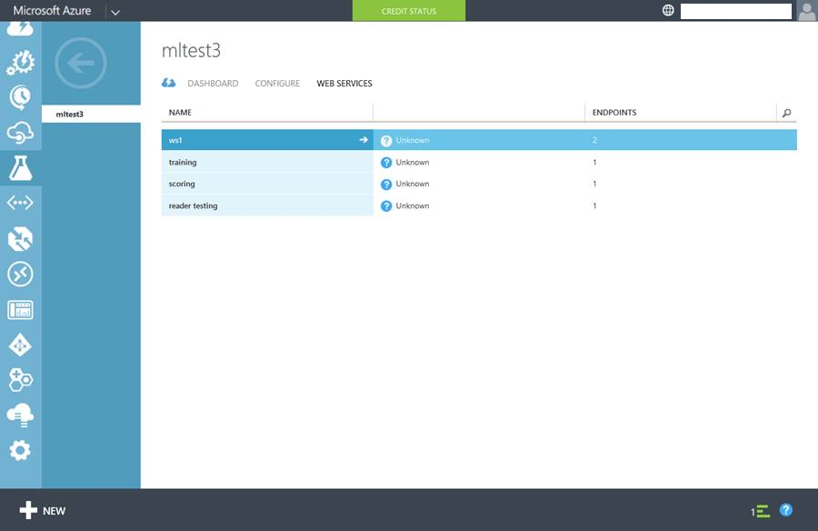

# Creating Endpoints
> [!NOTE]
> This topic describes techniques applicable to a classic web service.
> 
> 

Azure Machine Learning allows you to create multiple endpoints for a deployed web service. Each endpoint is individually addressed, throttled and managed, independently of the other endpoints of that web service. There is a unique URL and authorization key for each endpoint.

This allows you to create web services that you can then sell forward to your customers. Each endpoint can be individually customized with its own trained models while still being linked to the experiment which created the web service. In addition, any updates to the experiment can be selectively applied to an endpoint without overwriting the customizations.

[!INCLUDE [machine-learning-free-trial](../../includes/machine-learning-free-trial.md)]

## Endpoint Creation Steps
* Open [http://manage.windowsazure.com](http://manage.windowsazure.com), click **Machine Learning** in the left column. Click the workspace which has the web service you’re interested in.
  
* Click the **Web Services** tab.
  
* Click the web service you're interested in to see the list of available endpoints.
  
* Click the **Add Endpoint** button at the bottom. Fill in a name and description, ensure there are no other endpoints with the same name in this web service. Leave the throttle level with its default value unless you have special requirements.
  To learn more about throttling, see [Scaling API Endpoints](machine-learning-scaling-endpoints.md).
  

Once the endpoint is created, you can consume it through synchronous APIs, batch APIs, and excel worksheets. In addition to adding endpoints through this UI, you can also use the Endpoint Management APIs to programmatically add endpoints. For more information about using Machine Learning web services, see [How to consume a published Azure Machine Learning web service](machine-learning-consume-web-services.md).

 Note that you CANNOT delete the default endpoint, from the Studio or here, if you have added endpoints to it. It will throw an error.lick on Save.

