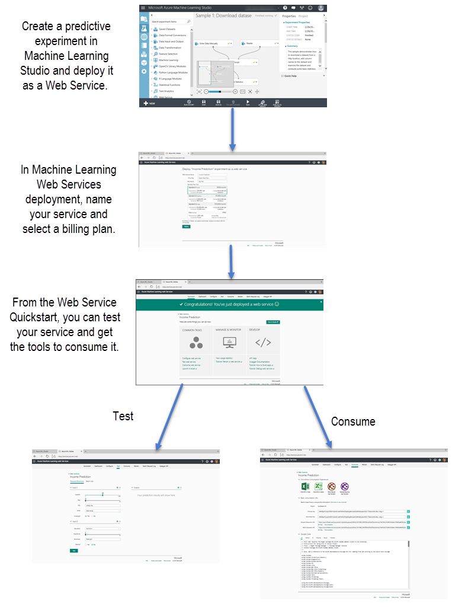

# Deploy a new web service
Microsoft Azure Machine learning now provides web services that are based on [Azure Resource Manager](../resource-group-overview.md) allowing for new billing plan options and deploying your web service to multiple regions.

The general workflow to deploy a web service using Microsoft Azure Machine Learning Web Services is:

* Create a predictive experiment
* deploy it
* configure its name
* billing plan
* test it
* consume it.

The following graphic illustrates the workflow.

## Deploy web service from Studio
To deploy an experiment as a new web service. Sign into the Machine Learning Studio and create a new predictive web service. 

**Note**: If you have already deployed an experiment as a classic web service you cannot deploy it as a new web service.

Click **Run** at the bottom of the experiment canvas and then click **Deploy Web Service** and **Deploy Web Service [New]**. The deployment page of the Machine Learning Web Service manager will open.

## Machine Learning Web Service Manager Deploy Experiment Page
On the Deploy Experiment page, enter a name for the web service.
Select a pricing plan. If you have an existing pricing plan you can select it, otherwise you must create a new price plan for the service. 

1. In the **Price Plan** drop down, select an existing plan or select the **Select new plan** option.
2. In **Plan Name**, type a name that will identify the plan on your bill.
3. Select one of the **Monthly Plan Tiers**. Note that the plan tiers default to the plans for your default region and your web service is deployed to that region.

Click **Deploy** and the Quickstart page for your web service opens.

## Quickstart page
The web service Quickstart page gives you access and guidance on the most common tasks you will perform after creating a new web service. From here you can easily access both the **Test** page and **Consume** page.

## Testing your web service
From the Quickstart page, click Test web service under common tasks.   

To test the web service as a Request-Response Service (RRS):

* Click **Test** on the menu bar.
* Click **Request-Response**.
* Enter appropriate values for the input columns of your experiment.
* Click Test **Request-Response**.

You results will display on the right hand side of the page.

To test a Batch Execution Service (BES) web service, you will use a CSV file:

* Click **Test** on the menu bar.
* Click **Batch**.
* Under your input, click Browse and navigate to your sample data file.
* Click **Test**.

The status of your test is displayed under **Test Batch Jobs**.

## Consuming your Web Service
When deployed as a web service, Azure Machine Learning experiments provide a REST API that can be consumed by a wide range of devices and platforms. This is because the simple REST API accepts and responds with JSON formatted messages. The Azure Machine Learning portal provides code that can be used to call the web service in R, C#, and Python.

On the Consuming page you can find:

* The API key and URI's for consuming web service in apps.
* Excel and web app templates to kick start your consumption process.
* Sample code in C#, python, and R to get you started.

For more information on consuming web services, see [How to consume an Azure Machine Learning web service that has been deployed from a Machine Learning experiment](machine-learning-consume-web-services.md).

<!--Image references-->
[1]: ./media/machine-learning-webservice-deploy-a-web-service/armdeploymentworkflow.png

<!--links-->
