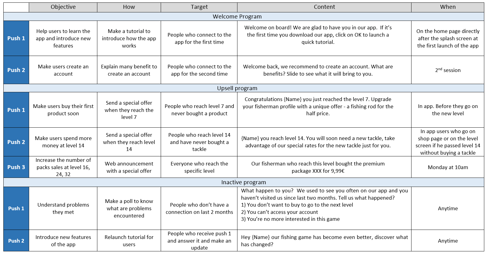

# Implement Mobile Engagement with Gaming App
## Overview
A gaming start-up has launched a new fishing based role-play/strategy game app. The game has been up and running for 6 months. This game is a huge success, and it has millions of downloads and the retention is very high compared to other start-up game apps. At the quarterly review meeting, stakeholders agree they need to increase average revenue per user (ARPU). Premium in-game packages are available as special offers. These game packs allow users to upgrade the appearance and performance of their fishing lines and lures or tackles in the game. However, package sales are very low. So they decide first to analyze the customer experience with an analytics tool, and then to develop an engagement program to increase sales using advanced segmentation.

Based on the [Azure Mobile Engagement - Getting Started Guide with Best practices](mobile-engagement-getting-started-best-practices.md) they build an engagement strategy.

## Objectives and KPIs
Key stakeholders for the game meet. All agree on one main objective - to increase premium package sales by 15%. They create Business Key Performance Indicators (KPIs) to measure and drive this objective

* On which level of the game are these packages purchased?
* What is the revenue per user, per session, per week, and per month?
* What are the favorite purchase types?

Part 1 of the [Getting Started Guide](mobile-engagement-getting-started-best-practices.md) explains how to define the objectives and KPIs. 

With the Business KPIs now defined, the Mobile Product Manager creates Engagement KPIs to determine new user trends and retention.

* Monitor retention and use across the following intervals: daily, every 2 days, weekly, monthly and every 3 months
* Active user counts
* The app rating in the store

Based on recommendations from the IT team, the following technical KPIs were added to answer the following questions:

* What is my user path (which page is visited, how much time users spend on it)
* Number of crashes or bugs encountered per session
* What OS versions are my users running?
* What is the average size of screen for my users?
* What kind of internet connectivity do my users have?

For each KPI the Mobile Product Manager specifies the data she needs and where it is located in her playbook.

## Engagement program and integration
Before building an advanced engagement program, the Mobile Project Director in charge of the project should have a deep understanding of how and when products are consumed by the users.

After 3 months, the Mobile Project Director has collected enough data to enhance his in-app push notification sales. He learns that:

* The first purchase generally happens at the level 14. For 90% of those cases, the purchase is new legendary weapons for $3.
* In 80 % of those cases, users who have made a purchase, continue with the product and make more purchases.
* Users who have passed the level 20, start to spend more than $10/week.
* Users tend to buy premium packages at level 16, 24 and 32.

Thanks to this analysis the Mobile Project Director decides to create specific push notification sequences to increase in app sales. He creates three push sequences which he calls: Welcome program, Sales Program, and Inactive Program. For more information refer to the [Playbooks](https://github.com/Azure/azure-mobile-engagement-samples/tree/master/Playbooks)
    

<!--Image references-->

[1]: ./media/mobile-engagement-game-scenario/notification-scenario.png

<!--Link references-->
