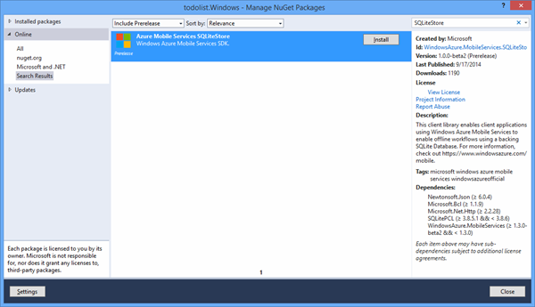
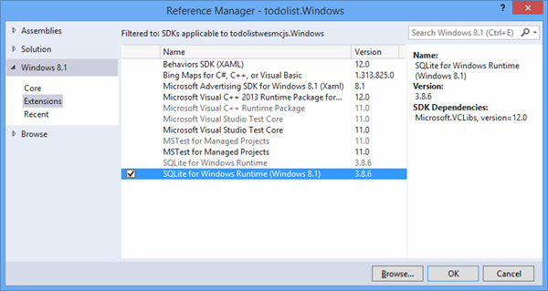
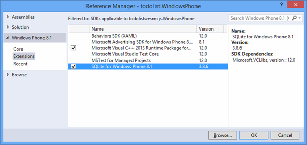
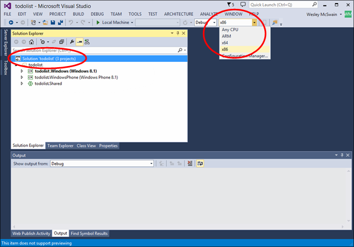
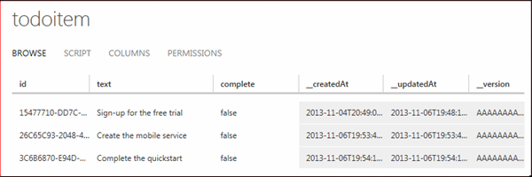
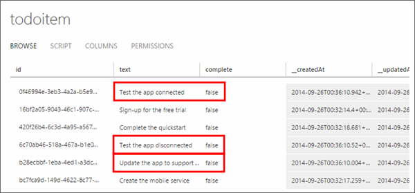
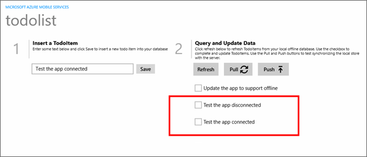
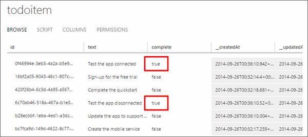

# Using offline data sync in Mobile Services
[!INCLUDE [mobile-service-note-mobile-apps](../../includes/mobile-services-note-mobile-apps.md)]

&nbsp;

[!INCLUDE [mobile-services-selector-offline](../../includes/mobile-services-selector-offline.md)]

This tutorial shows you how to add offline support to a Windows Universal Store app using Azure Mobile Services. Offline support will allow you to interact with a local database when your app is in an offline scenario. Once your app is online with the backend database, you sync your local changes using the offline features.

If you prefer to watch a video, the clip to the right follows the same steps as this tutorial.

> [!VIDEO https://channel9.msdn.com/Series/Windows-Azure-Mobile-Services/Build-offline-apps-Azure-Mobile-Services/player]
> 
> 
> 

In this tutorial, you update the Universal app project from the [Get started with Mobile Services](../mobile-services-windows-store-get-started.md) tutorial to support the offline features of Azure Mobile Services. Then you will add data in a disconnected offline scenario, sync those items to the online database, and then log in to the [Azure classic portal](https://manage.windowsazure.com) to view changes to data made when running the app.

> [!NOTE]
> This tutorial is intended to help you better understand how Mobile Services enables you to use Azure to store and retrieve data in a Windows Store app. If this is your first experience with Mobile Services, you should complete the tutorial [Get started with Mobile Services](../mobile-services-windows-store-get-started.md) first.
> 
> 

## Prerequisites
This tutorial requires the following:

* Visual Studio 2013 running on Windows 8.1.
* Completion of the [Get started with Mobile Services](../mobile-services-windows-store-get-started.md).
* [Azure Mobile Services SDK version 1.3.0 (or later)](http://www.nuget.org/packages/WindowsAzure.MobileServices/1.3.0)
* [Azure Mobile Services SQLite Store version 1.0.0 (or later)](http://www.nuget.org/packages/WindowsAzure.MobileServices.SQLiteStore/1.0.0)
* [SQLite for Windows 8.1](http://www.sqlite.org/download.html)
* An Azure account. If you don't have an account, you can sign up for an Azure trial and get up to 10 free mobile services that you can keep using even after your trial ends. For details, see [Azure Free Trial](https://azure.microsoft.com/pricing/free-trial/?WT.mc_id=AE564AB28).

## Update the app to support offline features
Azure Mobile Services offline features allow you to interact with a local database when you are in an offline scenario with your Mobile Service. To use these features in your app, you initialize a `MobileServiceClient.SyncContext` to a local store. Then reference your table through the `IMobileServiceSyncTable` interface. In this tutorial we use SQLite for the local store.

> [!NOTE]
> You can skip this section and just get the example project that already has offline support from the GitHub samples repository for Mobile Services. The sample project with offline support enabled is located here, [TodoList Offline Sample](http://go.microsoft.com/fwlink/?LinkId=394777).
> 
> 

1. Install the SQLite runtime for Windows 8.1 and Windows Phone 8.1.
   
   * **Windows 8.1 Runtime:** Install [SQLite for Windows 8.1](http://go.microsoft.com/fwlink/?LinkId=394776).
   * **Windows Phone 8.1:** Install [SQLite for Windows Phone 8.1](http://go.microsoft.com/fwlink/?LinkId=397953).
     
     > [!NOTE]
     > If you are using Internet Explorer, clicking the link to install SQLite may prompt you to download the .vsix as a .zip file. Save the file to a location on your hard drive with the .vsix extension instead of .zip. The double click the .vsix file in Windows Explorer to run the installation.
     > 
2. In Visual Studio open the project that you completed in the [Get started with Mobile Services](../mobile-services-windows-store-get-started.md) tutorial. Install the **WindowsAzure.MobileServices.SQLiteStore** NuGet package for the Windows 8.1 runtime and Windows Phone 8.1 projects.
   
   * **Windows 8.1:** In Solution Explorer, right click the Windows 8.1 project and click **Manage Nuget Packages** to run NuGet Package Manager. Search for **SQLiteStore** to install the `WindowsAzure.MobileServices.SQLiteStore` package.
   * **Windows Phone 8.1:** Right click the Windows Phone 8.1 project and click **Manage Nuget Packages** to run NuGet Package Manager. Search for **SQLiteStore** to install the `WindowsAzure.MobileServices.SQLiteStore` package.
     
     > [!NOTE]
     > If the installation creates a reference to an older version of SQLite, you can just delete that duplicate reference.
     > 
     > 
     
     
3. In Solution Explorer, right click **References** for the Windows 8.1 Runtime and Windows Phone 8.1 platform projects and ensure there is a reference to SQLite, which is located in the **Extensions** section.
   
    
     
   
    **Windows 8.1 Runtime**
   
    
     
   
    **Windows Phone 8.1**
4. The SQLite Runtime requires you to change the processor architecture of the project being built to **x86**, **x64**, or **ARM**. **Any CPU** is not supported. In Solution Explorer, click the Solution at the top, then change the processor architecture drop down box to one of the supported settings that you want to test.
   
    
5. In Solution Explorer, in the shared project, open the MainPage.cs file. Uncomment the following using statements at the top of the file:
   
        using Microsoft.WindowsAzure.MobileServices.SQLiteStore;  // offline sync
        using Microsoft.WindowsAzure.MobileServices.Sync;         // offline sync
6. In MainPage.cs, comment the definition of `todoTable` and uncomment the one on the following line that calls `MobileServicesClient.GetSyncTable()`:
   
        //private IMobileServiceTable<TodoItem> todoTable = App.MobileService.GetTable<TodoItem>();
        private IMobileServiceSyncTable<TodoItem> todoTable = App.MobileService.GetSyncTable<TodoItem>(); // offline sync
7. In MainPage.cs, in the region marked `Offline sync`, uncomment the methods `InitLocalStoreAsync` and `SyncAsync`. The method `InitLocalStoreAsync` initializes the client sync context with a SQLite store.
   
        private async Task InitLocalStoreAsync()
        {
            if (!App.MobileService.SyncContext.IsInitialized)
            {
                var store = new MobileServiceSQLiteStore("localstore.db");
                store.DefineTable<TodoItem>();
                await App.MobileService.SyncContext.InitializeAsync(store);
            }
   
            await SyncAsync();
        }
   
        private async Task SyncAsync()
        {
            await App.MobileService.SyncContext.PushAsync();
            await todoTable.PullAsync("todoItems", todoTable.CreateQuery());
        }
8. In the `OnNavigatedTo` event handler, uncomment the call to `InitLocalStoreAsync`:
   
        protected override async void OnNavigatedTo(NavigationEventArgs e)
        {
            await InitLocalStoreAsync(); // offline sync
            await RefreshTodoItems();
        }
9. Uncommment the 3 calls to `SyncAsync` in the methods `InsertTodoItem`, `UpdateCheckedTodoItem`, and `ButtonRefresh_Click`:
   
        private async Task InsertTodoItem(TodoItem todoItem)
        {
            await todoTable.InsertAsync(todoItem);
            items.Add(todoItem);
   
            await SyncAsync(); // offline sync
        }
   
        private async Task UpdateCheckedTodoItem(TodoItem item)
        {
            await todoTable.UpdateAsync(item);
            items.Remove(item);
            ListItems.Focus(Windows.UI.Xaml.FocusState.Unfocused);
   
            await SyncAsync(); // offline sync
        }
   
        private async void ButtonRefresh_Click(object sender, RoutedEventArgs e)
        {
            ButtonRefresh.IsEnabled = false;
   
            await SyncAsync(); // offline sync
            await RefreshTodoItems();
   
            ButtonRefresh.IsEnabled = true;
        }
10. Add exception handlers in the `SyncAsync` method:
    
        private async Task SyncAsync()
        {
            String errorString = null;
    
            try
            {
                await App.MobileService.SyncContext.PushAsync();
                await todoTable.PullAsync("todoItems", todoTable.CreateQuery()); // first param is query ID, used for incremental sync
            }
    
            catch (MobileServicePushFailedException ex)
            {
                errorString = "Push failed because of sync errors: " +
                  ex.PushResult.Errors.Count + " errors, message: " + ex.Message;
            }
            catch (Exception ex)
            {
                errorString = "Pull failed: " + ex.Message +
                  "\n\nIf you are still in an offline scenario, " +
                  "you can try your Pull again when connected with your Mobile Serice.";
            }
    
            if (errorString != null)
            {
                MessageDialog d = new MessageDialog(errorString);
                await d.ShowAsync();
            }
        }
    
    In this example, we retrieve all records in the remote `todoTable`, but it is also possible to filter records by passing a query. The first parameter to `PullAsync` is a query ID that is used for incremental sync, which uses the `UpdatedAt` timestamp to get only records modified since the last sync. The query ID should be a descriptive string that is unique for each logical query in your app. To opt-out of incremental sync, pass `null` as the query ID. This will retrieve all records on each pull operation, which is potentially inefficient.
    
    > [!NOTE]
    > * To remove records from the device local store when they have been deleted in your mobile service database, you should enable [Soft Delete](mobile-services-using-soft-delete.md). Otherwise, your app should periodically call `IMobileServiceSyncTable.PurgeAsync()` to purge the local store.
    > 
    > 
    
    Note that the `MobileServicePushFailedException` can occur for both a push and a pull operation. It can occur for a pull because the pull operation internally executes a push to make sure all tables along with any relationships are consistent. The next tutorial, [Handling conflicts with offline support for Mobile Services](mobile-services-windows-store-dotnet-handling-conflicts-offline-data.md), shows how to handle these sync related exceptions.
11. In Visual Studio, press the **F5** key to rebuild and run the app. The app will behave the same as it did before the offline sync changes, because it does a sync operation on the insert, update, and refresh operations.

## Update the sync behavior of the app
In this section, you will modify the app so that it does not sync on the insert and update operations, but only when the **Refresh** button is pressed. Then, you will break the app connection with the mobile service to simulate an offline scenario. When you add data items, they will be held in the local store, but not synced to the mobile service.

1. Open MainPage.cs in the shared project. Edit the methods `InsertTodoItem` and `UpdateCheckedTodoItem` to comment out the calls to `SyncAsync`.
2. Edit App.xaml.cs in the shared project. Comment out the initialization of the **MobileServiceClient** and add the following lines, which use an invalid mobile service URL:
   
         public static MobileServiceClient MobileService = new MobileServiceClient(
            "https://your-mobile-service.azure-mobile.xxx/",
            "AppKey"
        );
3. In `InitLocalStoreAsync()`, comment out the call to `SyncAsync()`, so that the app does not perform a sync on launch.
4. Press **F5** to build and run the app. Enter some new todo items and click **Save** for each one. The new todo items exist only in the local store until they can be pushed to the mobile service. The client app behaves as if its connected to the mobile service supporting all create, read, update, delete (CRUD) operations.
5. Close the app and restart it to verify that the new items you created are persisted to the local store.

## Update the app to reconnect your mobile service
In this section you reconnect the app to the mobile service. This simulates the app moving from an offline state to an online state with the mobile service. When you press the Refresh button, data will be synced to your mobile service.

1. Open App.xaml.cs in the shared project. Uncomment your previous initialization of `MobileServiceClient` to add back the correct mobile service URL and app key.
2. Press the **F5** key to rebuild and run the app. Notice that the data looks the same as the offline scenario even though the app is now connected to the mobile service. This is because this app always works with the `IMobileServiceSyncTable` that is pointed to the local store.
3. Log into the [Azure classic portal](https://manage.windowsazure.com) and look at the database for your mobile service. If your service uses the JavaScript backend for mobile services, you can browse the data from the **Data** tab of the mobile service.
   
    If you are using the .NET backend for your mobile service, in Visual Studio go to **Server Explorer** -> **Azure** -> **SQL Databases**. Right click your database and select **Open in SQL Server Object Explorer**.
   
    Notice the data has not been synchronized between the database and the local store.
   
    
4. In the app, press the **Refresh** button. This causes the app to call `PushAsync` and `PullAsync`. This push operation sends the local store items to the mobile service, then retrieves new data from the mobile service.
   
    A push operation is executed off the `MobileServiceClient.SyncContext` instead of the `IMobileServicesSyncTable` and pushes changes on all tables associated with that sync context. This is to cover scenarios where there are relationships between tables.
   
    
5. In the app, click the check box beside a few items to complete them in the local store.
   
    
6. Push the **Refresh** button again, which causes `SyncAsync` to be called. `SyncAsync` calls both push and pull, but in this case we could have removed the call to `PushAsync`. This is because a **pull always does a push first**. This is to ensure all tables in the local store along with relationships remain consistent.
   
    

## Summary
[!INCLUDE [mobile-services-offline-summary-csharp](../../includes/mobile-services-offline-summary-csharp.md)]

## Next steps
* [Handling conflicts with offline support for Mobile Services](mobile-services-windows-store-dotnet-handling-conflicts-offline-data.md)
* [Using Soft Delete in Mobile Services](mobile-services-using-soft-delete.md)

<!-- Anchors. -->
[Update the app to support offline features]: #enable-offline-app
[Update the sync behavior of the app]: #update-sync
[Update the app to reconnect your mobile service]: #update-online-app
[Next Steps]:#next-steps

<!-- Images -->
[1]: ./media/mobile-services-windows-store-dotnet-get-started-offline-data/mobile-services-add-reference-sqlite-dialog.png
[2]: ./media/mobile-services-windows-store-dotnet-get-started-offline-data/mobile-services-sqlitestore-nuget.png
[6]: ./media/mobile-services-windows-store-dotnet-get-started-offline-data/mobile-data-browse.png
[7]: ./media/mobile-services-windows-store-dotnet-get-started-offline-data/mobile-data-browse2.png
[8]: ./media/mobile-services-windows-store-dotnet-get-started-offline-data/mobile-services-online-app-run2.png
[10]: ./media/mobile-services-windows-store-dotnet-get-started-offline-data/mobile-data-browse3.png
[11]: ./media/mobile-services-windows-store-dotnet-get-started-offline-data/mobile-services-add-wp81-reference-sqlite-dialog.png
[12]: ./media/mobile-services-windows-store-dotnet-get-started-offline-data/new-synchandler-class.png
[13]: ./media/mobile-services-windows-store-dotnet-get-started-offline-data/cpu-architecture.png

<!-- URLs. -->
[Handling conflicts with offline support for Mobile Services]: mobile-services-windows-store-dotnet-handling-conflicts-offline-data.md
[TodoList Offline Sample]: http://go.microsoft.com/fwlink/?LinkId=394777
[Get started with Mobile Services]: /develop/mobile/tutorials/get-started/#create-new-service
[Getting Started]: ../mobile-services-dotnet-backend-windows-phone-get-started.md
[Get started with Mobile Services]: ../mobile-services-windows-store-get-started.md
[SQLite for Windows 8.1]: http://go.microsoft.com/fwlink/?LinkId=394776
[SQLite for Windows Phone 8.1]: http://go.microsoft.com/fwlink/?LinkId=397953
[Soft Delete]: mobile-services-using-soft-delete.md

[Mobile Services SDK Nuget]: http://www.nuget.org/packages/WindowsAzure.MobileServices/1.3.0
[SQLite store nuget]: http://www.nuget.org/packages/WindowsAzure.MobileServices.SQLiteStore/1.0.0
[Azure classic portal]: https://manage.windowsazure.com
