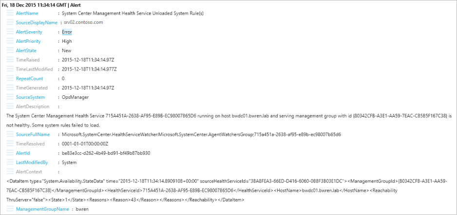
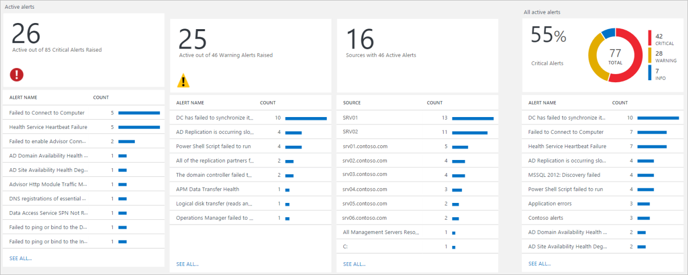
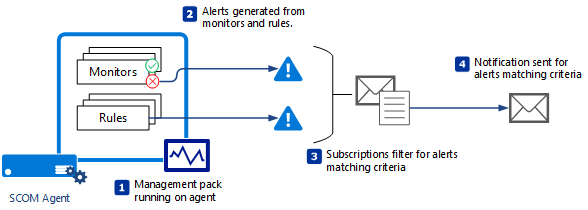

# Managing alerts with Microsoft monitoring
An alert indicates some issue that requires attention from an administrator.  There are distinct differences between System Center Operations Manager (SCOM) and Log Analytics in Operations Management Suite (OMS) in terms of how alerts are created, how they are managed and analyzed, and how you are notified that a critical issue has been detected.

## Alerts in Operations Manager
Alerts in SCOM are generated by individual rules or monitors to indicate a specific issue.  A monitor can generate an alert when it enters an error state while a rule may generate an alert to indicate some critical issue that is not directly related to the health of a managed object.  Management packs include a variety of workflows that create alerts for the application or service that they manage.  Part of the process of configuring a new management pack is tuning it to ensure that you don’t receive excessive alerts for issues that you don’t consider critical.

SCOM provides complete alert management with alerts having a status that can be changed by administrators as they work to resolve the issue.  When the issue has been resolved, the administrator sets the alert to closed at which time it will no longer appear in views displaying active alerts.  Alerts that are generated from monitors can be automatically resolved when the monitor returns to a healthy state.

## Alerts in Log Analytics
An alert in Log Analytics is created from a log query that is automatically run at regular intervals.  You can create an alert rule from any log query.  If the query returns results that match the criteria that you specify, then an alert is created.  This could be a specific query that creates an alert if a particular event is detected, or you could use a more general query that looks for any error event related to a particular application.

Log Analytics alerts are written to the OMS repository as an event and can be retrieved with a log query.  They do not have a status like SCOM events so that you can indicate when the issue has been resolved.

When SCOM is used as a data source for Log Analytics, SCOM alerts are written to the OMS repository as they are created and modified.  

The [Alert Management solution](http://technet.microsoft.com/library/mt484092.aspx) provides a summary of active alerts and several common queries to retrieve different sets of alerts.  This provides you with more effective analysis of your alerts than a report in SCOM.  You can drill down on from the summaries to detailed data and create ad hoc queries to retrieve different sets of alerts.

## Notifications
Notifications in SCOM send you a mail or text in response to alerts that match particular criteria.  You can create different notification subscriptions that have different people notified depending on such criteria as the object being monitored, the severity of the alert, the kind of problem that detected, or the time of day.

Few subscriptions can be used to implement a complete notification strategy for a large number of management packs.

Log Analytics can notify you through mail that an alert has been created by setting an email notification action on each [alert rule](http://technet.microsoft.com/library/mt614775.aspx).  It does not have the ability of SCOM the subscribe to multiple alerts with a single rule.  You also need to create your own alert rules since OMS does not provide any preconfigured.

You can’t completely manage SCOM alerts in Log Analytics though since you can only modify them in the Operations Console.  Log Analytics is useful as part of an alert management process though for providing analysis tools that SCOM alone doesn’t have.

## Alert Remediation
[Remediation](http://technet.microsoft.com/library/mt614775.aspx) refers to an attempt to automatically correct the problem identified by an alert.

SCOM allows you to run Diagnostics and Recoveries in response to a monitor entering an unhealthy state.  This happens simultaneous to the monitor creating the alert.  Diagnostics and recoveries are typically implemented as a script that runs on the agent.  A diagnostic attempts to gather more information about the detected issue while a recovery attempts to correct the problem.

Log Analytics allows you to start an [Azure Automation runbook](https://azure.microsoft.com/documentation/services/automation/) in response to a Log Analytics alert.  Runbooks can contain complex logic implemented in PowerShell.  The script runs in Azure and can access any Azure resources or external resources available from the cloud.  Azure Automation does have the ability to execute runbooks on a server in your local datacenter, but this feature is not currently available when starting the runbook in response to Log Analytics alerts.

Both recoveries in SCOM and runbooks in OMS can contain PowerShell scripts, but recoveries are more difficult to create and manage because they must be contained within a management pack.  Runbooks are stored in Azure Automation which provides features for authoring, testing, and managing runbooks.

If you use SCOM as a data source for Log Analytics, you could create a Log Analytics alert using a log query to retrieve SCOM alerts stored in the OMS repository.  This would allow you to run an Azure Automation runbook in response to a SCOM alert.  Of course, since the runbook will run in Azure, this would not be a viable strategy for recoveries of on-premises issues.

## Next steps
* Learn the details of [alerts in System Center Operations Manager (SCOM)](https://technet.microsoft.com/library/hh212913.aspx).

