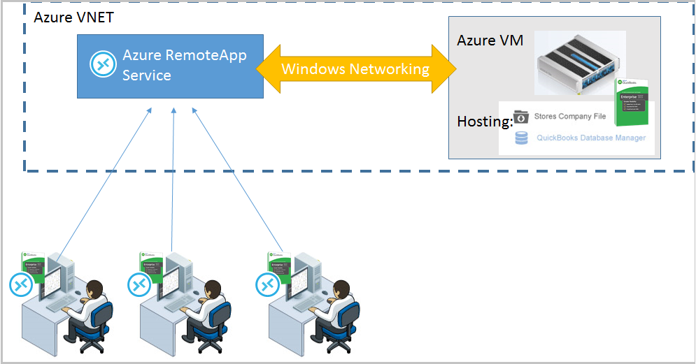

# How do you deploy QuickBooks in Azure RemoteApp?
Use the following information to share QuickBooks as an app in Azure RemoteApp.

You can share QuickBooks 2015 Enterprise with Azure RemoteApp in either a hybrid or cloud collection. The company file must reside on a VM that is running QuickBooks database server that is separate from the Azure RemoteApp servers. Never store the company file on your Azure RemoteApp image - data loss is expected if you do this. Only QuickBooks Enterprise supports hosting the QuickBooks file on an external share with QuickBooks database server accessible via standard Windows networking.   

> [!IMPORTANT]
> The QuickBooks database server that is hosting the company file must reside on a separate VM within the same VNET as the Azure RemoteApp collection.  
> 
> 

## Steps to deploy QuickBooks
1. Create an Azure VM and install QuickBooks, QuickBooks database server, and place the company file on a Azure VM.  Make sure to properly configure firewall rules.
2. Install QuickBooks on a [custom image](remoteapp-imageoptions.md) and create an [Azure RemoteApp collection](remoteapp-collections.md), either cloud or hybrid, within the exact same VNET where the VM hosting the QuickBooks database server with company files resides. 
3. [Publish](remoteapp-publish.md) QuickBooks app to users
4. Launch the Azure RemoteApp-hosted QuickBooks client, navigate using standard Windows networking to the VM hosting the QuickBooks database server and open the company file. 

## Documentation references
* QuickBooks [supported configurations](http://enterprisesuite.intuit.com/products/enterprise-solutions/technical/#top)
* QuickBooks [deployment options](http://enterprisesuite.intuit.com/everythingenterprise/launchpad/new-user/)

You can also check out my Ignite presentation, [Fundamentals of Microsoft Azure RemoteApp Management and Administration](https://channel9.msdn.com/Events/Ignite/2015/BRK3868) - fast-forward to 1:02:45 to get to the QuickBooks part.

## Deployment architecture

