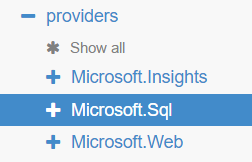
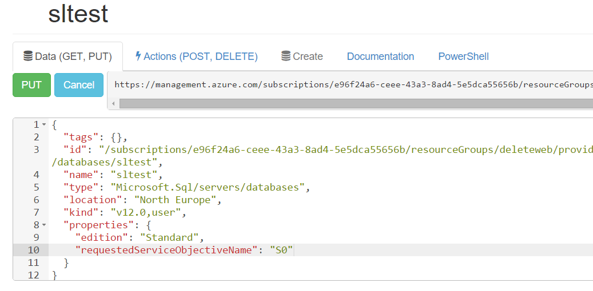

# Use Azure Resource Explorer to view and modify resources
The [Azure Resource Explorer](https://resources.azure.com) is a great tool for looking at resources that you've already created in your subscription. By using this tool, you can understand how the resources are structured, and see the properties assigned to each resource. You can learn about the REST API operations and PowerShell cmdlets that are available for a resource type, and you can issue commands through the interface. Resource Explorer can be particularly helpful when you are creating Resource Manager templates because it enables you to view the properties for existing resources.

The source for the Resource Explorer tool is available on [github](https://github.com/projectkudu/ARMExplorer), which provides a valuable reference if you need to implement similar behavior in your own applications.

## View resources
Navigate to [https://resources.azure.com](https://resources.azure.com) and sign in with the same credentials you would use for the [Azure Portal](https://portal.azure.com).

Once loaded, the treeview on the left allows you to drill down into your subscriptions and resource groups:

As you drill into a resource group you will see the providers for which there are resources in that group:

From there you can start drilling into the resource instances. In the screenshot below you can see the `sltest` SQL Server instance in the treeview. On the right hand side, you can see information about the REST API requests you can use with that resource. By navigating to the node for a resource, Resource Explorer automatically makes the GET request to retrieve information about the resource. In the large text area below the URL, you will see the response from the API. 

As you become familiar with Resource Manager templates the body content starts to look familiar! The **properties** section of the response matches the values you can provide in the **properties** section of your template.

Resource Explorer allows you to keep drilling down to explore child resources, in the case of the SQL Database Server, there are child resources for things such as databases and firewall rules.

Exploring a database shows us the properties for that database. In the screenshot below we can see that the database `edition` is `Standard` and the `serviceLevelObjective` (or database tier) is `S1`.

## Change resources
Once you have navigated to a resource, you can select the Edit button to make the JSON content editable. You can then use Resource Explorer to edit the JSON and send a PUT request to change the resource. For example, the image below shows the database tier changed to `S0`:

By selecting **PUT** you submit the request. 

Once the request has been submitted Resource Explorer re-issues the GET request to refresh the status. In this case we can see that the `requestedServiceObjectiveId` has been updated and is different from the `currentServiceObjectiveId` indicating that a scaling operation is in progress. You can click the GET button to refresh the status manually.

## Performing Actions on resources
The **Actions** tab enables you to see and perform additional REST operations. For example, when you have selected a web site resource, the Actions tab presents a long list of available operations, some of which are shown below.

## Invoking the API via PowerShell
The PowerShell tab in Resource Explorer shows you the cmdlets to use to interact with the resource that you are currently exploring. Depending on the type of resource you have selected, the displayed PowerShell script can range from simple cmdlets (such as `Get-AzureRmResource` and `Set-AzureRmResource`) to more complicated cmdlets (such as swapping slots on a web site). 

For more information on The Azure PowerShell cmdlets, see [Using Azure PowerShell with Azure Resource Manager](powershell-azure-resource-manager.md)

## Summary
When working with Resource Manager, the Resource Explorer can be an extremely useful tool. It is a great way to find ways to use PowerShell to query and make changes. If you're working with the REST API it is a great way to get started and quickly test API calls before you start writing code. And if you're writing templates it can be a great way to understand the resource hierarchy and find where to put configuration - you can make a change in the Portal and then find the corresponding entries in Resource Explorer!

For more information, watch the [Channel 9 video with Scott Hanselman and David Ebbo](https://channel9.msdn.com/Shows/Azure-Friday/Azure-Resource-Manager-Explorer-with-David-Ebbo)

