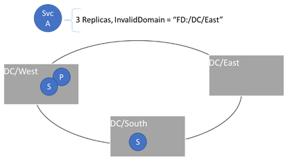
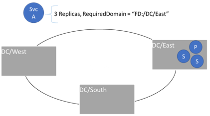
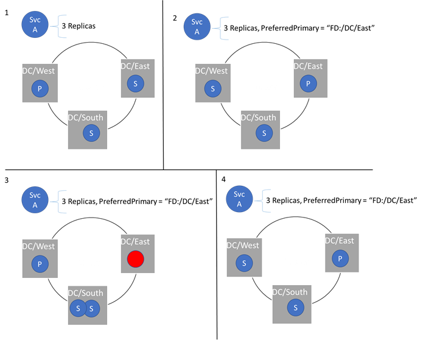

# Placement policies for service fabric services
There are many different additional rules that you may end up caring about if your Service Fabric cluster is spanned across a geographic distance, say multiple datacenters or Azure regions, or if your environment spans multiple areas of geopolitical control (or some other case where you have legal or policy boundaries you care about, or the distances involved have actual performance/latency impact). Most of these could be configured via node properties and placement constraints, but some are more complicated. In any case, we provide these shortcuts – just like placement constraints, placement policies can be configured on a per-named service instance basis.

## Specifying invalid domains
The InvalidDomain placement policy allows you to specify that a particular Fault Domain is invalid for this workload. This policy  ensures that a particular service never runs in a particular area, for example for geopolitical or corporate policy reasons. Multiple invalid domains may be specified



Code:

```csharp
ServicePlacementInvalidDomainPolicyDescription invalidDomain = new ServicePlacementInvalidDomainPolicyDescription();
requiredDomain.DomainName = "fd:/DCEast/"; //regulations prohibit this workload here
serviceDescription.PlacementPolicies.Add(invalidDomain);
```

Powershell:

```posh
New-ServiceFabricService -ApplicationName $applicationName -ServiceName $serviceName -ServiceTypeName $serviceTypeName –Stateful -MinReplicaSetSize 2 -TargetReplicaSetSize 3 -PartitionSchemeSingleton -PlacementPolicy @("InvalidDomain,fd:/dc9/”)
```
## Specifying required domains
The required domain placement policy requires that all of the replicas be present in the specified domain. Multiple required domains can be specified.



Code:

```csharp
ServicePlacementRequiredDomainPolicyDescription requiredDomain = new ServicePlacementRequiredDomainPolicyDescription();
requiredDomain.DomainName = "fd:/DC01/RK03/BL2";
serviceDescription.PlacementPolicies.Add(requiredDomain);
```

Powershell:

```posh
New-ServiceFabricService -ApplicationName $applicationName -ServiceName $serviceName -ServiceTypeName $serviceTypeName –Stateful -MinReplicaSetSize 2 -TargetReplicaSetSize 3 -PartitionSchemeSingleton -PlacementPolicy @("RequiredDomain,fd:/DC01/RK03/BL2")
```

## Specifying a preferred domain for the primary replicas
The preferred Primary domain is an interesting control, since it allows selection of the fault domain in which the primary should be placed if it is possible to do so. When everything is healthy the primary will end up in this domain. Should the domain or the primary replica fail or be shut down for some reason the Primary will be migrated to some other location. When possible it will move back to the preferred domain. Naturally this setting only makes sense for stateful services. This policy is most useful in geographically spanned clusters where you are using other locations for redundancy, but would prefer that the primary replicas be placed in a certain location in order to provider lower latency for operations which go to the primary (writes and also by default all reads are served by the primary).



```csharp
ServicePlacementPreferPrimaryDomainPolicyDescription primaryDomain = new ServicePlacementPreferPrimaryDomainPolicyDescription();
primaryDomain.DomainName = "fd:/EastUs/";
serviceDescription.PlacementPolicies.Add(invalidDomain);
```

Powershell:

```posh
New-ServiceFabricService -ApplicationName $applicationName -ServiceName $serviceName -ServiceTypeName $serviceTypeName –Stateful -MinReplicaSetSize 2 -TargetReplicaSetSize 3 -PartitionSchemeSingleton -PlacementPolicy @("PreferredPrimaryDomain,fd:/EastUs")
```

## Requiring replicas to be distributed among all domains and disallow packing
Another policy you can specify is to require replicas to always be distributed among the available domains. Notice that in the above example it is possible that temporarily multiple replicas (in fact a quorum, yikes) are packed into the same datacenter. In this case we’re actually probably ok since the Primary is not in the same DC as a majority of the replicas, but it points out that we could temporarily be subject to a configuration we wish to avoid. This will depend on other conditions in the cluster at the time, but you still may want to avoid the case entirely by ensuring that your replicas are always in separate domains. Keep in mind that if you select this you will be opting for downtime/failures rather than allowing the service to continue to run on the remaining nodes. The RequireDomainDistribution policy configures this behavior, but note that it may mean that we don’t place replicas at all if it would result in packing. This means that temporarily you’re running at below your target number of replicas until nodes in a viable domain come back. We’ve seen some customers who would rather have the target number of replicas (copies of state) at all times, whereas others won’t want to risk the availability concerns – if we do pack the replicas into a fault domain, and that domain fails, you lose all those replicas simultaneously. For small numbers of replicas this could result in quorum loss. In the unlikely even that the domain never came back, this could result in data loss. Since most people run with more than 3 replicas, the default is to not require domain distribution and let balancing and failover handle cases normally even if that means that temporarily a domain has multiple replicas packed into it.

Code:

```csharp
ServicePlacementRequireDomainDistributionPolicyDescription distributeDomain = new ServicePlacementRequireDomainDistributionPolicyDescription();
serviceDescription.PlacementPolicies.Add(distributeDomain);
```

Powershell:

```posh
New-ServiceFabricService -ApplicationName $applicationName -ServiceName $serviceName -ServiceTypeName $serviceTypeName –Stateful -MinReplicaSetSize 2 -TargetReplicaSetSize 3 -PartitionSchemeSingleton -PlacementPolicy @("RequiredDomainDistribution")
```

Now, would it be possible to use these configurations for services in a cluster which was not geographically spanned? Sure you could! But there’s not a great reason too – especially the required, invalid, and preferred domain configurations should be avoided unless you’re actually running a geographically spanned cluster.

## Next steps
* For more information about the other options available for configuring services check out the topic on the other Cluster Resource Manager configurations available [Learn about configuring Services](service-fabric-cluster-resource-manager-configure-services.md)

[Image1]:./media/service-fabric-cluster-resource-manager-advanced-placement-rules-placement-policies/cluster-invalid-placement-domain.png
[Image2]:./media/service-fabric-cluster-resource-manager-advanced-placement-rules-placement-policies/cluster-required-placement-domain.png
[Image3]:./media/service-fabric-cluster-resource-manager-advanced-placement-rules-placement-policies/cluster-preferred-primary-domain.png
