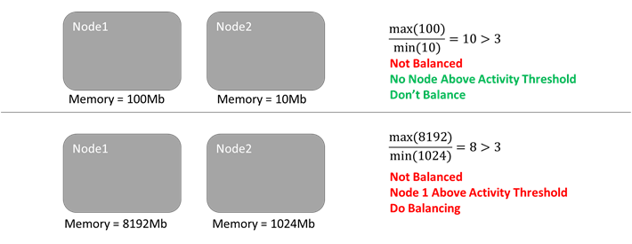
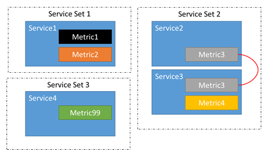

# Balancing your service fabric cluster
The Service Fabric Cluster Resource Manager allows reporting dynamic load, reacting to changes in the cluster, and generating plans for balance, but when does it do these things? What really triggers rebalancing in the cluster if services get placed according to their default load values when they are created? There are several controls related to this.

The first set of controls that govern balancing a set of timers that govern how often the Cluster Resource Manager examines the state of the cluster for things that need to be addressed. These timers relate to the different stages of work that it always does. These are:

1. Placement – this stage deals with placing any stateful replicas or stateless instances which are missing. This covers both new services and handling replicas or instances which have failed and need to be recreated. Deleting and dropping replicas or instances is also handled here.
2. Constraint Checks – this stage checks for and corrects violations of the different placement constraints (rules) within the system. Examples of rules are things like ensuring that nodes are not over capacity and that a service’s placement constraints (more on these later) are met.
3. Balancing – this stage checks to see if proactive rebalancing is necessary based on the configured desired level of balance for different metrics, and if so attempts to find an arrangement in the cluster that is more balanced.

## Configuring Cluster Resource Manager Steps and Timers
Each of these different stages is controlled by a different timer which governs its frequency. So for example, if you only want to deal with placing new service workloads in the cluster every hour (to batch them up), but want regular balancing checks every few seconds, you can enforce that. When each timer fires, a flag is set saying that we need to deal with that portion of the Resource Manager’s duties, and it is picked up in the next overall sweep through the state machine (that’s why these configurations are defined as “minimum intervals”). By default the Resource Manager scans its state and applies updates every 1/10th of a second, sets the placement and constraint check flags every second, and the balancing flag every 5 seconds.

ClusterManifest.xml:

``` xml
        <Section Name="PlacementAndLoadBalancing">
            <Parameter Name="PLBRefreshGap" Value="0.1" />
            <Parameter Name="MinPlacementInterval" Value="1.0" />
            <Parameter Name="MinConstraintCheckInterval" Value="1.0" />
            <Parameter Name="MinLoadBalancingInterval" Value="5.0" />
        </Section>
```

Today we only perform one of these actions at a time, sequentially. This is so that, for example, we’ve already responded to any requests to create new replicas before we move on to balancing the cluster. As you can see by the default time intervals specified, we can scan and check for anything we need to do very frequently, meaning that the set of changes we make at the end of the round is usually smaller: we’re not scanning through hours of changes in the cluster and trying to correct them all at once, we are trying to handle things more or less as they happen but with some batching when many things happen at the same time. This makes the Service Fabric resource manager very responsive to things that happen in the cluster.

Fundamentally the Cluster Resource Manager also needs to know when to consider the cluster imbalanced, and which replicas should be moved in order to fix things. For that we have two other major pieces of configuration: *Balancing Thresholds* and *Activity Thresholds*.

## Balancing thresholds
A Balancing Threshold is the main control for triggering proactive rebalancing. The Balancing Threshold defines how imbalanced the cluster needs to be for a specific metric in order for the Resource Manager to consider it imbalanced and trigger balancing.
Balancing Thresholds are defined on a per-metric basis as a part of the cluster definition:

ClusterManifest.xml

``` xml
    <Section Name="MetricBalancingThresholds">
      <Parameter Name="MetricName1" Value="2"/>
      <Parameter Name="MetricName2" Value="3.5"/>
    </Section>
```

The Balancing Threshold for a metric is a ratio. If the amount of load on the most loaded node divided by the amount of load on the least loaded node exceeds this ratio, then the cluster is considered imbalanced and balancing will be triggered during the next run of the Resource Manager’s state node.


In this simple example each service is just consuming one unit of some metric. In the top example, the maximum load on a node is 5 and the minimum is 2. Let’s say that the balancing threshold for this metric is 3. Therefore, in the top example, the cluster is considered balanced and no balancing will be triggered (since the ratio in the cluster is 5/2 = 2.5 and that is less than the specified balancing threshold of 3).

In the bottom example, the max load on a node is 10, while the minimum is 2 (resulting in a ratio of 5), putting us over the designed balancing threshold of 3. As a result, global rebalancing will happen the next time the timer fires and the load will almost certainly be distributed to Node3. Note that since we are not using a greedy approach some could also land on Node2 since that would result in minimization of the overall differences between nodes, but we would expect that the majority of the load would flow to Node3.


Note that getting below the balancing threshold is not an explicit goal – Balancing Thresholds are just the *trigger* that tells the Service Fabric Cluster Resource Manager that it should look into the cluster to determine what improvements it can make.

## Activity thresholds
Sometimes, although nodes are relatively imbalanced, the total amount of load in the cluster is low. This could be just because of the time of day, or because the cluster is new and just getting bootstrapped. In either case, you may not want to spend time balancing because there’s actually very little to be gained – you’ll just be spending network and compute resources to move things around. There’s another control inside of the Resource Manager, known as Activity Threshold, which allows you to specify some absolute lower bound for activity – if no node has at least this much load then balancing will not be triggered even if the Balancing Threshold is met.
As an example let’s say that we have reports with the following totals for consumption on these nodes. Let’s also say that we retain our Balancing Threshold of 3, but now we also have an Activity Threshold of 1536. In the first case, while the cluster is imbalanced per the balancing threshold no node meets that minimum activity threshold, so we leave things alone. In the bottom example, Node1 is way over the Activity Threshold, so balancing will be performed.



Just like Balancing Thresholds, Activity Thresholds are defined per-metric via the cluster definition:

ClusterManifest.xml

``` xml
    <Section Name="MetricActivityThresholds">
      <Parameter Name="Memory" Value="1536"/>
    </Section>
```

## Balancing services together
Something that’s interesting to note is that whether the cluster is imbalanced or not is a cluster-wide decision, but the way we go about fixing it is moving individual service replicas and instances around. This makes sense, right? If memory is stacked up on one node, multiple replicas or instances could be contributing to it, so it could take moving all replicas or instances that use the affected, imbalanced metric.

Occasionally though a customer will call us up or file a ticket saying that a service that wasn’t imbalanced got moved. How could that happen if all of that service’s metrics were balanced, even perfectly so, at the time of the other imbalance? Let’s see!

Take for example four services, S1, S2, S3, and S4. S1 reports against metrics M1 and M2, S2 against M2 and M3, S3 against M3 and M4, and S4 against some metric M99. Surely you can see where we’re going here. We have a chain! From the perspective of the Resource Manager, we don’t really have four independent services, we have a bunch of services that are related (S1, S2, and S3) and one that is off on its own.


Thus it is possible that an imbalance in Metric1 can cause replicas or instances belonging to Service3 to move around. Usually these movements are pretty limited, but can be larger depending on exactly how imbalanced Metric1 got and what changes were necessary in the cluster in order to correct it. We can also say with certainty that an imbalance in Metrics 1, 2, or 3 will never cause movements in Service4 – there’d be no point since moving the replicas or instances belonging to Service4 around can do absolutely nothing to impact the balance of Metrics 1, 2, or 3.

The Resource Manager automatically figures out what services are related every time it runs, since services may have been added, removed, or had their metric configuration change – for example, between two runs of balancing Service2 may have been reconfigured to remove Metric2. This breaks the chain between Service1 and Service2. Now instead of two groups of services, you have three:



## Next steps
* Metrics are how the Service Fabric Cluster Resource Manger manages consumption and capacity in the cluster. To learn more about them and how to configure them check out [this article](service-fabric-cluster-resource-manager-metrics.md)
* Movement Cost is one way of signaling to the Cluster Resource Manager that certain services are more expensive to move than others. To learn more about movement cost, refer to [this article](service-fabric-cluster-resource-manager-movement-cost.md)
* The Cluster Resource Manager has several throttles that you can configure to slow down churn in the cluster. They're not normally necessary, but if you need them you can learn about them [here](service-fabric-cluster-resource-manager-advanced-throttling.md)

[Image1]:./media/service-fabric-cluster-resource-manager-balancing/cluster-resrouce-manager-balancing-thresholds.png
[Image2]:./media/service-fabric-cluster-resource-manager-balancing/cluster-resource-manager-balancing-threshold-triggered-results.png
[Image3]:./media/service-fabric-cluster-resource-manager-balancing/cluster-resource-manager-activity-thresholds.png
[Image4]:./media/service-fabric-cluster-resource-manager-balancing/cluster-resource-manager-balancing-services-together1.png
[Image5]:./media/service-fabric-cluster-resource-manager-balancing/cluster-resource-manager-balancing-services-together2.png
