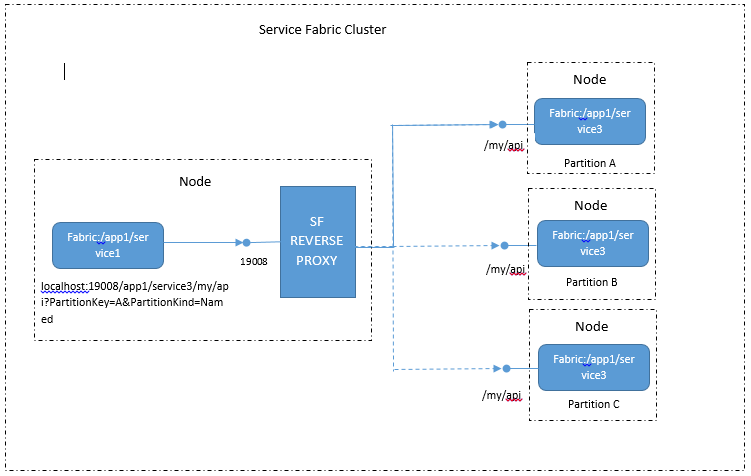
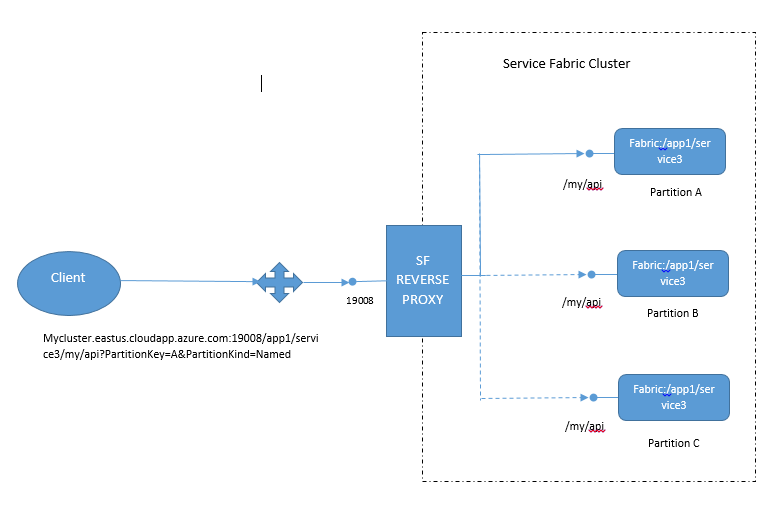

# Service Fabric Reverse Proxy
The Service Fabric Reverse proxy is a reverse proxy built-into service fabric that allows addressing microservices in the service fabric cluster that expose HTTP endpoints.

## Microservices communication model
Microservices in service fabric typically run on a subset of VM's in the cluster and can move from one VM to another for various reasons. So the endpoints for microservices can change dynamically. The typical pattern to communicate to the microservice is the resolve loop below,

1. Resolve the service location initially through the Naming Service.
2. Connect to the service.
3. Determine the cause of connection failures and re-resolve the service location when necessary.

This process generally involves wrapping client-side communication libraries in a retry loop that implements the service resolution and retry policies.
For more information on this topic, see [communicating with services](service-fabric-connect-and-communicate-with-services.md).

### Communicating via SF reverse proxy
Service Fabric reverse proxy runs on all the nodes in the cluster. It performs the entire service resolution process on a client's behalf and then forwards the client request. So clients running on the cluster can just use any client-side HTTP communication libraries to talk to the target service via the SF reverse proxy running locally on the same node.



## Reaching Microservices from outside the cluster
The default external communication model for microservices is **opt-in**  where each service by default cannot be accessed directly from external clients. The [Azure Load Balancer](../load-balancer/load-balancer-overview.md) is a network boundary between microservices and external clients, that performs network address translation and forwards external requests to internal **IP:port** endpoints. In order to make a microservice's endpoint directly accessible to external clients, the Azure Load Balancer must first be configured to forward traffic to each port used by the service in the cluster. Furthermore, most microservices(esp. stateful microservices) dont live on all the nodes of the cluster and they can move between nodes on failover, so in such cases, the Azure Load Balancer cannot effectively determine the target node of the replicas are located to forward the traffic to.

### Reaching Microservices via the SF reverse proxy from outside the cluster
Instead of configuring individual service's ports in the azure load balancer, just the SF Reverse proxy port can be configured in the Azure Load Balancer. This allows clients outside the cluster to reach services inside the cluster via the reverse proxy without an additional configurations.



> [!WARNING]
> Configuring the reverse proxy's port on the load balancer, makes all the micro services in the cluster that expose a http endpoint, to be addressible from outside the cluster.
> 
> 

## URI format for addressing services via the reverse proxy
The Reverse proxy uses a specific URI format to identify which service partition the incoming request should be forwarded to :

```
http(s)://<Cluster FQDN | internal IP>:Port/<ServiceInstanceName>/<Suffix path>?PartitionKey=<key>&PartitionKind=<partitionkind>&Timeout=<timeout_in_seconds>
```

* **http(s):** The reverse proxy can be configured to accept HTTP or HTTPS traffic. In case of HTTPS traffic, SSL termination occurs at the reverse proxy. Requests that are forwarded by the reverse proxy to services in the cluster are over http.
* **Gateway FQDN | internal IP:** For external clients, the reverse proxy can be configured so that it is reachable through the cluster domain (e.g., mycluster.eastus.cloudapp.azure.com). By default the reverse proxy runs on every node, so for internal traffic it can be reached on localhost or on any internal node IP (e.g., 10.0.0.1).
* **Port:** The port that has been specified for the reverse proxy. Eg: 19008.
* **ServiceInstanceName:** This is the fully-qualified deployed service instance name of the service you are trying to reach sans the "fabric:/" scheme. For example, to reach service *fabric:/myapp/myservice/*, you would use *myapp/myservice*.
* **Suffix path:** This is the actual URL path for the service that you want to connect to. For example, *myapi/values/add/3*
* **PartitionKey:** For a partitioned service, this is the computed partition key of the partition you want to reach. Note that this is *not* the partition ID GUID. This parameter is not required for services using the singleton partition scheme.
* **PartitionKind:** The service partition scheme. This can be 'Int64Range' or 'Named'. This parameter is not required for services using the singleton partition scheme.
* **Timeout:**  This specifies the timeout for the http request created by the reverse proxy to the service on behalf of the client request. The default value for this is 60 seconds. This is an optional parameter.

### Example usage
As an example, let's take service **fabric:/MyApp/MyService** that opens an HTTP listener on the following URL:

```
http://10.0.05:10592/3f0d39ad-924b-4233-b4a7-02617c6308a6-130834621071472715/
```

With the following resources:

* `/index.html`
* `/api/users/<userId>`

If the service uses the singleton partitioning scheme, the *PartitionKey* and *PartitionKind* query string parameters are not required, and the service can be reached via the gateway as:

* Externally: `http://mycluster.eastus.cloudapp.azure.com:19008/MyApp/MyService`
* Internally: `http://localhost:19008/MyApp/MyService`

If the service uses the Uniform Int64 partitioning scheme, the *PartitionKey* and *PartitionKind* query string parameters must be used to reach a partition of the service:

* Externally: `http://mycluster.eastus.cloudapp.azure.com:19008/MyApp/MyService?PartitionKey=3&PartitionKind=Int64Range`
* Internally: `http://localhost:19008/MyApp/MyService?PartitionKey=3&PartitionKind=Int64Range`

To reach the resources exposed by the service, simply place the resource path after the service name in the URL:

* Externally: `http://mycluster.eastus.cloudapp.azure.com:19008/MyApp/MyService/index.html?PartitionKey=3&PartitionKind=Int64Range`
* Internally: `http://localhost:19008/MyApp/MyService/api/users/6?PartitionKey=3&PartitionKind=Int64Range`

The gateway will then forward these requests to the service's URL:

* `http://10.0.05:10592/3f0d39ad-924b-4233-b4a7-02617c6308a6-130834621071472715/index.html`
* `http://10.0.05:10592/3f0d39ad-924b-4233-b4a7-02617c6308a6-130834621071472715/api/users/6`

## Special handling for port-sharing services
The Application Gateway attempts to re-resolve a service address and retry the request when a service cannot be reached. This is one of the major benefits of the gateway, as client code does not need to implement its own service resolution and resolve loop.

Generally when a service cannot be reached it means the service instance or replica has moved to a different node as part of its normal lifecycle. When this happens, the gateway may receive a network connection error indicating an endpoint is no longer open on the originally resolved address.

However, replicas or service instances can share a host process and may also share a port when hosted by an http.sys-based web server, including:

* [System.Net.HttpListener](https://msdn.microsoft.com/library/system.net.httplistener%28v=vs.110%29.aspx)
* [ASP.NET Core WebListener](https://docs.asp.net/latest/fundamentals/servers.html#weblistener)
* [Katana](https://www.nuget.org/packages/Microsoft.AspNet.WebApi.OwinSelfHost/)

In this situation it is likely that the web server is available in the host process and responding to requests but the resolved service instance or replica is no longer available on the host. In this case, the gateway will receive an HTTP 404 response from the web server. As a result, an HTTP 404 has two distinct meanings:

1. The service address is correct, but the resource requested by the user does not exist.
2. The service address is incorrect, and the resource requested by the user may actually exist on a different node.

In the first case, this is a normal HTTP 404, which is considered a user error. However, in the second case, the user has requested a resource that does exist, but the gateway was unable to locate it because the service itself has moved, in which case the gateway needs to re-resolve the address and try again.

The gateway thus needs a way to distinguish between these two cases. In order to make that distinction, a hint from the server is required.

* By default, the Application Gateway assumes case #2 and attempts to re-resolve and re-issue the request.
* To indicate case #1 to the Application Gateway, the service should return the following HTTP response header:

`X-ServiceFabric : ResourceNotFound`

This HTTP response header indicates a normal HTTP 404 situation in which the requested resource does not exist, and the gateway will not attempt to re-resolve the service address.

## Setup and configuration
The service fabric Reverse proxy can be enabled for the cluster via the [Azure Resource Manager template](service-fabric-cluster-creation-via-arm.md).

Once you have the template for the cluster that you want to deploy(either from the sample templates or by creating a custom resource manager template) the Reverse proxy can be enabled in the template by the following steps.

1. Define a port for the reverse proxy in the [Parameters section](../resource-group-authoring-templates.md) of the template.
   
    ```json
    "SFReverseProxyPort": {
        "type": "int",
        "defaultValue": 19008,
        "metadata": {
            "description": "Endpoint for Service Fabric Reverse proxy"
        }
    },
    ```
2. Specify the port for each of the nodetype objects in the **Cluster** [Resource type section](../resource-group-authoring-templates.md)
   
    ```json
    {
        "apiVersion": "2016-03-01",
        "type": "Microsoft.ServiceFabric/clusters",
        "name": "[parameters('clusterName')]",
        "location": "[parameters('clusterLocation')]",
        ...
       "nodeTypes": [
          {
           ...
           "httpApplicationGatewayEndpointPort": "[parameters('SFReverseProxyPort')]",
           ...
          },
        ...
        ],
        ...
    }
    ```
3. To address the reverse proxy from outside the azure cluster, setup the **azure load balancer rules** for the port specified in step 1.
   
    ```json
    {
        "apiVersion": "[variables('lbApiVersion')]",
        "type": "Microsoft.Network/loadBalancers",
        ...
        ...
        "loadBalancingRules": [
            ...
            {
                "name": "LBSFReverseProxyRule",
                "properties": {
                    "backendAddressPool": {
                        "id": "[variables('lbPoolID0')]"
                    },
                    "backendPort": "[parameters('SFReverseProxyPort')]",
                    "enableFloatingIP": "false",
                    "frontendIPConfiguration": {
                        "id": "[variables('lbIPConfig0')]"
                    },
                    "frontendPort": "[parameters('SFReverseProxyPort')]",
                    "idleTimeoutInMinutes": "5",
                    "probe": {
                        "id": "[concat(variables('lbID0'),'/probes/SFReverseProxyProbe')]"
                    },
                    "protocol": "tcp"
                }
            }
        ],
        "probes": [
            ...
            {
                "name": "SFReverseProxyProbe",
                "properties": {
                    "intervalInSeconds": 5,
                    "numberOfProbes": 2,
                    "port":     "[parameters('SFReverseProxyPort')]",
                    "protocol": "tcp"
                }
            }  
        ]
    }
    ```
4. To configure SSL certificates on the port for the Reverse proxy, add the certificate to the httpApplicationGatewayCertificate property in the **Cluster** [Resource type section](../resource-group-authoring-templates.md)
   
    ```json
    {
        "apiVersion": "2016-03-01",
        "type": "Microsoft.ServiceFabric/clusters",
        "name": "[parameters('clusterName')]",
        "location": "[parameters('clusterLocation')]",
        "dependsOn": [
            "[concat('Microsoft.Storage/storageAccounts/', parameters('supportLogStorageAccountName'))]"
        ],
        "properties": {
            ...
            "httpApplicationGatewayCertificate": {
                "thumbprint": "[parameters('sfReverseProxyCertificateThumbprint')]",
                "x509StoreName": "[parameters('sfReverseProxyCertificateStoreName')]"
            },
            ...
            "clusterState": "Default",
        }
    }
    ```

## Next steps
* See an example of HTTP communication between services in a [sample project on GitHUb](https://github.com/Azure-Samples/service-fabric-dotnet-getting-started/tree/master/Services/WordCount).
* [Remote procedure calls with Reliable Services remoting](service-fabric-reliable-services-communication-remoting.md)
* [Web API that uses OWIN in Reliable Services](service-fabric-reliable-services-communication-webapi.md)
* [WCF communication by using Reliable Services](service-fabric-reliable-services-communication-wcf.md)

[0]: ./media/service-fabric-reverseproxy/external-communication.png
[1]: ./media/service-fabric-reverseproxy/internal-communication.png
