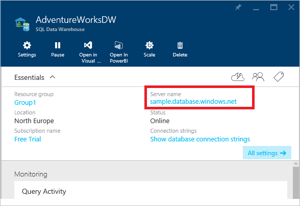

# Connect to Azure SQL Data Warehouse
> [!div class="op_single_selector"]
> * [Overview](sql-data-warehouse-connect-overview.md)
> * [Authentication](sql-data-warehouse-authentication.md)
> * [Drivers](sql-data-warehouse-connection-strings.md)
> 
> 

Overview of connecting to Azure SQL Data Warehouse. 

## Discover connection string from portal
Your SQL Data Warehouse is associated with an Azure SQL server. To connect you need the fully qualified name of the server (**servername**.database.windows.net*).

To find the fully qualified server name:

1. Go to the [Azure portal](https://portal.azure.com).
2. Click **SQL databases** and click the database you want to connect to. This example uses the AdventureWorksDW sample database.
3. Locate the full server name.
   
    

## Connection settings
SQL Data Warehouse standardizes a few settings during connection and object creation. These cannot be overridden.

| Database Setting | Value |
|:--- |:--- |
| ANSI_NULLS |ON |
| QUOTED_IDENTIFIERS |ON |
| NO_COUNT |OFF |
| DATEFORMAT |mdy |
| DATEFIRST |7 |
| Database Collation |SQL_Latin1_General_CP1_CI_AS |

## Sessions and requests
Once a connection has been made and a session has been established you are ready to write and submit queries to SQL Data Warehouse.

Each query will be represented by one or more request identifiers. All queries submitted on that connection are part of a single session and will therefore be represented by a single session id.

However, as SQL Data Warehouse is a distributed MPP (Massively Parallel Processing) system both session and request identifiers are exposed a little differently when compared to SQL Server.

Sessions and requests are logically represented by their respective identifiers.

| Identifier | Example value |
|:--- |:--- |
| Session ID |SID123456 |
| Request ID |QID123456 |

Notice that the Session ID is prefixed by SID - shorthand for Session ID - and the requests are prefixed by QID which is shorthand for Query ID.

You will need this information to help you identify your query when monitoring your query performance. You can monitor your query performance by using either the [Azure Portal](https://portal.azure.com) and the dynamic management views.

This query identifies your current session.

```sql
SELECT SESSION_ID()
;
```

To view all the queries that are either running or have recently run against your data warehouse you can use the following example. This creates a view and then runs the view.

```sql
CREATE VIEW dbo.vSessionRequests
AS
SELECT      s.[session_id]                                    AS Session_ID
        ,s.[status]                                        AS Session_Status
        ,s.[login_name]                                    AS Session_LoginName
        ,s.[login_time]                                    AS Session_LoginTime
        ,r.[request_id]                                    AS Request_ID
        ,r.[status]                                        AS Request_Status
        ,r.[submit_time]                                AS Request_SubmitTime
        ,r.[start_time]                                    AS Request_StartTime
        ,r.[end_compile_time]                            AS Request_EndCompileTime
        ,r.[end_time]                                    AS Request_EndTime
        ,r.[total_elapsed_time]                            AS Request_TotalElapsedDuration_ms
        ,DATEDIFF(ms,[submit_time],[start_time])        AS Request_InitiateDuration_ms
        ,DATEDIFF(ms,[start_time],[end_compile_time])    AS Request_CompileDuration_ms
        ,DATEDIFF(ms,[end_compile_time],[end_time])        AS Request_ExecDuration_ms
        ,[label]                                        AS Request_QueryLabel
        ,[command]                                        AS Request_Command
        ,[database_id]                                    AS Request_Database_ID
FROM    sys.dm_pdw_exec_requests r
JOIN    sys.dm_pdw_exec_sessions s    ON    r.[session_id] = s.[session_id]
WHERE   s.[session_id] <> SESSION_ID()
;

SELECT * FROM dbo.vSessionRequests;
```

## Next steps
To start querying your data warehouse with Visual Studio and other applications, see [Query with Visual Studio](sql-data-warehouse-query-visual-studio.md).

<!--Arcticles-->

[Query with Visual Studio]: ./sql-data-warehouse-query-visual-studio.md

<!--Other-->
[Azure portal]: https://portal.azure.com

<!--Image references-->

[1]: media/sql-data-warehouse-connect-overview/get-server-name.png


