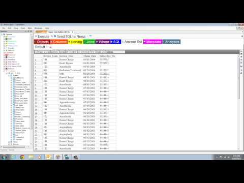
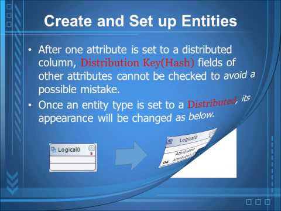
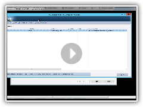
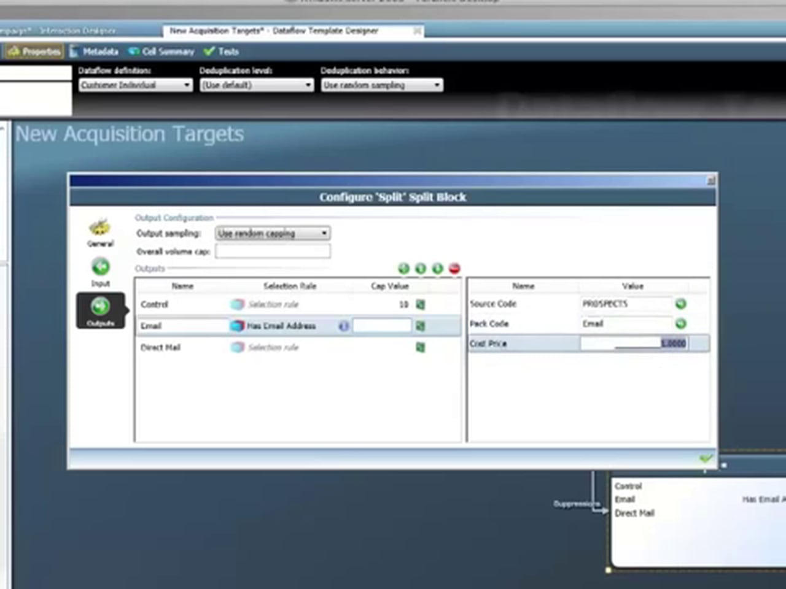
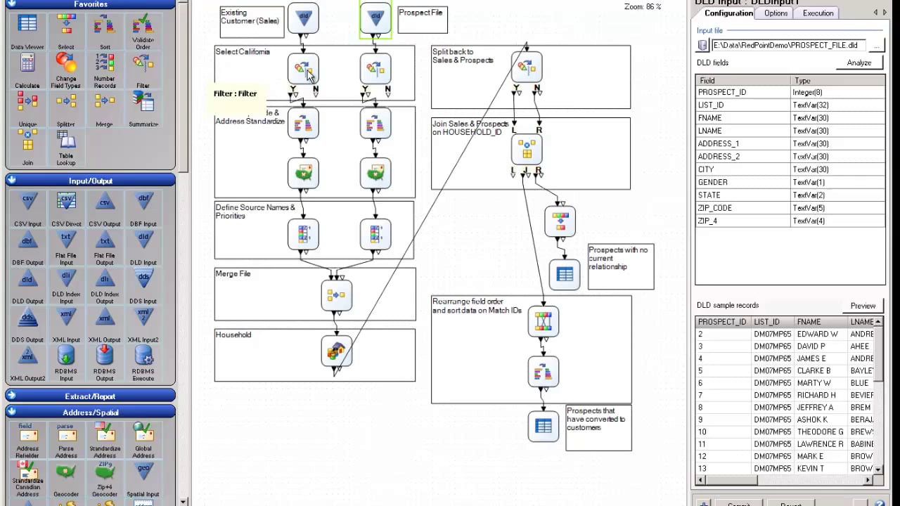

# SQL Data Warehouse data management partners
To create your end-to-end data warehouse solution, choose from a wide variety of industry-leading tools.  Below is a list of several partner companies that have data management tools and solutions for SQL Data Warehouse.

## Our data management partners
| Partner | Description | Links | Videos |
| --- | --- | --- | --- |
|  |**Coffing Data Warehousing** Coffing Data Warehousing provides Nexus Chameleon, a tool with 10 years of design dedicated to querying systems. Nexus is available as a query tool for SQL Data Warehouse. Use Nexus to query  in-house and cloud computers and join data across different platforms. Point-Click-Report! |[Marketplace](https://azure.microsoft.com/en-us/marketplace/partners/nexus/nexus-chameleon-9/) [Website](http://www.coffingdw.com/software/nexus/) [Press Release](http://www.coffingdw.com/press-release-nexus-tuned-for-azure-sql-data-warehouse/) [Twitter](https://twitter.com/CoffingDW) [YouTube](https://www.youtube.com/channel/UC8o1zhc9tNp9ve6vDn34tkw) | |
|  |**MicroERD** Inbrein MicroERD provides the tools that you need in order to create a precise data model, reduce data redundancy, improve productivity, and observe standards. By using its UI which was developed based on extensive user experiences, a modeler can work on DB models easily and conveniently. You can continuously enjoy new and improved functions of MicroERD through prompt functional improvements and updates. |[Website](http://microerd.com/) [Datasheet](http://microerd.com/images/MicroERD_Manual/MicroERD_Manual.pdf) [Twitter](https://twitter.com/microerd) [YouTube](https://www.youtube.com/channel/UCHTYjFFaTpo6bPAtuxgdZig) | |
|  |**Infolibrarian** InfoLibrarian catalogs, stores, and manages metadata to help you solve key pain points of data management. In addition, we provide metadata management, data governance and asset management software solutions for managing and publishing metadata from a diverse set of tools and technologies. |[Marketplace](https://azure.microsoft.com/en-us/marketplace/partners/infolibrarian/infolibrarian-metadata-management-server/) [Website](http://www.infolibcorp.com/metadata-management/software-tools) [Twitter](https://twitter.com/InfoLibCorp) | |
|  |**RedPoint Interaction** RedPoint Interaction empowers you to engage with customers in a continuous dialog across every communication channel and touch point. Easily manage the complete lifecycle of omnichannel marketing from a single point of operational control |[Marketplace](https://azure.microsoft.com/en-us/marketplace/partners/redpoint-global/redpoint-interaction/) [Website](http://www.redpoint.net/products/customer-interaction-management/) [Press Release](http://www.redpoint.net/press/redpoint-global-announces-support-for-microsoft-azure-sql-data-warehouse-microsoft-azure-data-lake-service/) [Datasheet](http://www.redpoint.net/wp-content/uploads/2016/06/RedPoint-Interaction-FS-wordle-8.5x11-RPIUS0815-07-PRINT.pdf) [Twitter](https://twitter.com/RedPointGlobal) [YouTube](https://www.youtube.com/user/RedPointGlobal) | |
|  |**RedPoint Data Management** RedPoint Data Management enable marketers to leverage all their data to drive cross-channel customer engagement while performing structured and unstructured data management. By taking advantage of Microsoft Azure SQL Data Warehouse, RedPoint users can maximize the value of all their structured or unstructured data to deliver the hyper-personalized and contextual interactions needed to engage today’s omni-channel customer. Drag-and-drop interface makes designing and executing data management processes easy. |[Marketplace](https://azure.microsoft.com/en-us/marketplace/partners/redpoint-global/redpoint-rpdm/) [Website](http://www.redpoint.net/products/data-management-solutions/) [Press Release](http://www.redpoint.net/press/redpoint-global-announces-support-for-microsoft-azure-sql-data-warehouse-microsoft-azure-data-lake-service/) [Datasheet](http://www.redpoint.net/wp-content/uploads/2014/09/RedPoint-Data-Management-FS-V2-wordle-8.5x11-0216-WEB.pdf) [Twitter](https://twitter.com/RedPointGlobal) [YouTube](https://www.youtube.com/user/RedPointGlobal) | |
|  |**SQL Sentry** SQL Sentry Performance Advisor delivers real-time and historical views of the most pertinent Azure SQL Data Warehouse performance metrics, allowing customers to see performance trends, and easily access more detailed information for in-depth analysis and troubleshooting. Performance Advisor allows viewing of performance data for any point in time or date range. |[Marketplace](https://azure.microsoft.com/en-us/marketplace/partners/sqlsentry/sqlsentryplatform/) [Website](http://www.sqlsentry.com/solutions/business-analytics/) [Press Release](http://blogs.sqlsentry.com/davidbenoit/sql-sentry-v9-aps-sql-dw/) [Twitter](https://twitter.com/SQLSentry) [YouTube](https://www.youtube.com/user/SQLSentry) | |

## Next Steps
To learn more about some of our other partners, see [Business Intelligence partners](sql-data-warehouse-partner-business-intelligence.md) and [Data Integration partners](sql-data-warehouse-partner-data-integration.md).

<!--Image references-->
[1]: ./media/sql-data-warehouse-partner-data-management/coffing_data_warehousing_logo.png
[2]: ./media/sql-data-warehouse-partner-data-management/inbrein_logo.png
[3]: ./media/sql-data-warehouse-partner-data-management/infolibrarian_logo.png
[4]: ./media/sql-data-warehouse-partner-data-management/redpoint_global_logo.png
[5]: ./media/sql-data-warehouse-partner-data-management/sql_sentry_logo.png

<!--Article links-->
[bi_partners]: ./sql-data-warehouse-partner-business-intelligence.md
[dm_partners]: ./sql-data-warehouse-partner-data-management.md
[di_partners]: ./sql-data-warehouse-partner-data-integration.md

<!--Website links -->
[coffing_website]:http://www.coffingdw.com/software/nexus/
[inbrein_website]:http://microerd.com/
[infolibrarian_website]:http://www.infolibcorp.com/metadata-management/software-tools
[redpoint_it_website]:http://www.redpoint.net/products/customer-interaction-management/
[redpoint_dm_website]:http://www.redpoint.net/products/data-management-solutions/
[sql_sentry_website]:http://www.sqlsentry.com/solutions/business-analytics/

<!--ebook Links-->

<!--Datasheet Links-->
<!--[coffing_datasheet]:-->
[inbrein_datasheet]:http://microerd.com/images/MicroERD_Manual/MicroERD_Manual.pdf
<!--[infolibrarian_datasheet]:-->
[redpoint_it_datasheet]:http://www.redpoint.net/wp-content/uploads/2016/06/RedPoint-Interaction-FS-wordle-8.5x11-RPIUS0815-07-PRINT.pdf
[redpoint_dm_datasheet]:http://www.redpoint.net/wp-content/uploads/2014/09/RedPoint-Data-Management-FS-V2-wordle-8.5x11-0216-WEB.pdf
<!--[sql_sentry_datasheet]:-->

<!--Marketplace Links -->
[coffing_marketplace]:https://azure.microsoft.com/en-us/marketplace/partners/nexus/nexus-chameleon-9/ 
<!--[inbrein_marketplace]:-->
[infolibrarian_marketplace]:https://azure.microsoft.com/en-us/marketplace/partners/infolibrarian/infolibrarian-metadata-management-server/
[redpoint_it_marketplace]:https://azure.microsoft.com/en-us/marketplace/partners/redpoint-global/redpoint-interaction/
[redpoint_dm_marketplace]:https://azure.microsoft.com/en-us/marketplace/partners/redpoint-global/redpoint-rpdm/ 
[sql_sentry_marketplace]:https://azure.microsoft.com/en-us/marketplace/partners/sqlsentry/sqlsentryplatform/

<!--Press links-->
[coffing_press]:http://www.coffingdw.com/press-release-nexus-tuned-for-azure-sql-data-warehouse/
<!--[inbrein_press]:-->
<!--[infolibrarian_press]:-->
[redpoint_press]:http://www.redpoint.net/press/redpoint-global-announces-support-for-microsoft-azure-sql-data-warehouse-microsoft-azure-data-lake-service/
[sql_sentry_press]:http://blogs.sqlsentry.com/davidbenoit/sql-sentry-v9-aps-sql-dw/

<!--YouTube links-->
[coffing_youtube]:https://www.youtube.com/channel/UC8o1zhc9tNp9ve6vDn34tkw
[inbrein_youtube]:https://www.youtube.com/channel/UCHTYjFFaTpo6bPAtuxgdZig
<!--[infolibrarian_youtube]:-->
[redpoint_youtube]:https://www.youtube.com/user/RedPointGlobal
[sql_sentry_youtube]:https://www.youtube.com/user/SQLSentry

<!--Twitter links-->
[coffing_twitter]:https://twitter.com/CoffingDW
[inbrein_twitter]:https://twitter.com/microerd
[infolibrarian_twitter]:https://twitter.com/InfoLibCorp
[redpoint_twitter]:https://twitter.com/RedPointGlobal
[sql_sentry_twitter]:https://twitter.com/SQLSentry

<!--Video links-->
