# Get the client id and key for connecting to SQL Database from code
To create and manage SQL Database from code you must register your app in the Azure Active Directory (AAD) domain associated with the subscription where your Azure resources have been created. When you register your application, Azure will generate a client id and key that you will need in your code to authenticate your app. For more information, see [Azure Active Directory](https://azure.microsoft.com/documentation/services/active-directory/).

## Register a native client application and get the client id
To create a new application and register it do the following:

1. Login to the [Classic Portal](https://manage.windowsazure.com/) (currently, registering applications need to be done in the Classic Portal).
2. Locate **Active Directory** in the menu and select it.
   
    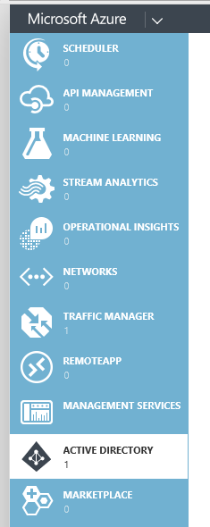
3. Select the directory to authenticate your application and click it's **Name**.
   
    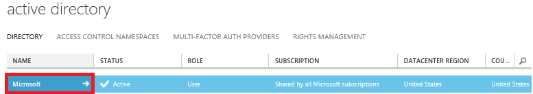
4. On the directory page, click **APPLICATIONS**.
   
    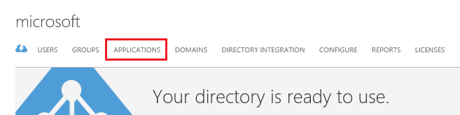
5. Click **ADD** to create a new application.
   
    
6. Provide a **NAME** for the app, and select **NATIVE CLIENT APPLICATION**.
   
    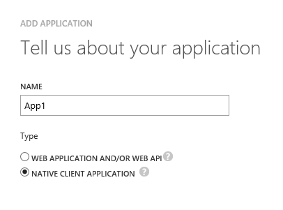
7. Provide a **REDIRECT URI**. It doesn't need to be an actual endpoint, just a valid URI.
   
    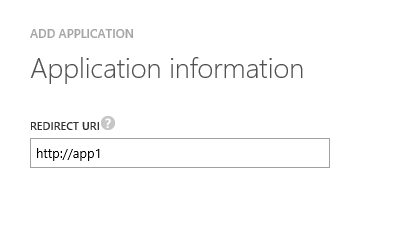
8. Finish creating the app, click **CONFIGURE**, and copy the **CLIENT ID** (this is the value you will need in your code).
   
    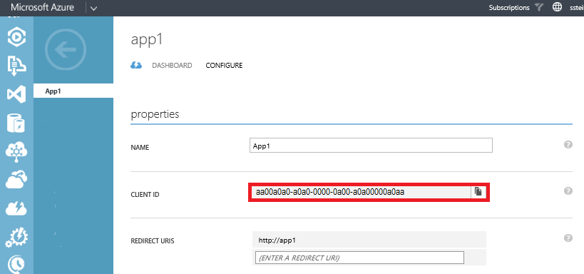
9. Scroll down on the page and click **Add application**.
10. Select **Microsoft Apps**.
11. Select **Windows Azure Service Management API**, and then complete the wizard.
12. In the **permissions to other applications** section locate the **Windows Azure Service Management API** and click **Delegated Permissions**.
13. Select **Access Azure Service Management...**.
    
     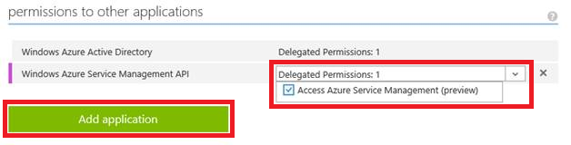
14. Click **SAVE** at the bottom of the page.

## Register a web app (or web api) and get the client id and key
To create a new application and register it in the correct active directory do the following:

1. Login to the [Classic Portal](https://manage.windowsazure.com/).
2. Locate **Active Directory** in the menu and select it.
   
    
3. Select the directory to authenticate your application and click it's **Name**.
   
    
4. On the directory page, click **APPLICATIONS**.
   
    
5. Click **ADD** to create a new application.
   
    
6. Provide a **NAME** for the app, and select **WEB APPLICATION AND/OR WEB API**.
   
    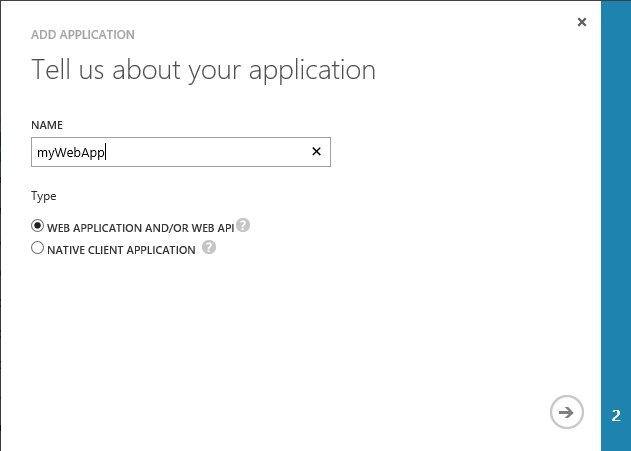
7. Provide a **SIGN-ON URL**, and an **APP ID URI**. It doesn't need to be an actual endpoint, just a valid URI.
   
    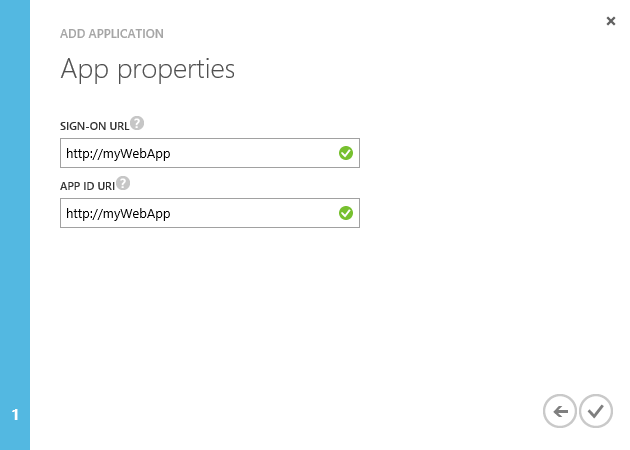
8. Finish creating the app, then click **CONFIGURE**.
   
    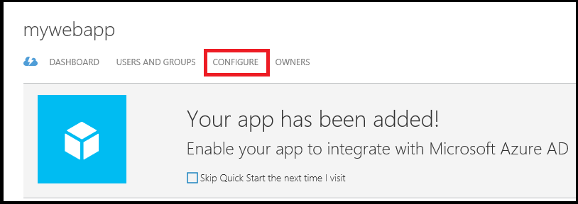
9. Scroll to the **keys** section and select **1 year** in the **Select duration** list. The key value will be displayed after you save so we'll come back and copy the key later.
   
    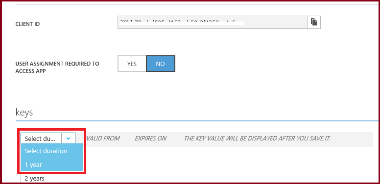
10. Scroll down on the page and click **Add application**.
11. Select **Microsoft Apps**.
12. Locate and select **Windows Azure Service Management API**, and then complete the wizard.
13. In the **permissions to other applications** section locate the **Windows Azure Service Management API** and click **Delegated Permissions**.
14. Select **Access Azure Service Management...**.
    
     
15. Click **SAVE** at the bottom of the page.
16. After the save completes locate and save the CLIENT ID and key:
    
     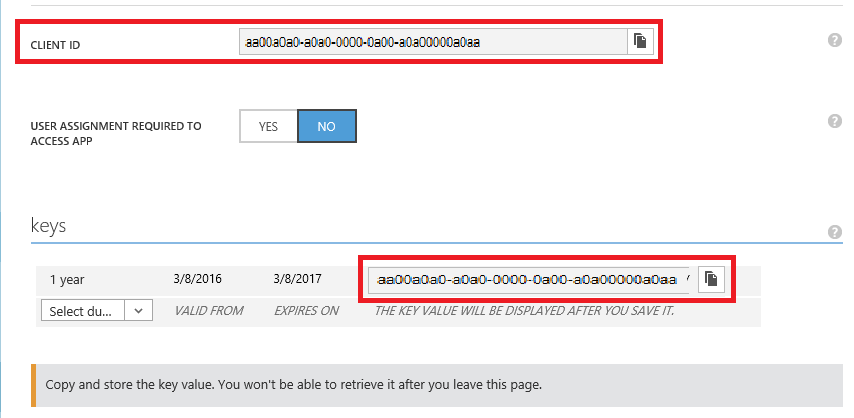

## Get your domain name
The domain name is sometimes required for your auth code. An easy way to identify the proper domain name is to:

1. Go to the [Azure Portal](https://portal.azure.com).
2. Hover over your name in the upper right corner and note the Domain that appears in the pop-up window.
   
    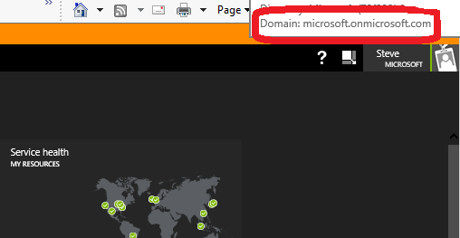

## Example Console Application
Get the required management library by installing the following packages using the [package manager console](http://docs.nuget.org/Consume/Package-Manager-Console) in Visual Studio (**Tools** > **NuGet Package Manager** > **Package Manager Console**):

    PM> Install-Package Microsoft.Azure.Common.Authentication –Pre

Create a console app named **SqlDbAuthSample** and replace the contents of **Program.cs** with the following:

    using Microsoft.IdentityModel.Clients.ActiveDirectory;
    using System;

    namespace SqlDbAuthSample
    {
    class Program
    {
        static void Main(string[] args)
        {
            token = GetAccessTokenforNativeClient();
            // token = GetAccessTokenUsingUserCredentials(new UserCredential("<email address>"));
            // token = GetAccessTokenForWebApp();

            Console.WriteLine("Signed in as: " + token.UserInfo.DisplayableId);

            Console.WriteLine("Press Enter to continue...");
            Console.ReadLine();
        }

        // authentication variables (native)
        static string nclientId = "<your client id>";
        static string nredirectUri = "<your redirect URI>";
        static string ndomainName = "<i.e. microsoft.onmicrosoft.com>";
        static AuthenticationResult token;

        private static AuthenticationResult GetAccessTokenforNativeClient()
        {
            AuthenticationContext authContext = new AuthenticationContext
                ("https://login.windows.net/" + ndomainName /* Tenant ID or AAD domain */);

            token = authContext.AcquireToken
                ("https://management.azure.com/"/* the Azure Resource Management endpoint */,
                    nclientId,
            new Uri(nredirectUri),
            PromptBehavior.Auto /* with Auto user will not be prompted if an unexpired token is cached */);

            return token;
        }

        // authentication variables (web)
        static string wclientId = "<your client id>";
        static string wkey = "<your key>";
        static string wdomainName = "<i.e. microsoft.onmicrosoft.com>";

        private static AuthenticationResult GetAccessTokenForWebApp()
        {
            AuthenticationContext authContext = new AuthenticationContext
                ("https://login.windows.net/" /* AAD URI */
                + wdomainName /* Tenant ID or AAD domain */);

            ClientCredential cc = new ClientCredential(wclientId, wkey);

            AuthenticationResult token = authContext.AcquireToken(
                "https://management.azure.com/"/* the Azure Resource Management endpoint */,
                cc);

            return token;
        }

        private static AuthenticationResult GetAccessTokenUsingUserCredentials(UserCredential userCredential)
        {
            AuthenticationContext authContext = new AuthenticationContext
                ("https://login.windows.net/" /* AAD URI */
                + ndomainName /* Tenant ID or AAD domain */);

            AuthenticationResult token = authContext.AcquireToken(
                "https://management.azure.com/"/* the Azure Resource Management endpoint */,
                nclientId /* application client ID from AAD*/,
                new Uri(nredirectUri) /* redirect URI */,
                PromptBehavior.Auto,
                new UserIdentifier(userCredential.UserName, UserIdentifierType.RequiredDisplayableId));

            return token;
        }
    }
    }

For specific code examples related to Azure AD authentication see the [SQL Server Security Blog](http://blogs.msdn.com/b/sqlsecurity/) on MSDN.

## See also
* [Create a SQL database with C#](sql-database-get-started-csharp.md)
* [Connecting to SQL Database By Using Azure Active Directory Authentication](sql-database-aad-authentication.md)

<!--Image references-->
[1]: ./media/sql-database-client-id-keys/aad.png
[2]: ./media/sql-database-client-id-keys/permissions.png
[3]: ./media/sql-database-client-id-keys/getdomain.png
[4]: ./media/sql-database-client-id-keys/aad2.png
[5]: ./media/sql-database-client-id-keys/aad-applications.png
[6]: ./media/sql-database-client-id-keys/add.png
[7]: ./media/sql-database-client-id-keys/add-application.png
[8]: ./media/sql-database-client-id-keys/add-application2.png
[9]: ./media/sql-database-client-id-keys/clientid.png
[10]: ./media/sql-database-client-id-keys/add-application-web.png
[11]: ./media/sql-database-client-id-keys/add-application-app-properties.png
[12]: ./media/sql-database-client-id-keys/configure.png
[13]: ./media/sql-database-client-id-keys/key-duration.png
[14]: ./media/sql-database-client-id-keys/web-secrets.png