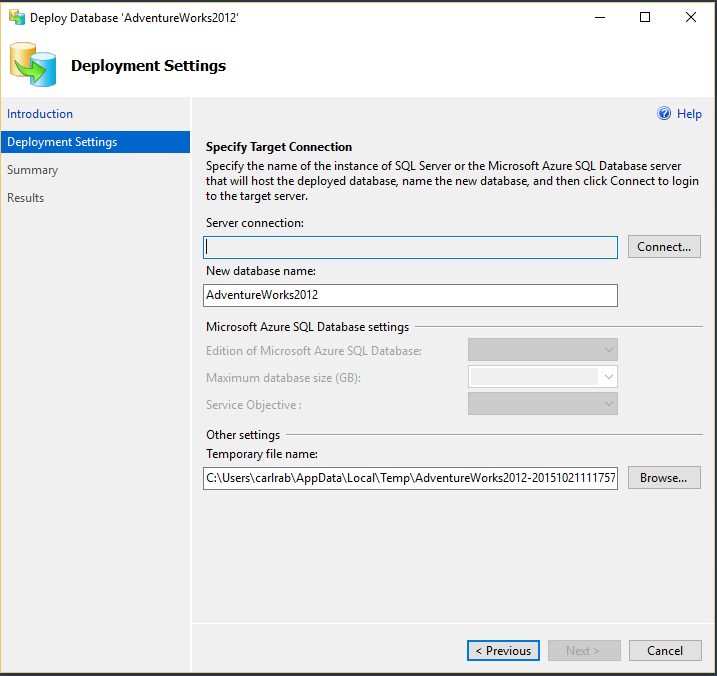
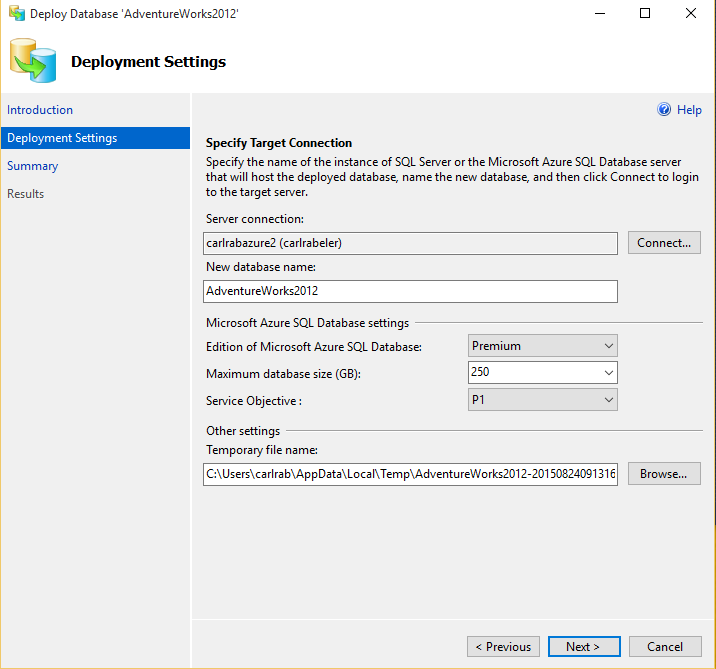

# Migrate SQL Server database to SQL Database using Deploy Database to Microsoft Azure Database Wizard
> [!div class="op_single_selector"]
> * [SSMS Migration Wizard](sql-database-cloud-migrate-compatible-using-ssms-migration-wizard.md)
> * [Export to BACPAC File](sql-database-cloud-migrate-compatible-export-bacpac-ssms.md)
> * [Import from BACPAC File](sql-database-cloud-migrate-compatible-import-bacpac-ssms.md)
> * [Transactional Replication](sql-database-cloud-migrate-compatible-using-transactional-replication.md)
> 
> 

The Deploy Database to Microsoft Azure Database wizard in SQL Server Management Studio migrates a [compatible SQL Server database](sql-database-cloud-migrate.md) directly into your Azure SQL Database server.

## Use the Deploy Database to Microsoft Azure Database Wizard
> [!NOTE]
> The steps below assume that you have a [provisioned SQL Database server](https://azure.microsoft.com/documentation/learning-paths/sql-database-training-learn-sql-database/).
> 
> 

1. Verify that you have the latest version of SQL Server Management Studio. New versions of Management Studio are updated monthly to remain in sync with updates to the Azure portal.
   
   > [!IMPORTANT]
   > It is recommended that you always use the latest version of Management Studio to remain synchronized with updates to Microsoft Azure and SQL Database. [Update SQL Server Management Studio](https://msdn.microsoft.com/library/mt238290.aspx).
   > 
2. Open Management Studio and connect to your SQL Server database to be migrated in Object Explorer.
3. Right-click the  database in the Object Explorer, point to **Tasks**, and click **Deploy Database to Microsoft Azure SQL Database…**
   
    
4. In the deployment wizard, click **Next**, and then click **Connect** to configure the connection to your SQL Database server.
   
   
5. In the Connect to Server dialog box, enter your connection information to connect to your SQL Database server.
   
    
6. Provide the **New database name** for the new database name, set the **Edition of Microsoft Azure SQL Database** ([service tier](sql-database-service-tiers.md)), **Maximum database size**, **Service Objective** (performance level), and **Temporary file name** for the [BACPAC](https://msdn.microsoft.com/library/ee210546.aspx#Anchor_4) file that this wizard creates during the migration process. 
   
   
7. Complete the wizard to migrate the database. Depending on the size and complexity of the database, deployment may take from a few minutes to many hours. If this wizard detects compatibility issues, errors will be displayed to the screen and the migration will not continue. For guidance on how to fix database compatibility issues, go to [fix database compatibility issues](sql-database-cloud-migrate-fix-compatibility-issues.md).
8. Using Object Explorer, connect to your migrated database in your Azure SQL Database server.
9. Using the Azure Portal, view your database and its properties.

## Next steps
* [Newest version of SSDT](https://msdn.microsoft.com/library/mt204009.aspx)
* [Newest version of SQL Server Management Studio](https://msdn.microsoft.com/library/mt238290.aspx)

## Additional resources
* [SQL Database V12](sql-database-v12-whats-new.md)
* [Transact-SQL partially or unsupported functions](sql-database-transact-sql-information.md)
* [Migrate non-SQL Server databases using SQL Server Migration Assistant](http://blogs.msdn.com/b/ssma/)

