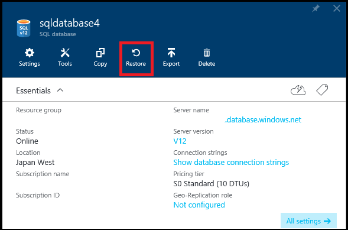
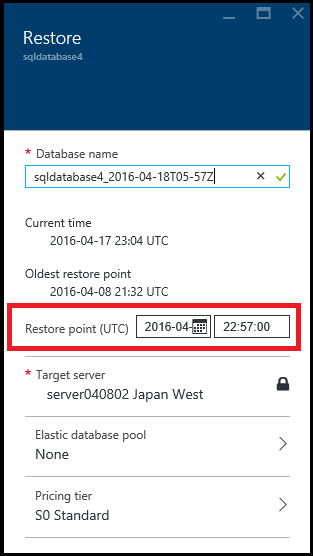

# Restore an Azure SQL Database to a previous point in time with the Azure Portal
> [!div class="op_single_selector"]
> * [Overview](sql-database-recovery-using-backups.md)
> * [Point-In-Time Restore: PowerShell](sql-database-point-in-time-restore-powershell.md)
> 
> 

This article shows you how to restore your database to an earlier point in time from [SQL Database automated backups](sql-database-automated-backups.md) using the Azure Portal.

## Select a database to restore to a previous point in time
To restore a database in the Azure Portal do the following:

1. Open the [Azure Portal](https://portal.azure.com).
2. On the left side of the screen select **BROWSE** > **SQL databases**.
3. Navigate to the database you want to restore and select it.
4. At the top of your database's blade, select **Restore**:
   
   
5. Specify a database name, point in time and then click Ok:
   
   

## Next steps
* For a business continuity overview and scenarios, see [Business continuity overview](sql-database-business-continuity.md)
* To learn about Azure SQL Database automated backups, see [SQL Database automated backups](sql-database-automated-backups.md)
* To learn about using automated backups for recovery, see [restore a database from the service-initiated backups](sql-database-recovery-using-backups.md)
* To learn about faster recovery options, see [Active-Geo-Replication](sql-database-geo-replication-overview.md)  
* To learn about using automated backups for archiving, see [database copy](sql-database-copy.md)

