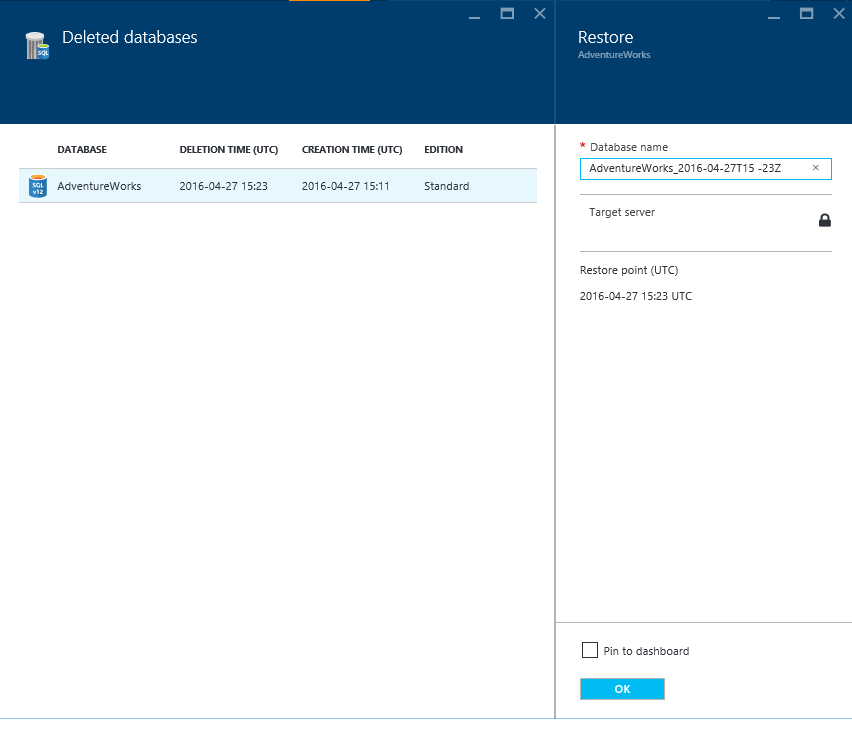

# Restore a deleted Azure SQL database using the Azure Portal
> [!div class="op_single_selector"]
> * [Overview](sql-database-recovery-using-backups.md)
> * [Deleted database restore: PowerShell](sql-database-restore-deleted-database-powershell.md)
> 
> 

## Select the database to restore
To restore a database in the Azure Portal do the following:

1. Open the [Azure Portal](https://portal.azure.com).
2. On the left side of the screen select **BROWSE** > **SQL servers**.
3. Navigate to the server with the deleted database you want to restore and select the server
4. Scroll down to the **operations** section of your server blade and select **Deleted databases**:
   
5. Select the deleted database you want to restore.
6. Specify a database name, and click Ok:
   
   

## Next steps
* For a business continuity overview and scenarios, see [Business continuity overview](sql-database-business-continuity.md)
* To learn about Azure SQL Database automated backups, see [SQL Database automated backups](sql-database-automated-backups.md)
* To learn about using automated backups for recovery, see [restore a database from the service-initiated backups](sql-database-recovery-using-backups.md)
* To learn about faster recovery options, see [Active-Geo-Replication](sql-database-geo-replication-overview.md)  
* To learn about using automated backups for archiving, see [database copy](sql-database-copy.md)

