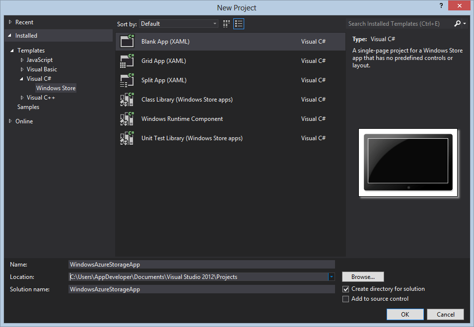
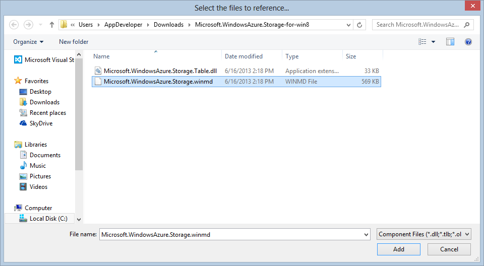
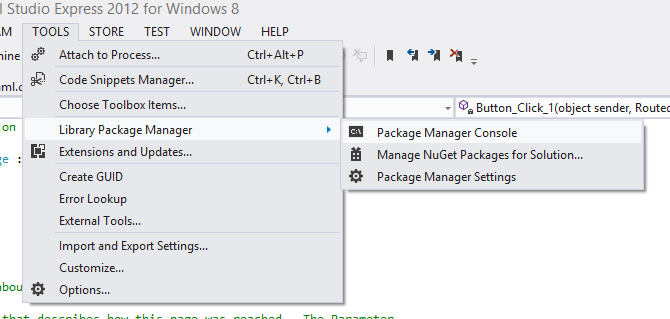

# How to use Azure Storage in Windows Store apps
## Overview
This guide shows how to get started with developing a Windows Store app that makes use of Azure Storage.

## Download required tools
* [Visual Studio](https://www.visualstudio.com/en-us/visual-studio-homepage-vs.aspx) makes it easy to build, debug, localize, package, and deploy Windows Store apps. Visual Studio 2012 or later is required.
* The [Azure Storage Client Library](https://www.nuget.org/packages/WindowsAzure.Storage) provides a Windows Runtime class library for working with Azure Storage.
* [WCF Data Services Tools for Windows Store Apps](http://www.microsoft.com/download/details.aspx?id=30714) extends the Add Service Reference experience with client-side OData support for Windows Store apps in Visual Studio.

## Develop apps
### Getting ready
Create a new Windows Store app project in Visual Studio 2012 or later:

Next, add a reference to the Azure Storage Client Library by right-clicking **References**, clicking **Add Reference**, and then browsing to the Storage Client Library for Windows Runtime that you downloaded:

### Using the library with the Blob and Queue services
At this point, your app is ready to call the Azure Blob and Queue services. Add the following **using** statements so that Azure Storage types can be referenced directly:

    using Microsoft.WindowsAzure.Storage;
    using Microsoft.WindowsAzure.Storage.Auth;

Next, add a button to your page. Add the following code to its **Click** event and modify your event handler method by using the [async keyword](http://msdn.microsoft.com/library/vstudio/hh156513.aspx):

    var credentials = new StorageCredentials(accountName, accountKey);
    var account = new CloudStorageAccount(credentials, true);
    var blobClient = account.CreateCloudBlobClient();
    var container = blobClient.GetContainerReference("container1");
    await container.CreateIfNotExistsAsync();

This code assumes that you have two string variables, *accountName* and *accountKey*. They represent the name of your storage account and the account key that is associated with that account.

Build and run the application. Clicking the button will check whether a container named *container1* exists in your account and then create it if not.

### Using the library with the Table service
Types that are used to communicate with the Azure Table service depend on WCF Data Services for the Windows Store app library. Next, add a reference to the required WCF libraries by using the Package Manager Console:

Use the following command to point Package Manager to the location on your machine:

    Install-Package Microsoft.Data.OData.WindowsStore -Source "C:\Program Files (x86)\Microsoft WCF Data Services\5.0\bin\NuGet"

This command will automatically add all required references to your project. If you do not want to use the Package Manager Console, you can add the WCF Data Services NuGet folder on your local machine to the list of package sources and then add the reference through the UI, as described in [Managing NuGet Packages Using the Dialog](http://docs.nuget.org/docs/start-here/Managing-NuGet-Packages-Using-The-Dialog).

When you have referenced the WCF Data Services NuGet package, change the code in your button's **Click** event:

    var credentials = new StorageCredentials(accountName, accountKey);
    var account = new CloudStorageAccount(credentials, true);
    var tableClient = account.CreateCloudTableClient();
    var table = tableClient.GetTableReference("table1");
    await table.CreateIfNotExistsAsync();

This code checks whether a table named *table1* exists in your account, and then creates it if not.

You can also add a reference to Microsoft.WindowsAzure.Storage.Table.dll, which is available in the same package that you downloaded. This library contains additional functionality, such as reflection-based serialization and generic queries. Note that this library does not support JavaScript.

[store-apps-storage-vs-project]: ./media/storage-use-store-apps/store-apps-storage-vs-project.png
[store-apps-storage-choose-library]: ./media/storage-use-store-apps/store-apps-storage-choose-library.png
[store-apps-storage-package-manager]: ./media/storage-use-store-apps/store-apps-storage-package-manager.png
