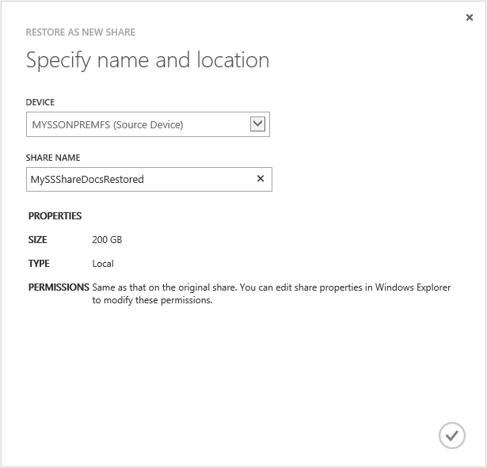
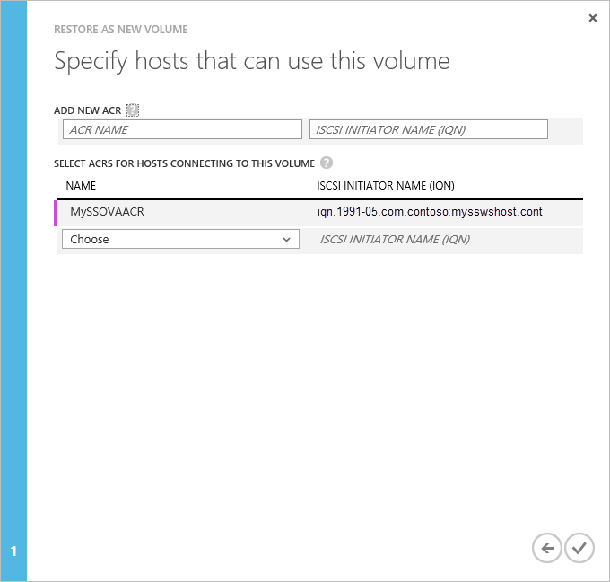

# Restore from a backup of your StorSimple Virtual Array
## Overview
This article applies to Microsoft Azure StorSimple Virtual Array (also known as the StorSimple on-premises virtual device or StorSimple virtual device) running March 2016 general availability (GA) release or later. This article describes step-by-step how to restore from a backup set of your shares or volumes on your StorSimple Virtual Array. The article also details how the item-level recovery works on your StorSimple Virtual Array that is configured as a file server.

## Restore shares from a backup set
**Before you try to restore shares, ensure that you have sufficient space on the device to complete this operation.** To restore from a backup, in the [Azure classic portal](https://manage.windowsazure.com/), perform the following steps.

#### To restore a share
1. Browse to the **Backup Catalog**. Filter by appropriate device and time range to search for your backups. Click the check icon  to execute the query.
2. In the list of backup sets displayed, click and select a specific backup. Expand the backup to see the various shares under it. Click and select a share that you want to restore.
3. At the bottom of the page, click **Restore as new**.
4. This will initiate the **Restore as new share** wizard. On the **Specify name and location** page:
   
   1. Verify the source device name. This should be the device that contains the share you want to restore. The device selection is grayed out. To select a different source device, you will need to exit the wizard and reselect the backup set again.
   2. Provide a share name. The share name must contain 3 to 127 characters.
   3. Review the size, type, and permissions associated with the share that you are trying to restore. You will be able to modify the share properties via Windows Explorer after the restore is complete.
   4. Click the check icon .
      
      
5. After the restore job is complete, the restore will start and you will see another notification. To monitor the progress of restore, click **View job**. This will take you to the **Jobs** page.
6. You can track the progress of the restore job. When the restore is 100% complete, navigate back to the **Shares** page on your device.
7. You can now view the new restored share in the list of shares on your device. Note that restore is done to the same type of the share. A tiered share is restored as tiered and a locally pinned share as a locally pinned share.

You have now completed the device configuration and learned how to backup or restore a share. 

## Restore volumes from a backup set
To restore from a backup, in the Azure classic portal, perform the following steps. The restore operation restores the backup to a new volume on the same virtual device; you cannot restore to a different device.

#### To restore a volume
1. Browse to the **Backup Catalog**. Filter by appropriate device and time range to search for your backups. Click the check icon  to execute the query.
2. In the list of backup sets displayed, click and select a specific backup. Expand the backup to see the various volumes under it. Select the volume you want to restore. 
3. At the bottom of the page, click **Restore as new**. The **Restore as new volume** wizard will start.
4. On the **Specify name and location** page:
   
   1. Verify the source device name. This should be the device that contains the volume that you want to restore. The device selection is unavailable. To select a different source device, you will need to exit the wizard and reselect the backup set again.
   2. Provide a volume name for the volume being restored as new. The volume name must contain 3 to 127 characters.
   3. Click the arrow icon.
      
      
5. On the **Specify hosts that can use this volume** page, select the appropriate ACRs from the dropdown list.
   
   
6. Click the check icon . This will initiate a restore job and you will see the following notification that the job is in progress.
7. After the restore job is complete, the restore will start and you will see another notification. To monitor the progress of restore, click **View job**. This will take you to the **Jobs** page.
8. You can track the progress of the restore job. Navigate back to the **Volumes** page on your device.
9. You can now view the new restored volume in the list of volumes on your device. Note that restore is done to the same type of volume. A tiered volume is restored as tiered and a locally pinned volume is restored as a locally pinned volume.
10. Once the volume appears online on the list of volumes, the volume is available for use.  On the iSCSI initiator host, refresh the list of targets in iSCSI initiator properties window.  A new target which contains the restored volume name should appear as 'inactive' under the status column.
11. Select the target and click **Connect**.   After the initiator is connected to the target, the status should change to **Connected**. 
12. In the **Disk Management** window, the mounted volumes will appear as shown in the following illustration. Right-click the discovered volume (click the disk name), and then click **Online**.

> [!IMPORTANT]
> When trying to restore a volume or a share from a backup set, if the restore job fails, a target volume or share may still be created in the portal. It is important that you delete this target volume or share in the portal to minimize any     future issues arising from this element.
> 
> 

## Item-level recovery (ILR)
This release introduces the item-level recovery (ILR) on a StorSimple virtual device configured as a file server. The feature allows you to do granular recovery of files and folders from a cloud backup of all the shares on the StorSimple device. Users can retrieve deleted files from recent backups using a self-service model.

Every share has a *.backups* folder that contains the most recent backups. The user can navigate to the desired backup, copy relevant files and folders from the backup and restore them. This eliminates calls to administrators for restoring files from backups.

1. When performing the ILR, you can view the backups through Windows Explorer. Click the specific share that you want to look at the backup for. You will see a *.backups* folder created under the share that stores all the backups. Expand the *.backups* folder to view the backups. The folder will then show the exploded view of the entire backup hierarchy. This view is created on-demand and usually takes only a couple of seconds to create.
   
   The last 5 backups are displayed in this way and can be used to perform an item-level recovery. The 5 recent backups include both the default scheduled and the manual backups.

    -   **Scheduled backups** named as &lt;Device name&gt;DailySchedule-YYYYMMDD-HHMMSS-UTC.

    -   **Manual backups** named as Ad-hoc-YYYYMMDD-HHMMSS-UTC.

        

1. Identify the backup containing the most recent version of the deleted file. Though the folder name contains a UTC timestamp in each of the above cases, the time at which the folder was created is the actual device time when the backup started. Use the folder timestamp to locate and identify the backups.
2. Locate the folder or the file that you want to restore in the backup that you identified in the previous step. Note you can only view the files or folders that you have permissions for. If you are not able to access certain files or folders, you will need to contact a share administrator who can use Windows Explorer to edit the share permissions and give you access to the specific file or folder. It is a recommended best practice that the share administrator be a user group instead of a single user.
3. Copy the file or the folder to the appropriate share on your StorSimple file server.

 **Video available**

Watch the video to see how you can create shares, back up shares, and restore data on a StorSimple Virtual Array.

> [!VIDEO https://channel9.msdn.com/Blogs/Windows-Azure/Use-the-StorSimple-Virtual-Array/player]
> 
> 
> 

## Next steps
Learn more about how to [administer your StorSimple Virtual Array using the local web UI](storsimple-ova-web-ui-admin.md).

