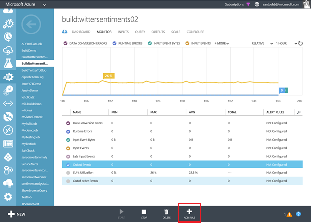
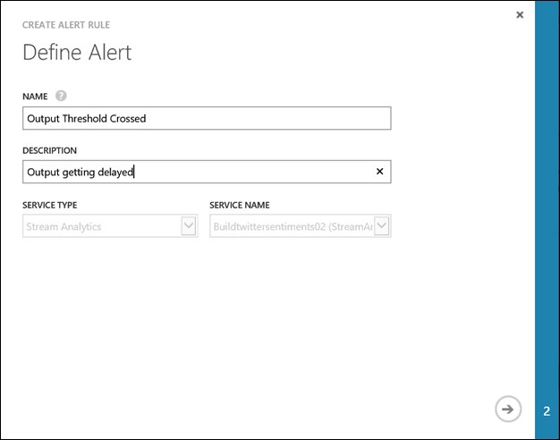
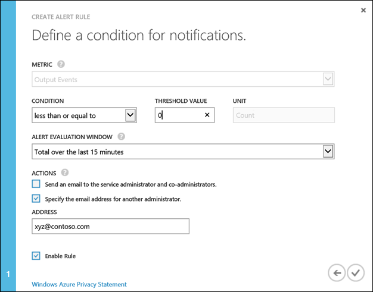
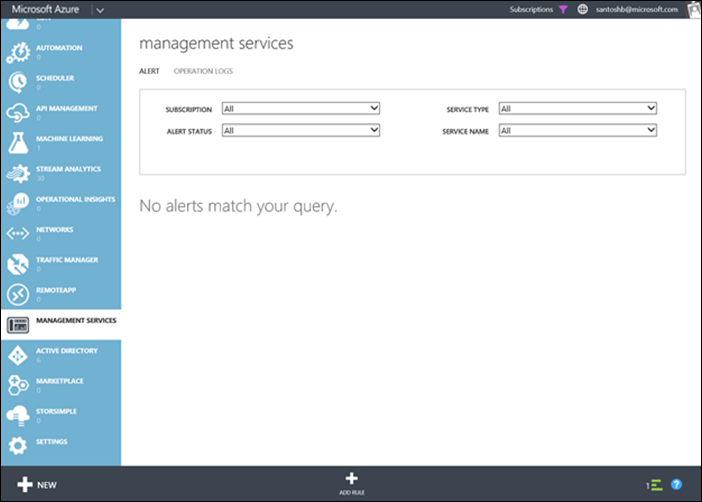
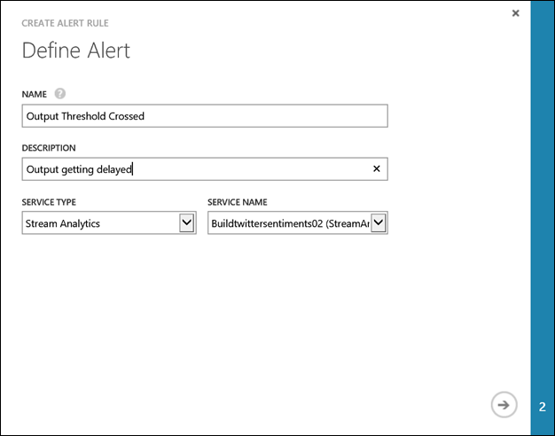
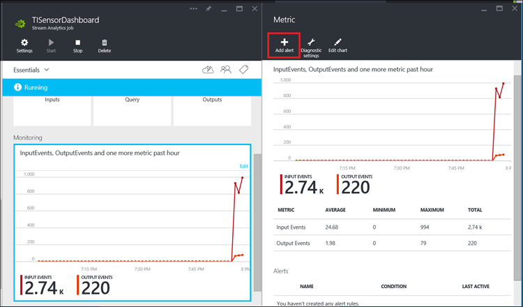
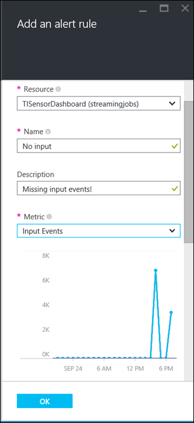

# Set up alerts for Azure Stream Analytics jobs
## Introduction: Monitor page
You can set up alerts to trigger an alert when a metric reaches a condition that you specify.

For example,  “If Output Events for the last 15 minutes is <100,  send email notification to email id: xyz@company.com”.

Rules can be set up on metrics through the portal, or can be configured [programmatically](https://code.msdn.microsoft.com/windowsazure/Receive-Email-Notifications-199e2c9a) over Operation Logs data.

## Set up alerts through the Azure Classic Portal
There are two ways to setup alerts in the Azure Management portal:  

1. The **Monitor** tab of your Stream Analytics job  
2. The Operations Log in the Management services  

## Set up alert through the Monitor tab of the job in the portal
1. Select the metric in the monitor tab, and click on the **Add Rule** button in the bottom of the dashboard, and setup your rules.  
   
     
2. Define the name and description of the Alert  
   
     
3. Enter the thresholds, alert evaluation window and the actions for the alert  
   
     

## Set up alerts through the Operations logs
1. Go to the **Alerts** tab in Management Services in the [Azure Classic Portal](https://manage.windowsazure.com).  
2. Click on **Add Rule**  
   
     
3. Define the name and description of the Alert. Select ‘Stream Analytics’ as Service Type, and the job name as the Service Name.  
   
     

## Set up alerts in the Azure Portal
In the Azure Portal, browse to the Stream Analtyics job you are interested in alerting on and click the **Monitoring** section.  In the **Metric** blade that opens, click the **Add alert** command.

    

You can name your alert rule, and choose a description that will show up in the notification email.

When you select Metrics you'll choose a condition and threshold Value for the metric.

    

For more detail on configuring alerts in the Azure Portal, see [Receive alert notifications](../azure-portal/insights-receive-alert-notifications.md).  

## Get help
For further assistance, try our [Azure Stream Analytics forum](https://social.msdn.microsoft.com/Forums/en-US/home?forum=AzureStreamAnalytics)

## Next steps
* [Introduction to Azure Stream Analytics](stream-analytics-introduction.md)
* [Get started using Azure Stream Analytics](stream-analytics-get-started.md)
* [Scale Azure Stream Analytics jobs](stream-analytics-scale-jobs.md)
* [Azure Stream Analytics Query Language Reference](https://msdn.microsoft.com/library/azure/dn834998.aspx)
* [Azure Stream Analytics Management REST API Reference](https://msdn.microsoft.com/library/azure/dn835031.aspx)

