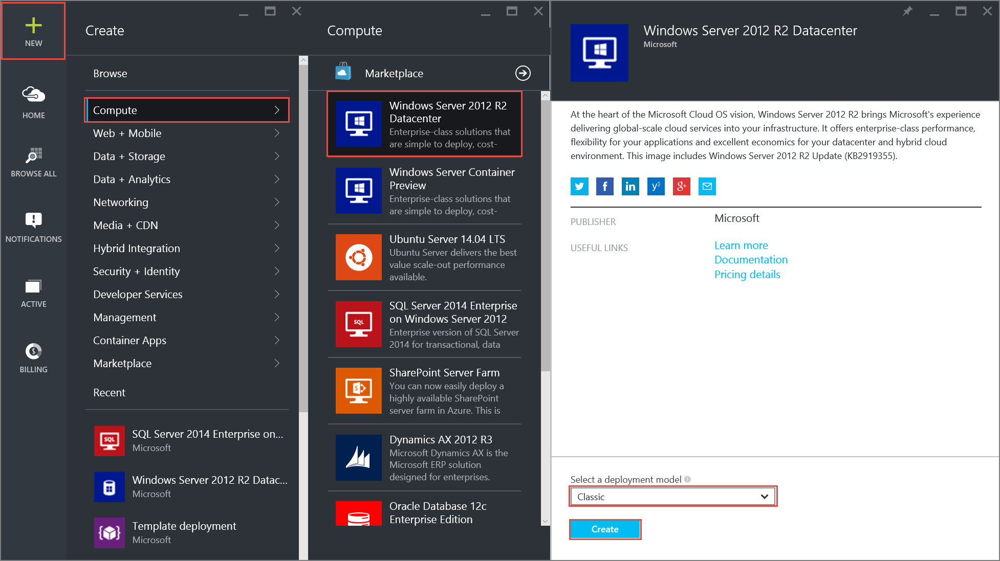
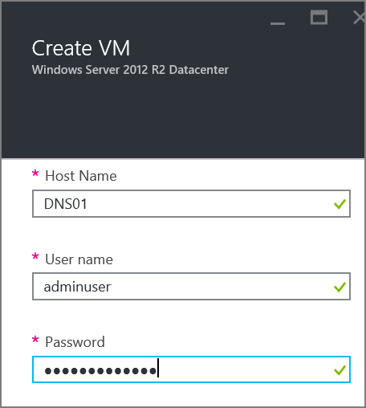
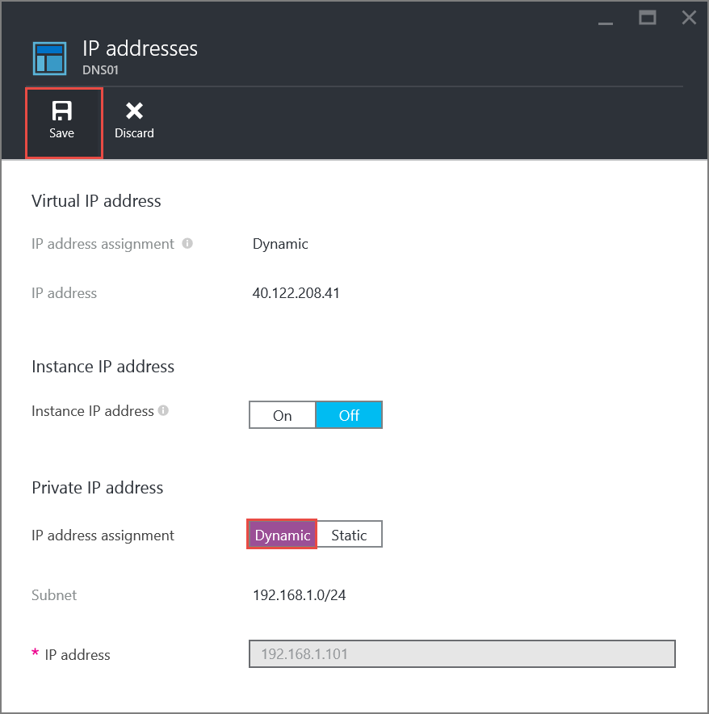

# How to set a static private IP address (classic) in the Azure portal
[!INCLUDE [virtual-networks-static-private-ip-selectors-classic-include](../../includes/virtual-networks-static-private-ip-selectors-classic-include.md)]

[!INCLUDE [virtual-networks-static-private-ip-intro-include](../../includes/virtual-networks-static-private-ip-intro-include.md)]

[!INCLUDE [azure-arm-classic-important-include](../../includes/azure-arm-classic-important-include.md)] This article covers the classic deployment model. You can also [manage a static private IP address in the Resource Manager deployment model](virtual-networks-static-private-ip-arm-pportal.md).

[!INCLUDE [virtual-networks-static-ip-scenario-include](../../includes/virtual-networks-static-ip-scenario-include.md)]

The sample steps below expect a simple environment already created. If you want to run the steps as they are displayed in this document, first build the test environment described in [create a vnet](virtual-networks-create-vnet-classic-pportal.md).

## How to specify a static private IP address when creating a VM
To create a VM named *DNS01* in the *FrontEnd* subnet of a VNet named *TestVNet* with a static private IP of *192.168.1.101*, follow the steps below:

1. From a browser, navigate to http://portal.azure.com and, if necessary, sign in with your Azure account.
2. Click **NEW** > **Compute** > **Windows Server 2012 R2 Datacenter**, notice that the **Select a deployment model** list already shows **Classic**, and then click **Create**.
   
    
3. In the **Create VM** blade, enter the name of the VM to be created (*DNS01* in our scenario), the local administrator account, and password.
   
    
4. Click **Optional Configuration** > **Network** > **Virtual Network**, and then click **TestVNet**. If **TestVNet** is not available, make sure you are using the *Central US* location and have created the test environment described at the beginning of this article.
   
    
5. In the **Network** blade, make sure the subnet currently selected is *FrontEnd*, then click **IP addresses**, under **IP address assignment** click **Static**, and then enter *192.168.1.101* for **IP Address** as seen below.
   
        
6. Click **OK** in the **IP addresses** blade, then click **OK** in the **Network** blade, and click **OK** in the **Optional config** blade.
7. In the **Create VM** blade, click **Create**. Notice the tile below displayed in your dashboard.
   
    

## How to retrieve static private IP address information for a VM
To view the static private IP address information for the VM created with the steps above, execute the steps below.

1. From the Azure Azure portal, click **BROWSE ALL** > **Virtual machines (classic)** > **DNS01** > **All settings** > **IP addresses** and notice the IP address assignment and IP address as seen below.
   
    

## How to remove a static private IP address from a VM
To remove the static private IP address from the VM created above, follow the steps below.

1. From the **IP addresses** blade shown above, click **Dynamic** to the right of **IP address assignment**, then click **Save**, and then click **Yes**.
   
    

## How to add a static private IP address to an existing VM
To add a static private IP address to the VM created using the steps above, follow the steps below:

1. From the **IP addresses** blade shown above, click **Static** to the right of **IP address assignment**.
2. Type *192.168.1.101* for **IP address**, then click **Save**, and then click **Yes**.

## Next steps
* Learn about [reserved public IP](virtual-networks-reserved-public-ip.md) addresses.
* Learn about [instance-level public IP (ILPIP)](virtual-networks-instance-level-public-ip.md) addresses.
* Consult the [Reserved IP REST APIs](https://msdn.microsoft.com/library/azure/dn722420.aspx).

